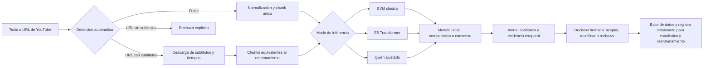

# Arquitectura operacional del demostrador

Este diagrama resume el flujo verificable del moderador textual local. Una sola caja acepta una frase o una URL: la interfaz detecta el tipo de entrada y rechaza enlaces de YouTube sin subtítulos descargables. La versión de adquisición y evaluación usada en el paper está en `pipeline_moderacion.tex`; la arquitectura del demostrador está en `despliegue.tex`.

El consenso es una mayoría de al menos dos de los tres modelos, no unanimidad. El sistema materializa moderación semiautomática: prioriza, enlaza el diagnóstico con tiempos del video y permite que el supervisor acepte, modifique o rechace. Una alerta informa esa decisión y no constituye por sí sola una sanción. No se afirma uso de reconocimiento automático del habla; el modo URL exige una pista de subtítulos disponible.
