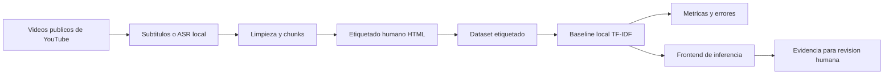

# Arquitectura del sistema

Este diagrama describe el flujo del moderador textual local. La version usada directamente en el paper esta en `pipeline_moderacion.tex`.

```mermaid
flowchart LR
  A[Videos publicos de YouTube] --> B[Subtitulos o ASR local]
  B --> C[Limpieza y chunks]
  C --> D[Etiquetado humano HTML]
  D --> E[Dataset etiquetado]
  E --> F[Baseline local TF-IDF]
  F --> G[Metricas y errores]
  F --> H[Frontend de inferencia]
  H --> I[Evidencia para revision humana]
```
