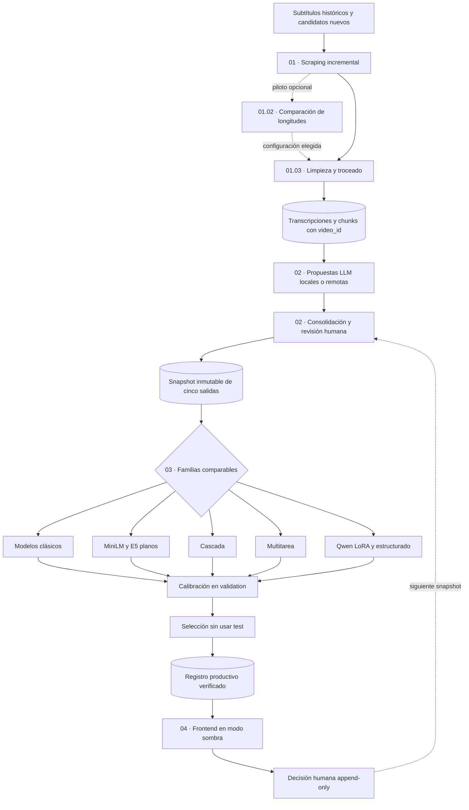

# Moderación semiautomática de videos peruanos de YouTube mediante modelos clásicos y neuronales de procesamiento del lenguaje natural

**Trabajo final del curso de Procesamiento de Lenguaje Natural (PLN) de la Maestría en Inteligencia Artificial de la Universidad Nacional de Ingeniería (UNI) — Semestre 2026-1**

**Grupo 4:** Luis Enrique Koc Góngora, Alex Felipe Mancilla Antay, Herbert Antonio Meléndez García y Dennis Jack Paitán Cano

---

## Resumen

El proyecto construye un asistente de moderación semiautomática para fragmentos de subtítulos de videos peruanos de YouTube. El flujo reúne subtítulos públicos, los limpia y divide en fragmentos con evidencia temporal, propone etiquetas mediante modelos de lenguaje, permite adjudicación humana y entrena varias familias de clasificadores. El sistema prioriza casos y presenta cinco scores al supervisor; no elimina contenido, no sanciona usuarios y no sustituye la decisión humana.

La implementación activa usa el contrato `moderacion_peru_5_salidas_v2`, versión `2.1.0`. `SEGURO` es una salida aprendida y mutuamente excluyente con cualquier daño. Las cuatro categorías de daño pueden coexistir. Los casos sin evidencia suficiente se difieren mediante `needs_review=true` y no forman una sexta clase.

El repositorio separa el flujo activo de la evidencia histórica. Las métricas conservadas en el paper y la presentación corresponden al contrato anterior de cuatro daños con `SEGURO` derivado. El rendimiento del contrato activo de cinco salidas permanece pendiente hasta ejecutar nuevamente el entrenamiento, la calibración y el test; el README no traslada las métricas históricas al contrato nuevo.

## Arquitectura del flujo

El siguiente diagrama resume la relación entre los cuatro bloques implementados en los cuadernos. Los eventos humanos vuelven al corpus como evidencia versionada para el siguiente incremento.



*Figura 1. Flujo activo del repositorio. Cada transición materializa archivos o manifiestos verificables; una entrada sin cambios produce `noop` en lugar de duplicar resultados. La fuente visual relacionada del artículo es [`pipeline_moderacion.tex`](Documento_final_paper/figuras/pipeline_moderacion.tex).*

## Taxonomía operativa

La taxonomía combina antecedentes generales, evidencia peruana o institucional, políticas de plataforma y decisiones operativas del proyecto. Estas categorías sirven al contrato de moderación y no constituyen tipos jurídicos ni una taxonomía validada por expertos peruanos.


*Figura 2. Contrato de salida. `SEGURO` tiene ejemplos, score, umbral y métricas propios; nunca puede coexistir con una categoría de daño. La figura académica reproducible se conserva en [`datos_taxonomia.tex`](Documento_final_paper/figuras/datos_taxonomia.tex).*

| Salida | Alcance operativo resumido | Etiquetas finas asociadas |
|---|---|---|
| `SEGURO` | Fragmento evaluable sin ninguno de los cuatro daños cubiertos | `seguro`, `seguro_ironia_marcada` |
| `RACISMO_DISCRIMINACION` | Inferiorización o exclusión por racialización, etnia, lengua, procedencia o asociación clasista racializada | cinco fenómenos finos |
| `ATAQUE_POR_GENERO_IDENTIDAD` | Daño dirigido por género, orientación sexual, identidad o expresión de género | misoginia/acoso por género y homofobia/transfobia |
| `ACOSO_AMENAZA` | Ataque personal, hostigamiento o anuncio plausible de daño | acoso personal y amenaza directa |
| `CONTENIDO_SEXUAL` | Contenido sexual explícito, cosificación o contenido sexual no consentido | tres fenómenos finos |

Las definiciones, inclusiones, exclusiones, contraejemplos y fuentes se encuentran en [`config/taxonomia_v2.json`](config/taxonomia_v2.json), [`docs/TAXONOMIA_V2.md`](docs/TAXONOMIA_V2.md) y [`docs/MATRIZ_EVIDENCIA_TAXONOMIA.md`](docs/MATRIZ_EVIDENCIA_TAXONOMIA.md).

## Qué realiza cada etapa

### 01 · Scraping, limpieza y troceado

| Cuaderno | Entrada | Proceso y salida | Repetición |
|---|---|---|---|
| `01_01_scraping_incremental` | snapshots, caché, canales, consultas y candidatos con `video_id` | descubre fuentes en modo semilla, dirigido o combinado; adquiere VTT con `yt-dlp` y consolida solo videos nuevos | toda la cola se procesa en lotes reanudables; `DISCOVER_NEW=False` y `FETCH_NEW=False` no usan la red |
| `01_02_optimizacion_longitud_chunks` | chunks etiquetados, transcripciones y snapshot entrenable | piloto rápido o confirmación corta para 15/20/25/30/35 s; reentrena, calibra e infiere por cada longitud | opcional; nunca selecciona con `test` ni cambia datos si `APPLY_CHUNK_SELECTION=False` |
| `01_03_limpieza_troceado_incremental` | transcripciones canónicas + `config/chunking.json` | normaliza texto y crea chunks temporales deterministas | compara transcripción y firma completa; archiva/restaura derivados al cambiar longitud |

La adquisición restaura la técnica estable del cuaderno histórico: `yt-dlp` escribe únicamente VTT manuales o automáticos en almacenamiento temporal, se elige la pista más completa y se exige un mínimo de 200 caracteres. `youtube-transcript-api` se usa solo como respaldo. No se descarga video ni audio ni se ejecuta reconocimiento automático del habla. El identificador de video, el hash de la transcripción, la versión y la firma de configuración del troceador impiden repetir trabajo ya materializado.

`01_02` está separado de la materialización porque elegir longitud es selección de hiperparámetros. El smoke test rápido entrena dos baselines CPU una vez por longitud; el modo confirmatorio entrena ComplementNB, regresión logística y SGD en tres cohortes pareadas. En ambos casos, entrenamiento, calibración e inferencia usan chunks de la misma longitud. La confirmación ampliada del 6 de agosto de 2026 usó 200/80/80 videos por cohorte y eligió conservar **30 s**: ganó las tres repeticiones de validación con AP macro de daño `0.1142 ± 0.0050`; 35 s redujo costo, pero su AP cayó a `0.0554 ± 0.0057`. Son métricas proxy, no productivas. La metodología, los resultados por modelo y la trazabilidad están en [Informe de selección de longitud de chunks](docs/OPTIMIZACION_LONGITUD_CHUNKS.md).

Durante `01_01`, primero se consolidan en el canónico todas las transcripciones completas disponibles en snapshots, particiones por canal y cachés. Después se inventarían también datasets y chunks históricos con texto: estos derivados no se presentan como raw, pero sus `video_id` se excluyen para impedir descargas duplicadas. La auditoría local del 6 de agosto de 2026 encontró 2314 transcripciones completas recuperables, 3230 videos en derivados y **4097 videos conocidos únicos**; los conteos se recalculan y muestran en cada ejecución. Una barra muestra la fuente actual y avanza al terminar cada canal o consulta; otra informa el avance por candidato. El descubrimiento aplica un timeout HTTP configurable de 45 segundos por operación y guarda atómicamente cada fuente terminada en `datos/raw/manifests/discovery_<modo>_checkpoint.json`. Al reanudar, reutiliza las fuentes exitosas sin red y vuelve a intentar únicamente las fallidas. El modo `directed` calcula déficits por videos etiquetados de `train+validation`, estima rendimiento histórico por canal, expande canales desde búsquedas temáticas y materializa una cohorte vigente con *round-robin* ponderado; si no hay datos previos, reparte la adquisición por igual entre los cuatro daños. Con `MAX_DIRECTED_CANDIDATES=None` y `MAX_NEW_VIDEOS=None` se conservan y recorren todos los candidatos dirigidos realmente inéditos. La cola de descarga usa una prioridad pseudoaleatoria reproducible e intercala un video por canal. La red se regula en lotes de 10, con una pausa adicional de 20 segundos entre lotes y pausas internas de 5–10 segundos en `yt-dlp`. El detalle queda en `datos/raw/fallos_descubrimiento_ultima_ejecucion.json` y `datos/raw/fallos_adquisicion.jsonl`.

`yt-dlp` gestiona cabeceras, sesión HTTP, pausas y reintentos. No existe un cortacircuito global: si un video devuelve 429, se excluye únicamente su canal durante esa ejecución, se difieren sus videos posteriores y se continúa con todos los demás canales. Si falta identidad de canal, solo falla ese video. La aleatorización no corrige un bloqueo general de la IP; 429 simultáneos en numerosos canales requieren detener y reanudar más tarde. Éxitos y fallos tienen checkpoints inmediatos, por lo que la siguiente corrida reanuda la cola. La selección, sus fórmulas, los artefactos, el reinicio recuperable y las limitaciones del muestreo se documentan en [Metodología de scraping y adquisición de subtítulos](docs/METODOLOGIA_SCRAPING.md).

### 02 · Etiquetado semiautomático

| Cuaderno | Función | Control principal |
|---|---|---|
| `02_01_etiquetado_local_ollama` | genera propuestas estructuradas con Ollama o, opcionalmente, Hugging Face en Colab | piloto inicial con `LIMIT=20`; reanuda por `chunk_id` |
| `02_02_etiquetado_remoto` | ofrece un proveedor DeepSeek remoto intercambiable | `RUN_REMOTE=False` evita llamadas comerciales accidentales |
| `02_03_revision_llm_dirigida` | prioriza baja confianza, duda o cobertura insuficiente | selección determinista y trazable |
| `02_04_consolidacion_validacion_humana` | consolida proveedores y sirve la campaña humana | precedencia explícita, propuesta ocultable y eventos append-only |
| `02_05_cierre_humano_snapshot` | aplica la última decisión humana y congela el dataset | excluye diferidos/rechazados y conserva `video_id`, flags, split y procedencia |

La revisión humana puede aceptar, modificar, diferir o excluir. Una propuesta visible aceptada no se presenta como anotación humana ciega independiente. El frontend impide seleccionar `SEGURO` junto con daño y pseudonimiza al revisor antes de guardar el evento.

### 03 · Entrenamiento, calibración y comparación

| Cuaderno | Familia o decisión | Resultado materializado |
|---|---|---|
| `03_01_modelos_clasicos` | Dummy, ComplementNB, regresión logística, SVM lineal y SGD incremental con TF-IDF | cinco candidatos con umbrales y métricas |
| `03_02_transformers_planos` | MiniLM multilingüe y E5-small multilingüe | checkpoints y candidatos planos |
| `03_03_transformer_cascada` | compuerta de cualquier daño seguida de cuatro salidas de daño | candidato de dos etapas |
| `03_04_transformer_multitarea` | cinco salidas principales, 14 etiquetas finas y tres flags auxiliares | candidato multitarea |
| `03_05_qwen_lora` | Qwen3-0.6B con adaptación LoRA | adaptador, checkpoint y candidato reanudable |
| `03_06_qwen_estructurado` | Qwen con penalización del conflicto `SEGURO+daño` | checkpoint y candidato estructurado |
| `03_07_comparacion_final` | compara candidatos del mismo snapshot | informe común y registro productivo |
| `03_08_auditoria_finas_flags` | audita cobertura de etiquetas finas y flags | informe auxiliar del snapshot |

Cada candidato completa `fit → calibración en validation → evaluación en test → manifiesto`. La selección usa solo validation. Test informa el desempeño después de congelar modelo y umbrales. El protocolo registra AP, precisión, recall y F1 por salida; AP/F1 macro de los cuatro daños; detección de cualquier daño; falsos seguros; conflicto `SEGURO+daño`; calibración y carga de revisión.

### 04 · Operación supervisada

`04_01_frontend_produccion` inicia un demostrador local para texto o URL de YouTube. La interfaz muestra las cinco probabilidades, sus umbrales, la evidencia temporal y los motivos que obligan revisión. Un conflicto, una salida vacía o la proximidad a un umbral nunca se convierte automáticamente en `SEGURO`.

El [frontend humano](flujo/02_etiquetado/frontend/validacion_humana.html) permite revisar campañas, conservar contexto y reanudar el trabajo. El [frontend productivo](flujo/04_produccion/frontend/produccion.html) opera en modo sombra, reutiliza el caché de subtítulos y registra decisiones humanas para análisis o reentrenamiento posterior.

## Estructura del repositorio

```text
config/                         taxonomía, Colab y disponibilidad de artefactos
docs/                           metodología de scraping, contratos, hardware, orden y trazabilidad
src/moderacion_peru/            implementación reutilizable y CLI modperu
flujo/01_datos/                 adquisición, limpieza y ampliación
flujo/02_etiquetado/            LLM, consolidación y validación humana
flujo/03_entrenamiento/         familias de modelos, comparación y auditoría
flujo/04_produccion/            demostrador supervisado
datos/                          fuentes, snapshots y vistas canónicas
modelos/                        candidatos, checkpoints y registro activo
resultados/                     comparaciones, manifiestos y bundle Colab
tools/                          scripts de generación, auditoría y preparación de Colab
tests/                          pruebas automáticas del contrato y del flujo
archivo/                        evidencia histórica, no usada como flujo activo
Documento_final_paper/          artículo, bibliografía y figuras reproducibles
Presentación_BEAMER/            presentación derivada del artículo
Planning/                       plan de reorganización ejecutado
```

Los resultados preliminares de los cuadernos se muestran mediante el componente común `src/moderacion_peru/notebook_ui.py`: tarjetas de estado, tablas clave–valor, vistas tabulares limitadas y bloques de comandos. Los 17 cuadernos activos evitan `print()` para mantener una salida legible y homogénea; los artefactos completos permanecen en JSON, JSONL o manifiestos y no dependen de la representación visual.

## Reproducción local desde una clonación nueva

### 1. Requisitos

- Git.
- Python 3.11, 3.12 o 3.13; se recomienda Python 3.12.
- VS Code con las extensiones Python y Jupyter, o JupyterLab mediante el extra `cuadernos`.
- Ollama para el etiquetado local de `02_01`; el resto del flujo no requiere LM Studio.
- PyTorch instalado para el backend de entrenamiento elegido. El proyecto acepta `auto`, `cuda`, `rocm`, `xpu` y `cpu`; consulte [`docs/HARDWARE.md`](docs/HARDWARE.md) antes de instalar una rueda específica.
- Espacio adicional para datos, cachés y checkpoints. Los pesos neuronales y varios artefactos generados no se almacenan en Git.

### 2. Clonar y crear un entorno aislado

En PowerShell:

```powershell
git clone https://github.com/lkoc/Trabajo_PLN-MIA-Grupo4.git
Set-Location Trabajo_PLN-MIA-Grupo4
py -3.12 -m venv .venv
.\.venv\Scripts\python.exe -m pip install --upgrade pip
.\.venv\Scripts\python.exe -m pip install -e ".[datos,etiquetado,cuadernos,dev]"
```

La ruta `.venv\Scripts` **no es una carpeta versionada del proyecto**. El comando `py -3.12 -m venv .venv` la crea automáticamente en Windows dentro del repositorio clonado. Si todavía no aparece, la creación del entorno no se ejecutó o terminó con error. Los scripts mantenidos por el proyecto se encuentran en [`tools/`](tools/).

La instalación editable crea el comando de consola declarado en `pyproject.toml`. En Windows se genera como `.venv\Scripts\modperu.exe`; en Linux y macOS se genera como `.venv/bin/modperu`, sin extensión `.exe`. De forma general, `.venv/bin` es el equivalente de `.venv\Scripts` en esos sistemas.

En Linux o macOS:

```bash
git clone https://github.com/lkoc/Trabajo_PLN-MIA-Grupo4.git
cd Trabajo_PLN-MIA-Grupo4
python3.12 -m venv .venv
./.venv/bin/python -m pip install --upgrade pip
./.venv/bin/python -m pip install -e '.[datos,etiquetado,cuadernos,dev]'
```

### 3. Instalar PyTorch y el extra de entrenamiento

PyTorch no se fija como dependencia universal porque CUDA, ROCm, XPU y CPU requieren distribuciones distintas. Instale primero en `.venv` la distribución correspondiente a su sistema siguiendo [`docs/HARDWARE.md`](docs/HARDWARE.md) y el selector oficial enlazado allí. Después complete el entorno:

```powershell
.\.venv\Scripts\python.exe -m pip install -e ".[entrenamiento]"
.\.venv\Scripts\python.exe -c "import torch; print(torch.__version__); print(torch.cuda.is_available())"
```

La segunda línea solo comprueba la interfaz CUDA de PyTorch. En AMD/ROCm, `torch.version.hip` distingue el backend; en Intel, `torch.xpu.is_available()` informa XPU. `modperu preflight` realiza la detección completa y registra el motivo de cualquier fallback. Los modelos clásicos y las auditorías pueden ejecutarse sin acelerador neuronal.

### 4. Configurar Ollama

Ollama expone la API local en `http://127.0.0.1:11434`. Los tres modelos del piloto se preparan con:

```powershell
ollama pull qwen3.5:4b
ollama pull qwen3.5:9b
ollama pull gemma3:4b
ollama list
```

El adaptador llama a la API HTTP de Ollama y exige JSON conforme al esquema de anotación. Si Ollama, el modelo o la API no están disponibles, la corrida falla de forma explícita y conserva el punto de reanudación.

La ruta remota es opcional. Solo si se decide usarla, configure `DEEPSEEK_API_KEY` fuera del repositorio y cambie `RUN_REMOTE=True` en `02_02`. Nunca guarde credenciales en un cuaderno, `.env` versionado o manifiesto.

### 5. Verificar entorno, contrato y artefactos

```powershell
.\.venv\Scripts\modperu.exe preflight
.\.venv\Scripts\modperu.exe validate
.\.venv\Scripts\modperu.exe artifacts
```

`preflight` informa la raíz, taxonomía, backend, memoria, versión de PyTorch, estado de Ollama y artefactos presentes. `artifacts` distingue archivos disponibles de archivos que deben recuperarse o producirse. Una ausencia no se oculta ni se reemplaza con métricas históricas.

Una clonación nueva contiene código, configuración, cuadernos y evidencia histórica versionada, pero no garantiza la presencia de las vistas canónicas, checkpoints o registro productivo ignorados por Git. Para repetir exactamente un snapshot existente se deben recuperar los artefactos de acceso controlado y comprobarlos contra sus manifiestos. Para reconstruirlos, se ejecuta el recorrido `01 → 02`; la adjudicación histórica solo puede reproducirse de forma idéntica si también se dispone de sus eventos humanos originales. `modperu artifacts` identifica estas diferencias antes de iniciar una corrida costosa.

La raíz se encuentra automáticamente mediante `pyproject.toml`. En una ejecución externa puede fijarse sin editar cuadernos:

```powershell
$env:MODPERU_ROOT = (Get-Location).Path
```

`MODPERU_ROOT` es opcional cuando el proceso comienza dentro del repositorio. `MODPERU_ARTIFACT_ROOT` está reservado para consumidores que usan el helper `artifact_root`; no reubica por sí solo los datasets, modelos o rutas canónicas declaradas por los cuadernos.

### 6. Abrir y ejecutar los cuadernos

Desde VS Code, abra la carpeta clonada, seleccione como kernel el Python de `.venv` y ejecute los cuadernos en el orden de [`docs/ORDEN_EJECUCION.md`](docs/ORDEN_EJECUCION.md). También puede iniciar JupyterLab:

```powershell
.\.venv\Scripts\jupyter-lab.exe
```

El recorrido completo contiene 17 cuadernos:

```text
01_01 → 01_02 opcional → 01_03
→ 02_01 → 02_02 opcional → 02_03 → 02_04 → 02_05
→ 03_01 ... 03_06 en ramas comparables
→ 03_07 → 03_08 → 04_01
```

Antes de una corrida costosa, revise los interruptores deliberados:

| Cuaderno | Interruptor inicial | Acción para ejecutar |
|---|---|---|
| `01_01` | plantilla segura: `DISCOVER_NEW=False`, `FETCH_NEW=False` | elija `DISCOVERY_MODE`; use `MAX_NEW_VIDEOS=None` para toda la cola y regule la red con lotes de 10, pausas internas de 5–10 s y 60 s entre lotes |
| `01_02` | ambas pruebas y la aplicación están en `False`; elección manual 30 s | active primero el smoke rápido o la confirmación corta; solo `APPLY_CHUNK_SELECTION=True` archiva/restaura derivados y escribe la elección |
| `02_01` | `RUN=False`, `LIMIT=20` | active `RUN=True`, valide el piloto y luego amplíe o retire el límite |
| `02_02` | `RUN_REMOTE=False` | active solo con autorización para usar la API remota |
| `03_01`–`03_06` | `RUN_TRAINING=False` | active la familia que se desea entrenar |
| `03_07` | `RUN_PUBLISH=False` | active después de reunir candidatos completos del mismo snapshot |

`03_01`–`03_06` no forman una cadena: son alternativas comparables y pueden ejecutarse en paralelo o por separado. `03_07` requiere al menos un candidato completo y no compara candidatos creados con snapshots distintos.

### 7. Reconciliar, entrenar y publicar mediante la CLI

Los puentes principales también tienen comandos reproducibles. Los cuadernos siguen siendo la narración ejecutable recomendada, mientras la CLI facilita automatización y pruebas:

```powershell
.\.venv\Scripts\modperu.exe prepare-training
.\.venv\Scripts\modperu.exe train classical
.\.venv\Scripts\modperu.exe train flat --device auto
.\.venv\Scripts\modperu.exe train cascade --device auto
.\.venv\Scripts\modperu.exe train multitask --device auto
.\.venv\Scripts\modperu.exe train qwen_lora --device auto
.\.venv\Scripts\modperu.exe train qwen_structured --device auto
.\.venv\Scripts\modperu.exe publish-model
```

Cada experimento registra la firma del dataset y la configuración. Si el candidato y su manifiesto ya están completos, una segunda ejecución devuelve `status="noop"`. `--force` debe reservarse para una repetición deliberada de la misma firma.

### 8. Ejecutar los frontends

Después de `02_04`, el frontend humano puede iniciarse con la campaña consolidada:

```powershell
.\.venv\Scripts\modperu.exe serve-labeling `
  --campaign datos/etiquetado/consolidado/anotaciones_v2.jsonl
```

Después de entrenar y publicar con `03_07`, el frontend productivo se inicia con:

```powershell
.\.venv\Scripts\modperu.exe serve-production `
  --registry modelos/registro_modelos_5_salidas.json
```

Ambos servidores escuchan por defecto en `127.0.0.1:8765`. Los eventos se guardan en JSONL append-only. El frontend productivo rechaza la inferencia si no existe un registro v2.1 cuyo checkpoint y hashes puedan verificarse.

### 9. Comprobar la reproducción

```powershell
.\.venv\Scripts\python.exe -m pytest
.\.venv\Scripts\python.exe tools/audit_project.py
.\.venv\Scripts\python.exe tools/generate_workflow_notebooks.py
```

Las pruebas comprueban esquemas, exclusividad de `SEGURO`, migración, precedencia humana, idempotencia, archivado reversible por longitud, proveedores, entrenamiento, registro, frontends, citas y carátulas académicas. El auditor revisa los 17 cuadernos, sus referencias finales, enlaces Markdown, rutas, nombres de taxonomía y metadatos.

El artículo y la presentación se recompilan de forma independiente:

```powershell
Set-Location Documento_final_paper
latexmk -pdf -interaction=nonstopmode -halt-on-error paper_moderador_contenido_youtube_ieee.tex
Set-Location ..\Presentación_BEAMER
latexmk -pdf -interaction=nonstopmode -halt-on-error presentacion_grupo4.tex
```

Una compilación correcta no sustituye la revisión visual del PDF A4 ni de las diapositivas.

## Incrementar la muestra sin reiniciar

Para incorporar videos o subtítulos adicionales:

1. añada candidatos con `video_id` y URL a `datos/raw/videos_candidatos.csv` o al JSONL de candidatos;
2. ejecute nuevamente `01_01` y `01_03`; `01_02` solo se repite si desea reevaluar o cambiar la longitud;
3. ejecute `02_01`–`02_05` para los chunks pendientes;
4. active las familias de `03` que desea actualizar;
5. publique de nuevo solo cuando `03_07` encuentre candidatos completos del snapshot nuevo.

El flujo omite videos conocidos, reutiliza subtítulos y cachés, y recorre todos los candidatos pendientes por lotes. Cada pista VTT se conserva inmediatamente en `datos/raw/vtt_by_video/` antes de continuar y cada fallo se registra; una interrupción no obliga a repetir los éxitos anteriores. `BACKFILL_MISSING_VTT=True` trata por separado los JSON ya canónicos cuyo VTT falta. Después conserva las asignaciones de split por `video_id` y reanuda anotaciones por `chunk_id`. Un incremento crea otro snapshot inmutable que combina datos anteriores y nuevos. Los modelos neuronales pueden reanudar una interrupción o inicializar el run nuevo desde un candidato compatible anterior; nunca se entrena únicamente con el lote nuevo olvidando el corpus previo.

### Continuar el flujo desde otra máquina

Git conserva `datos/raw/vtt_by_video/`, `datos/raw/transcripts_by_channel/`, candidatos, fallos y manifiestos de adquisición, además del bundle comprimido de Colab. El JSONL monolítico `transcripts_raw.jsonl`, `transcripts_cache/`, los chunks y el dataset sin comprimir siguen siendo artefactos locales: el primero se recompone desde las particiones por canal; caché no es necesaria; y los dos últimos se restauran desde el bundle verificado. Ninguna restauración borra filas existentes del canónico.

Después de clonar y preparar el entorno:

```powershell
python tools/restore_synced_checkpoints.py
```

El comando verifica los SHA-256 de `datos/raw/transcripts_by_channel/index.json`, cada entrada de `datos/raw/vtt_by_video/index.json` y `resultados/colab_bundle/bundle_manifest.json`; reconstruye el canónico de forma idempotente y descomprime atómicamente chunks y dataset en sus rutas esperadas. Los cuadernos `03_01`–`03_08` repiten la verificación del dataset antes de usarlo: si falta, lo restauran; si existe con otro hash, se detienen en vez de sobrescribirlo.

Cuando `02_05` produzca un snapshot nuevo, regenere el bundle con `python tools/prepare_colab_bundle.py --destination resultados/colab_bundle` antes de ejecutar `03`; el error ante hashes distintos evita entrenar accidentalmente con una versión no declarada.

El dataset actual baja de aproximadamente 104,2 MiB a 20,3 MiB con gzip nivel 9, por lo que un único archivo comprimido es más simple y está holgadamente bajo los límites por archivo. Si una versión futura se aproxima a 45–50 MiB comprimidos, se deberá particionar primero por `split` y luego en partes numeradas, manteniendo un manifiesto único. El repositorio remoto es público: versionar estos checkpoints publica también el texto de los subtítulos y exige revisar licencias, términos de la plataforma y datos personales antes de hacer `push`.

## Google Colab L4 desde VS Code

Los cuadernos `03_02`–`03_06`, y opcionalmente `02_01`, incluyen dentro de sus propias celdas el puente para una GPU NVIDIA L4. El cuaderno permanece en VS Code. Google Drive transporta únicamente el código mínimo, los chunks o el snapshot comprimido y los resultados finales; no sincroniza videos, audio, PDFs, modelos Ollama ni cachés de Hugging Face.

La preparación, verificación SHA-256, reanudación por `COLAB_RUN_ID` y recuperación de resultados se describen en [`docs/COLAB_L4.md`](docs/COLAB_L4.md). El backend L4 falla explícitamente si Colab asigna una GPU distinta cuando `COLAB_REQUIRE_L4=True`.

## Artefactos, trazabilidad y estado de resultados

| Artefacto | Función |
|---|---|
| `datos/raw/transcripts_raw.jsonl` | vista canónica de transcripciones |
| `datos/raw/transcripts_by_channel/*.jsonl` | checkpoint sincronizable, pequeño e idempotente por canal |
| `datos/raw/vtt_by_video/*.vtt` | checkpoint sincronizable de pistas WebVTT, deduplicado por `video_id` y nombre de pista |
| `datos/processed/chunks_v2.jsonl` | fragmentos con evidencia temporal |
| `datos/etiquetado/**` | propuestas, campañas y eventos humanos |
| `datos/model_ready/v2/snapshots/<id>/` | datasets entrenables inmutables |
| `modelos/v2/**/candidate.json` | candidatos con configuración y métricas |
| `modelos/registro_modelos_5_salidas.json` | único modelo autorizado para el frontend activo |
| `resultados/**` | comparaciones, auditorías y manifiestos |
| `resultados/colab_bundle/*.{gz,zip}` | checkpoint comprimido y verificable para restauración/Colab |
| `archivo/` | contratos, cuadernos y métricas históricas preservadas |

Cada snapshot y run registra hashes, versión de taxonomía, código, parámetros, hardware, insumos y salidas. [`config/artifacts.json`](config/artifacts.json) declara los artefactos esperados y cómo recuperarlos. [`docs/MATRIZ_TRAZABILIDAD.md`](docs/MATRIZ_TRAZABILIDAD.md) relaciona afirmaciones, fuentes y artefactos.

Los resultados históricos siguen disponibles como línea base ejecutada, pero no demuestran el rendimiento de `SEGURO` como salida aprendida. El registro productivo v2 solo aparece después de completar `03_07`; su ausencia se informa y no se sustituye por un modelo histórico.

## Alcance ético y operativo

El sistema procesa texto de subtítulos públicos y puede exponer al revisor a contenido sensible. El flujo minimiza datos, pseudonimiza revisores y mantiene control humano. La sugerencia LLM puede ocultarse hasta la primera decisión para reducir anclaje. El acceso público a un video no implica permiso universal para redistribuir sus subtítulos; código, corpus, modelos base, adaptadores y recursos visuales conservan condiciones separadas.

El uso defendible es investigación aplicada, demostración local o modo sombra. La validación del frontend demuestra integración y trazabilidad, no eficacia para moderación autónoma ni validez jurídica.

## Documentación académica y técnica

- [Orden exacto de ejecución](docs/ORDEN_EJECUCION.md)
- [Contratos de datos](docs/CONTRATOS_DATOS.md)
- [Taxonomía y definiciones](docs/TAXONOMIA_V2.md)
- [Evidencia bibliográfica de la taxonomía](docs/MATRIZ_EVIDENCIA_TAXONOMIA.md)
- [Hardware local y aceleradores](docs/HARDWARE.md)
- [Ejecución en Colab L4](docs/COLAB_L4.md)
- [Auditoría de citas de cuadernos](docs/AUDITORIA_CITAS_CUADERNOS.md)
- [Artículo IEEE](Documento_final_paper/paper_moderador_contenido_youtube_ieee.pdf)
- [Presentación Beamer](Presentación_BEAMER/presentacion_grupo4.pdf)

El artículo y el Beamer contienen la discusión académica, las figuras reproducibles y los resultados históricos con sus límites. Este README funciona como resumen técnico y guía de reproducción del flujo activo.
