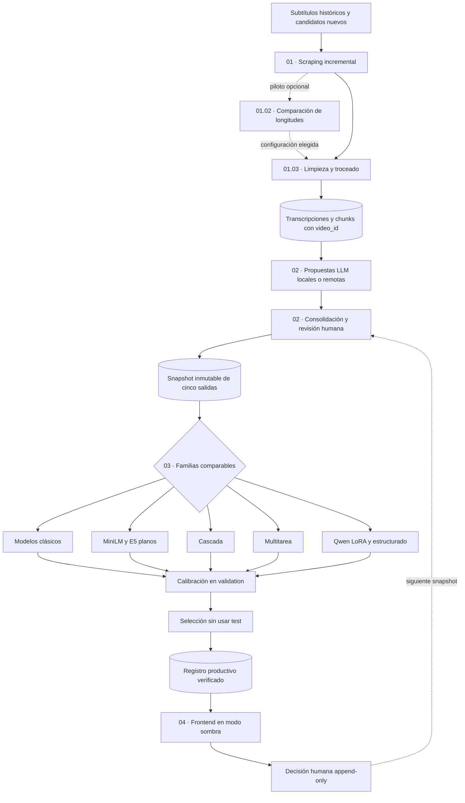
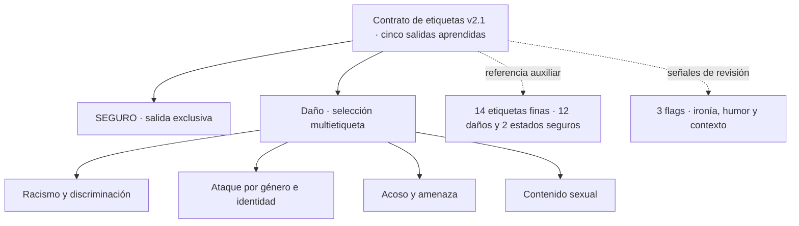

# Moderación semiautomática de videos peruanos de YouTube mediante modelos clásicos y neuronales de procesamiento del lenguaje natural

**Trabajo final del curso de Procesamiento de Lenguaje Natural (PLN) de la Maestría en Inteligencia Artificial de la Universidad Nacional de Ingeniería (UNI) — Semestre 2026-1**

**Grupo 4:** Luis Enrique Koc Góngora, Alex Felipe Mancilla Antay, Herbert Antonio Meléndez García y Dennis Jack Paitán Cano

---

## Resumen

El proyecto construye un asistente de moderación semiautomática para fragmentos de subtítulos de videos peruanos de YouTube. El flujo reúne subtítulos públicos, los limpia y divide en fragmentos con evidencia temporal, propone etiquetas mediante modelos de lenguaje, permite adjudicación humana y entrena varias familias de clasificadores. El sistema prioriza casos y presenta cinco scores al supervisor; no elimina contenido, no sanciona usuarios y no sustituye la decisión humana.

La implementación activa usa el contrato `moderacion_peru_5_salidas_v2`, versión `2.1.0`, con cinco salidas entrenadas: `SEGURO`, `RACISMO_DISCRIMINACION`, `ATAQUE_POR_GENERO_IDENTIDAD`, `ACOSO_AMENAZA` y `CONTENIDO_SEXUAL`. `SEGURO` es mutuamente excluyente con cualquier daño; las cuatro categorías de daño son multietiqueta y pueden coexistir. Los casos sin evidencia suficiente se difieren mediante `needs_review=true` y no forman una sexta clase. Esta combinación, sus umbrales y sus reglas de exclusividad son decisiones operativas locales.

El repositorio separa el flujo activo de la evidencia histórica. Las métricas conservadas en el paper y la presentación corresponden al contrato anterior de cuatro daños con `SEGURO` derivado. El rendimiento del contrato activo de cinco salidas permanece pendiente hasta ejecutar nuevamente el entrenamiento, la calibración y el test; el README no traslada las métricas históricas al contrato nuevo.

## Arquitectura del flujo

El siguiente diagrama resume la relación entre los cuatro bloques implementados en los cuadernos. Los eventos humanos vuelven al corpus como evidencia versionada para el siguiente incremento.



*Figura 1. Flujo activo del repositorio. Cada transición materializa archivos o manifiestos verificables; una entrada sin cambios produce `noop` en lugar de duplicar resultados. La fuente visual relacionada del artículo es [`pipeline_moderacion.tex`](Documento_final_paper/figuras/pipeline_moderacion.tex).*

## Taxonomía operativa

La taxonomía combina antecedentes generales, evidencia peruana o institucional, políticas de plataforma y decisiones operativas del proyecto. Estas categorías sirven al contrato de moderación y no constituyen tipos jurídicos ni una taxonomía validada por expertos peruanos.



*Figura 2. Contrato de salida. `SEGURO` tiene ejemplos, score, umbral y métricas propios; nunca puede coexistir con una categoría de daño. La figura académica reproducible se conserva en [`datos_taxonomia.tex`](Documento_final_paper/figuras/datos_taxonomia.tex).*

| Salida | Alcance operativo resumido | Etiquetas finas asociadas |
|---|---|---|
| `SEGURO` | Fragmento evaluable sin ninguno de los cuatro daños cubiertos | `seguro`, `seguro_ironia_marcada` |
| `RACISMO_DISCRIMINACION` | Inferiorización o exclusión por racialización, etnia, lengua, procedencia o asociación clasista racializada | cinco fenómenos finos |
| `ATAQUE_POR_GENERO_IDENTIDAD` | Daño dirigido por género, orientación sexual, identidad o expresión de género | misoginia/acoso por género y homofobia/transfobia |
| `ACOSO_AMENAZA` | Ataque personal, hostigamiento o anuncio plausible de daño | acoso personal y amenaza directa |
| `CONTENIDO_SEXUAL` | Contenido sexual explícito, cosificación o contenido sexual no consentido | tres fenómenos finos |

Las definiciones, inclusiones, exclusiones, contraejemplos y fuentes se encuentran en [`config/taxonomia_v2.json`](config/taxonomia_v2.json), [`docs/TAXONOMIA_V2.md`](docs/TAXONOMIA_V2.md) y [`docs/MATRIZ_EVIDENCIA_TAXONOMIA.md`](docs/MATRIZ_EVIDENCIA_TAXONOMIA.md).

## Qué realiza cada etapa

### 01 · Scraping, limpieza y troceado

| Cuaderno | Entrada | Proceso y salida | Repetición |
|---|---|---|---|
| `01_01_scraping_incremental` | snapshots, particiones por canal, VTT locales, caché y candidatos con `video_id` | consolida JSON/VTT, calcula los VTT faltantes, ejecuta primero su backfill y después adquiere candidatos nuevos con `yt-dlp` | cada VTT y JSON por canal es un checkpoint reanudable; la versión actual usa `DISCOVER_NEW=False`, `FETCH_NEW=True` y `BACKFILL_MISSING_VTT=True` |
| `01_015_ampliacion_dirigida_minorias` | campaña consolidada, eventos superiores, snapshot previo y rendimiento histórico por canal PE | proyecta la última decisión efectiva y estima canales/videos para superar 2.000 chunks por daño en `train` | campaña opcional separada; compuerta PE estricta, margen de canales y split estable; nunca modifica `01_01` |
| `01_02_optimizacion_longitud_chunks` | chunks etiquetados, transcripciones y snapshot entrenable | compara 15/20/25/30/35 s mediante un perfil clásico decisorio y un perfil neuronal robusto pareado con MiniLM congelado y Gemma 3 4B | opcional y reanudable; las familias neuronales son confirmatorias, nunca se promedian entre sí ni cambian datos si `APPLY_CHUNK_SELECTION=False` |
| `01_03_limpieza_troceado_incremental` | partes JSONL por canal, VTT locales + `config/chunking.json` | recompone el canónico, recupera VTT sin JSON y crea chunks temporales deterministas con barra por video | compara transcripción y firma completa; el modo normal es incremental y `REBUILD_CHUNKS_FROM_ZERO=True` crea respaldo antes de reconstruir |

La adquisición restaura la técnica estable del cuaderno histórico: `yt-dlp` escribe únicamente VTT manuales o automáticos en almacenamiento temporal, se elige la pista más completa y se exige un mínimo de 200 caracteres. `youtube-transcript-api` se usa solo como respaldo. No se descarga video ni audio ni se ejecuta reconocimiento automático del habla. El identificador de video, el hash de la transcripción, la versión y la firma de configuración del troceador impiden repetir trabajo ya materializado. El corte consolidado del 7 de agosto contiene 5.002 transcripciones y 166.940 chunks v2.2; criterios, cobertura, excepciones y distribución descriptiva están en [Consolidación y materialización reproducible de chunks](docs/MATERIALIZACION_TROCEADO.md).

El versionado no es global: `v2.1` identifica el contrato de etiquetas de cinco salidas y `v2.2.0` el troceador vigente. Modificar la materialización de chunks no cambia automáticamente la taxonomía, y por ello las referencias al contrato v2.1 se conservan deliberadamente.

`01_02` está separado de la materialización porque elegir longitud es selección de hiperparámetros. El smoke test y la confirmación corta permanecen como diagnósticos opcionales. La decisión principal corresponde al perfil clásico: 300/100/100 videos por cohorte, cinco cohortes, 75 ajustes y 1 000 réplicas bootstrap agrupadas por `video_id`. Compara las cinco longitudes contra la referencia predeclarada de 30 s con margen de no inferioridad de 0.01 AP y reserva `test` para descripción. El perfil neuronal, activado con `RUN_NEURAL_ROBUST_TEST=True`, conserva exactamente `CANDIDATE_SECONDS=(15,20,25,30,35)`: ajusta 25 cabezas logísticas sobre MiniLM congelado y solicita 500 respuestas de `gemma3:4b` con [`config/prompt_operacional_ollama_v2.md`](config/prompt_operacional_ollama_v2.md). Ambas familias usan el mismo panel pareado de 100 anclas de `validation`, cinco cohortes de reporte y 2 000 réplicas bootstrap por video. MiniLM aporta AP continua; Ollama aporta F1 con etiquetas duras y una compuerta de validez de esquema. Esas métricas no se promedian ni sustituyen la selección clásica. El panel MiniLM inicial fue inconcluso y Ollama produjo 474/500 salidas válidas, con 15, 20 y 25 s bajo la compuerta de 0.95. El contraste complementario `RUN_MINILM_20_30_NONINFERIORITY_TEST=True` usó 750 videos con predicción fuera de pliegue y estableció no inferioridad de 20 s —AP 0.492 frente a 0.468; `ΔAP=0.024`, IC 95% `[−0.0090, 0.059]`—, pero no superioridad. La síntesis conserva 30 s. El perfil clásico vigente obtuvo AP `0.1233`, IC bootstrap 95% `[0.1099, 0.1446]`, y dejó 30 s como única alternativa no inferior. La metodología clásica está en [Informe de selección de longitud](docs/OPTIMIZACION_LONGITUD_CHUNKS.md), la triangulación en [Robustez neuronal de la longitud](docs/ROBUSTEZ_NEURONAL_LONGITUD_CHUNKS.md) y el cierre bibliográfico en [Auditoría de citas de 01_02](docs/AUDITORIA_CITAS_01_02.md).

Para toda inferencia nueva, la versión operativa vigente es
[`config/prompt_operacional_ollama_v3_2.md`](config/prompt_operacional_ollama_v3_2.md).
Las referencias a v2 en resultados ya ejecutados se conservan únicamente como
trazabilidad histórica de esas corridas.

Durante `01_01`, primero se consolidan en el canónico todas las transcripciones completas disponibles en snapshots, particiones por canal, cachés y VTT locales recuperables. También se regenera el índice VTT y se calcula la diferencia exacta por `video_id`: el backfill de VTT conocidos se procesa antes que los candidatos nuevos. Los datasets y chunks históricos con texto no se presentan como raw, pero sus `video_id` se excluyen para impedir descargas duplicadas. El checkpoint actual registra 5.002 transcripciones, 4.968 VTT para 4.952 videos y 57 videos canónicos todavía sin VTT; la cohorte dirigida mantiene 141 candidatos sin éxito ni fallo, por lo que adquisición disponible y cola descubierta no son el mismo conteo. Una barra muestra la fuente actual y avanza al terminar cada canal o consulta; otras informan el backfill y los candidatos. El descubrimiento aplica un timeout HTTP configurable de 30 segundos por operación y guarda atómicamente cada fuente terminada en `datos/raw/manifests/discovery_<modo>_checkpoint.json`. Al reanudar, reutiliza las fuentes exitosas sin red y vuelve a intentar únicamente las fallidas. El modo `directed` calcula déficits por videos etiquetados de `train+validation`, estima rendimiento histórico por canal, expande canales desde búsquedas temáticas y materializa una cohorte vigente con *round-robin* ponderado; si no hay datos previos, reparte la adquisición por igual entre los cuatro daños. Con `MAX_DIRECTED_CANDIDATES=None`, `MAX_VTT_BACKFILL=None` y `MAX_NEW_VIDEOS=None` se recorren las colas completas. La cola de descarga usa una prioridad pseudoaleatoria reproducible e intercala un video por canal. La red se regula en lotes de 10, con una pausa adicional de 15 segundos entre lotes y pausas internas de 2.5–10 segundos en `yt-dlp`. El detalle queda en `datos/raw/fallos_descubrimiento_ultima_ejecucion.json`, `datos/raw/fallos_vtt_backfill.jsonl` y `datos/raw/fallos_adquisicion.jsonl`.

`01_015` es una campaña aparte para corregir el desbalance observado después de la revisión. El snapshot vigente deja en `train` 1.826 chunks de `RACISMO_DISCRIMINACION`, 1.568 de `ATAQUE_POR_GENERO_IDENTIDAD`, 5.255 de `ACOSO_AMENAZA` y 2.568 de `CONTENIDO_SEXUAL`; faltan, por tanto, 174 y 432 en las dos clases minoritarias. El cuaderno estima el número de canales y videos a partir de chunks positivos por video observados en el mismo tipo de canales dirigidos, descuenta ese rendimiento, agrega un factor de seguridad de 1,5 y suma 25 % de canales de margen. En el corte actual recomienda cuatro canales PE curados —tres de núcleo y uno de margen— y 311 candidatos: 239 de `train`, 36 de `validation` y 36 de `test`; estos valores se recalculan al ejecutar. Los demás canales del catálogo PE curado se mantienen como reserva para completar el presupuesto cuando el núcleo ya no ofrece suficientes videos inéditos. Una compuerta previa a la descarga excluye canales con país distinto de PE y también resultados sin evidencia de origen peruano. La selección guarda una firma de ronda: al reabrir el cuaderno retoma exactamente la cohorte pendiente y omite los videos ya consolidados, sin volver a cubrir los éxitos; sí puede rellenar una deuda de descubrimiento previamente registrada con candidatos PE nuevos. Al cambiar de ronda, todo pendiente que no entre en la nueva selección pasa a `datos/raw/directed_candidates_carryover.jsonl`; la adquisición fusiona ambas colas por `video_id` y vuelve a comprobar canónico, caché y VTT recuperados antes de acceder a la red. Si aun con las reservas no se alcanza el presupuesto, procesa la cohorte parcial y deja el faltante por split en el manifiesto en vez de abortar. Solo calcula una ronda nueva cuando cambian el déficit efectivo o sus parámetros. La consulta o el canal solo deciden qué recuperar: las etiquetas se asignan posteriormente con el prompt operativo.

`yt-dlp` gestiona cabeceras, sesión HTTP, pausas y reintentos. No existe un cortacircuito global: si un video devuelve 429, se excluye únicamente su canal durante esa ejecución, se difieren sus videos posteriores y se continúa con todos los demás canales. Si falta identidad de canal, solo falla ese video. La aleatorización no corrige un bloqueo general de la IP; 429 simultáneos en numerosos canales requieren detener y reanudar más tarde. Éxitos y fallos tienen checkpoints inmediatos, por lo que la siguiente corrida reanuda la cola. La selección, sus fórmulas, los artefactos, el reinicio recuperable y las limitaciones del muestreo se documentan en [Metodología de scraping y adquisición de subtítulos](docs/METODOLOGIA_SCRAPING.md).

### 02 · Etiquetado semiautomático

| Cuaderno | Función | Control principal |
|---|---|---|
| `02_00_preparacion_bundle_colab` | en Colab descarga el bundle sincronizado de GitHub —o recibe el local por navegador—, lo verifica y publica una versión inmutable en Drive | `RUN_PUBLISH_BUNDLE=False`; `BUNDLE_SOURCE='github'` o `'local_upload'` |
| `02_01_etiquetado_deepseek_flash_pro` | recupera 1:1 etiquetas históricas compatibles y ejecuta la cascada remota DeepSeek Flash→Pro con checkpoints atómicos | active en orden `RUN_API_PREFLIGHT`, `RUN_CALIBRATION`, `RUN_PRIMARY` y `RUN_DIRECTED_REVIEW`; use `None` para todos los pendientes |
| `02_02_etiquetado_hf_qwen_colab` | cascada independiente HF–Qwen en Colab: 1.7B→4B | active primero `RUN_PRIMARY` y luego `RUN_REVIEW`; use `None` para completar cada cola |
| `02_03_revision_llm_dirigida` | recupera calibración, enrutamiento y resultados Flash/Pro sin repetir llamadas | tablas reportables y límite inferencial explícito |
| `02_04_consolidacion_validacion_humana` | consolida proveedores y sirve la campaña humana | propuesta visible, revisión compacta, acciones masivas confirmadas y eventos append-only |
| `02_05_cierre_humano_snapshot` | aplica la última decisión humana y congela el dataset | excluye diferidos/rechazados y conserva `video_id`, flags, split y procedencia |

La revisión humana puede aceptar, modificar, diferir o excluir. Una propuesta visible aceptada no se presenta como anotación humana ciega independiente. El frontend impide seleccionar `SEGURO` junto con daño y pseudonimiza al revisor antes de guardar el evento.

#### Estado cuantitativo de la campaña Flash→Pro

Antes de consumir API, `02_01` recuperó por coincidencia exacta y unívoca
52 244 etiquetas Flash históricas y 9 912 Pro; quedaron 114 696 chunks
pendientes de primera pasada. El panel pareado de 1 000 completó ambos modelos
sin errores: Flash tardó 97.250 s (616.969 chunks/min, US$0.073349) y Pro
122.593 s (489.424 chunks/min, US$0.269223). Sus tasas de caché fueron 64.22 %
y 53.72 %, con ahorros medidos de 45.53 % y 37.65 % frente al mismo tráfico sin
caché.

Al checkpoint documentado del 2026-08-08 13:15:01 (UTC−05), Flash había
etiquetado 14 399 pendientes adicionales válidos a 867.279 chunks/min; una
respuesta con identificador u orden alterado fue rechazada. Ese tramo costó
US$0.908781 tras restar la calibración, o US$0.06311 por 1 000 chunks válidos.
Manteniendo ese régimen, la primera pasada se proyectaba en unas 2 h 12 min y
US$7.24; no son cifras finales. El acuerdo Flash–Pro a umbral 0.95 fue
80.41 % exacto y 99.77 % binario daño/seguro, pero el criterio exacto
predeclarado no se alcanzó: es acuerdo entre modelos, no exactitud humana. Vea
la [metodología](docs/METODOLOGIA_ETIQUETADO_CASCADA.md) y el
[corte cuantitativo con fuentes](resultados/ETIQUETADO_CASCADA_CORTE_2026-08-08.md).

Tras detener Pro, el checkpoint preservó 29 270 revisiones y registró
US$4.727523 para 14 079 respuestas nuevas. Con US$5.75 de saldo disponible, la
reanudación presupuestada acepta con mayor frecuencia la salida segura de Flash:
revisa todo daño, las 36 000 abstenciones de menor confianza y solo seguros por
debajo de 0.85, más un control seguro aleatorio reproducible del 1 %. Quedan
40 695 llamadas Pro se proyectaron entonces en US$13.66. Esa cifra queda como
referencia histórica: el cuaderno actual no exige un saldo mínimo ni impone un
tope artificial; persiste por `chunk_id` y puede continuar con una recarga.

### 03 · Entrenamiento, calibración y comparación

| Cuaderno | Familia o decisión | Resultado materializado |
|---|---|---|
| `03_01_modelos_clasicos` | cinco estimadores con TF-IDF palabra+carácter, en variantes base e informada por política | candidatos de 22 salidas con supervisión enmascarada |
| `03_02_transformers_planos` | MiniLM multilingüe y E5-small multilingüe | checkpoints de 5+14+3 salidas y candidatos planos |
| `03_03_transformer_cascada` | compuerta de cualquier daño con auxiliares, seguida de cuatro salidas de daño | candidato de dos etapas y diagnóstico de propagación |
| `03_03b_transformer_cascada_segura` | compuerta E5 calibrada por recall de daño y NPV segura, seguida de `SEGURO` más cuatro daños | candidato de seguridad primero, fallback a la rama completa y diagnóstico de cobertura |
| `03_04_transformer_multitarea` | cinco salidas principales, 14 etiquetas finas y tres flags auxiliares | candidato multitarea |
| `03_05_qwen_lora` | Qwen3-0.6B-Base con adaptación LoRA y cabeza clasificadora | adaptador y candidato de 22 salidas; no se presenta como prompting |
| `03_06_qwen_estructurado` | Qwen clasificador con penalización del conflicto `SEGURO+daño` | checkpoint estructurado de 22 salidas |
| `03_06b_qwen_prompt_sft` | Qwen3-0.6B conversacional, LoRA causal y cápsula trazable del prompt v3.2 | JSON estricto y candidato realmente condicionado por prompt |
| `03_07_comparacion_final` | individuos, ensembles, diversidad, bootstrap por video y pruebas pareadas | comparación en validation y manifiesto congelado; test/publicación separados |
| `03_08_auditoria_finas_flags` | audita máscaras, cobertura, consistencia y métricas auxiliares observadas | informes del snapshot y de candidatos disponibles |

Los cuadernos `03_01`–`03_06b` completan `fit → calibración/evaluación en validation → manifiesto` y dejan test sellado. `03_07` compara individuos y ensembles, congela candidatos, umbrales y regla; un segundo interruptor infiere una sola vez sobre el test natural completo. Train y validation conservan todo el daño y seleccionan `SEGURO` de forma determinista, aproximadamente proporcional por canal, con ratio 4:1: quedan 51.205/10.600 chunks. Test conserva sus 22.684 chunks y su prevalencia natural. De la misma inferencia se deriva además una vista secundaria determinista 4:1 de 9.010 chunks; no se vuelve a abrir ni ejecutar el modelo. La publicación permanece bloqueada por defecto.

La explicación arquitectónica, los esquemas Mermaid, las diferencias de implementación y una matriz de antecedentes aplicados están en [Arquitecturas de entrenamiento 03_01–03_06b](docs/ARQUITECTURAS_MODELOS_03.md).

Los cuadernos locales aprovechan cuatro hilos de forma acotada: `03_01` reutiliza una extracción TF–IDF por variante entre todos sus modelos y paraleliza las 22 cabezas; `03_07` paraleliza las réplicas bootstrap por video. Ambos registran tiempos por etapa. Los miembros del ensemble se infieren secuencialmente para evitar multiplicar RAM o VRAM.

### 04 · Operación supervisada

`04_01_frontend_produccion` inicia un demostrador local para texto o URL de YouTube. La interfaz permite consultar el mejor clásico, Transformer o Qwen, comparar sus respuestas o aplicar consenso 2-de-3. Muestra las cinco probabilidades, sus umbrales, la evidencia temporal y los motivos que obligan revisión. Un conflicto, una salida vacía o la proximidad a un umbral nunca se convierte automáticamente en `SEGURO`.

El [frontend humano](flujo/02_etiquetado/frontend/validacion_humana.html) permite revisar campañas, conservar contexto y reanudar el trabajo. El [frontend productivo](flujo/04_produccion/frontend/produccion.html) opera en modo sombra, reutiliza el caché de subtítulos y registra decisiones humanas para análisis o reentrenamiento posterior. La [matriz de paridad](docs/PARIDAD_FRONTENDS_ACTIVOS.md) contrasta todas las funciones históricas mínimas y delimita las capturas aún pendientes.

## Estructura del repositorio

```text
config/                         taxonomía, Colab y disponibilidad de artefactos
docs/                           metodología de scraping, contratos, hardware, orden y trazabilidad
src/moderacion_peru/            implementación reutilizable y CLI modperu
flujo/01_datos/                 adquisición, limpieza y ampliación
flujo/02_etiquetado/            LLM, consolidación y validación humana
flujo/03_entrenamiento/         familias de modelos, comparación y auditoría
flujo/04_produccion/            demostrador supervisado
datos/                          fuentes, snapshots y vistas canónicas
modelos/                        candidatos, checkpoints y registro activo
resultados/                     comparaciones, manifiestos y bundle Colab
tools/                          scripts de generación, auditoría y preparación de Colab
tests/                          pruebas automáticas del contrato y del flujo
archivo/                        evidencia histórica, no usada como flujo activo
Documento_final_paper/          artículo, bibliografía y figuras reproducibles
Presentación_BEAMER/            presentación derivada del artículo
Planning/                       plan de reorganización ejecutado
```

Los 19 cuadernos vigentes se encuentran exclusivamente bajo `flujo/`. Las
carpetas locales `archivo/03_2_etiquetado_llm_api/` y
`archivo/05_frontend_despliegue/` pertenecen a implementaciones anteriores y no
son etapas del recorrido activo.

Los resultados preliminares de los cuadernos se muestran mediante el componente común `src/moderacion_peru/notebook_ui.py`: tarjetas de estado, tablas clave–valor, vistas tabulares limitadas y bloques de comandos. Los 19 cuadernos activos evitan `print()` para mantener una salida legible y homogénea; los artefactos completos permanecen en JSON, JSONL o manifiestos y no dependen de la representación visual.

## Reproducción local desde una clonación nueva

### 1. Requisitos

- Git.
- Python 3.11, 3.12 o 3.13; se recomienda Python 3.12.
- VS Code con las extensiones Python y Jupyter, o JupyterLab mediante el extra `cuadernos`.
- `DEEPSEEK_API_KEY` para la campaña principal de `02_01`; el fallback local de `02_02` requiere Transformers y GPU recomendable, pero no Ollama ni LM Studio.
- PyTorch instalado para el backend de entrenamiento elegido. El proyecto acepta `auto`, `cuda`, `rocm`, `xpu` y `cpu`; consulte [`docs/HARDWARE.md`](docs/HARDWARE.md) antes de instalar una rueda específica.
- Espacio adicional para datos, cachés y checkpoints. Los pesos neuronales y varios artefactos generados no se almacenan en Git.

### 2. Clonar y crear un entorno aislado

En PowerShell:

```powershell
git clone https://github.com/lkoc/Trabajo_PLN-MIA-Grupo4.git
Set-Location Trabajo_PLN-MIA-Grupo4
py -3.12 -m venv .venv
.\.venv\Scripts\python.exe -m pip install --upgrade pip
.\.venv\Scripts\python.exe -m pip install -e ".[datos,etiquetado,cuadernos,dev]"
```

La ruta `.venv\Scripts` **no es una carpeta versionada del proyecto**. El comando `py -3.12 -m venv .venv` la crea automáticamente en Windows dentro del repositorio clonado. Si todavía no aparece, la creación del entorno no se ejecutó o terminó con error. Los scripts mantenidos por el proyecto se encuentran en [`tools/`](tools/).

La instalación editable crea el comando de consola declarado en `pyproject.toml`. En Windows se genera como `.venv\Scripts\modperu.exe`; en Linux y macOS se genera como `.venv/bin/modperu`, sin extensión `.exe`. De forma general, `.venv/bin` es el equivalente de `.venv\Scripts` en esos sistemas.

En Linux o macOS:

```bash
git clone https://github.com/lkoc/Trabajo_PLN-MIA-Grupo4.git
cd Trabajo_PLN-MIA-Grupo4
python3.12 -m venv .venv
./.venv/bin/python -m pip install --upgrade pip
./.venv/bin/python -m pip install -e '.[datos,etiquetado,cuadernos,dev]'
```

### 3. Instalar PyTorch y el extra de entrenamiento

PyTorch no se fija como dependencia universal porque CUDA, ROCm, XPU y CPU requieren distribuciones distintas. Instale primero en `.venv` la distribución correspondiente a su sistema siguiendo [`docs/HARDWARE.md`](docs/HARDWARE.md) y el selector oficial enlazado allí. Después complete el entorno:

```powershell
.\.venv\Scripts\python.exe -m pip install -e ".[entrenamiento]"
.\.venv\Scripts\python.exe -c "import torch; print(torch.__version__); print(torch.cuda.is_available())"
```

La segunda línea solo comprueba la interfaz CUDA de PyTorch. En AMD/ROCm, `torch.version.hip` distingue el backend; en Intel, `torch.xpu.is_available()` informa XPU. `modperu preflight` realiza la detección completa y registra el motivo de cualquier fallback. Los modelos clásicos y las auditorías pueden ejecutarse sin acelerador neuronal.

### 4. Configurar Ollama

Ollama expone la API local en `http://127.0.0.1:11434`. Los tres modelos del piloto se preparan con:

```powershell
ollama pull qwen3.5:4b
ollama pull qwen3.5:9b
ollama pull gemma3:4b
ollama list
```

El adaptador llama a la API HTTP de Ollama y exige JSON conforme al esquema de anotación. Si Ollama, el modelo o la API no están disponibles, la corrida falla de forma explícita y conserva el punto de reanudación.

La campaña activa reproduce el esquema histórico económico Flash→Pro. Configure `DEEPSEEK_API_KEY` fuera del repositorio —o como secreto de Colab— y active cada fase explícitamente en `02_01`. El preflight consulta `/models` sin enviar corpus; las fases de calibración y etiquetado sí transmiten texto al proveedor. Flash y Pro usan `thinking=disabled`, solicitan JSON, validan el contrato `annotations` y muestran velocidad, caché, costo acumulado y saldo periódico. Nunca guarde credenciales en un cuaderno, `.env` versionado, Drive o manifiesto. El método, la comparación económica y los artefactos reportables están en [`docs/METODOLOGIA_ETIQUETADO_CASCADA.md`](docs/METODOLOGIA_ETIQUETADO_CASCADA.md).

### 5. Verificar entorno, contrato y artefactos

```powershell
.\.venv\Scripts\modperu.exe preflight
.\.venv\Scripts\modperu.exe validate
.\.venv\Scripts\modperu.exe artifacts
```

`preflight` informa la raíz, taxonomía, backend, memoria, versión de PyTorch, estado de Ollama y artefactos presentes. `artifacts` distingue archivos disponibles de archivos que deben recuperarse o producirse. Una ausencia no se oculta ni se reemplaza con métricas históricas.

Una clonación nueva contiene código, configuración, cuadernos y evidencia histórica versionada, pero no garantiza la presencia de las vistas canónicas, checkpoints o registro productivo ignorados por Git. Para repetir exactamente un snapshot existente se deben recuperar los artefactos de acceso controlado y comprobarlos contra sus manifiestos. Para reconstruirlos, se ejecuta el recorrido `01 → 02`; la adjudicación histórica solo puede reproducirse de forma idéntica si también se dispone de sus eventos humanos originales. `modperu artifacts` identifica estas diferencias antes de iniciar una corrida costosa.

La raíz se encuentra automáticamente mediante `pyproject.toml`. En una ejecución externa puede fijarse sin editar cuadernos:

```powershell
$env:MODPERU_ROOT = (Get-Location).Path
```

`MODPERU_ROOT` es opcional cuando el proceso comienza dentro del repositorio. `MODPERU_ARTIFACT_ROOT` está reservado para consumidores que usan el helper `artifact_root`; no reubica por sí solo los datasets, modelos o rutas canónicas declaradas por los cuadernos.

### 6. Abrir y ejecutar los cuadernos

Desde VS Code, abra la carpeta clonada, seleccione como kernel el Python de `.venv` y ejecute los cuadernos en el orden de [`docs/ORDEN_EJECUCION.md`](docs/ORDEN_EJECUCION.md). También puede iniciar JupyterLab:

```powershell
.\.venv\Scripts\jupyter-lab.exe
```

El recorrido completo contiene 21 cuadernos:

```text
01_01 → 01_015 ampliación minoritaria opcional → 01_02 opcional → 01_03
→ 02_00 en Colab → 02_01 (calibración→Flash→Pro) → 02_02 fallback opcional → 02_03 auditoría → 02_04 → 02_05 → 02_00 en Colab
→ 03_01 ... 03_06 clasificadores —incluida 03_03b— y 03_06b SFT condicionado por prompt en ramas comparables
→ 03_07 → 03_08 → 04_01
```

Antes de una corrida costosa, revise los interruptores deliberados:

| Cuaderno | Interruptor inicial | Acción para ejecutar |
|---|---|---|
| `01_01` | continuación actual: `DISCOVER_NEW=False`, `FETCH_NEW=True`, `BACKFILL_MISSING_VTT=True` | reanuda primero todos los VTT faltantes y después los candidatos; usa lotes de 10, pausas internas de 2.5–10 s y 15 s entre lotes; cambie `FETCH_NEW=False` si solo desea inspeccionar sin red |
| `01_015` | `DISCOVER_NEW=True`, `FETCH_NEW=True`, objetivo 2.000 por daño en `train` | descubre y descarga la cohorte dirigida separada por split; repita después de etiquetar el lote si el déficit efectivo no llegó a cero |
| `01_02` | se reutiliza el clásico; ambos `RUN_...=True`, ambos `FORCE_...=False`, `USE_ROBUST_RECOMMENDATION=True` y `APPLY_CHUNK_SELECTION=False` | prioriza los JSON consolidados y muestra el perfil de cinco longitudes y el cierre MiniLM 20/30 sin recalcular; solo ejecuta una etapa si falta su artefacto |
| `02_00` | `RUN_PUBLISH_BUNDLE=False`, `BUNDLE_SOURCE='github'` | ábralo en Colab; use GitHub si el bundle está sincronizado o `'local_upload'` para seleccionar los nueve archivos locales, active y autorice `drive.mount()` |
| `02_01` | recuperación histórica y checkpoints automáticos activos; cuatro interruptores de API controlan cada fase; panel 1 000, `PRIMARY_LIMIT=None`, `REVIEW_LIMIT=None` para la campaña completa | recupera solo coincidencias exactas 1:1, valida `/models`, ejecuta calibración, Flash y Pro sobre pendientes; `Ctrl+C` conserva grupos terminados y publica el run en Drive cuando esa opción está habilitada |
| `02_02` | `RUN_FALLBACK=False`, `LIMIT=20` | active solo si necesita un diagnóstico local independiente; `None` procesa todos los pendientes |
| `03_01`–`03_06b` | `RUN_TRAINING=False`; ratio `SEGURO`/daño = 4:1 en train/validation; test natural completo | active la familia; `03_07` reutiliza una inferencia de test para las vistas natural y 4:1 |
| `03_07` | `RUN_COMPARE_AND_FREEZE=False`, `RUN_TEST_ONCE=False`, `RUN_PUBLISH=False` | compare/congele, revise evidencia, abra test una vez; publicación sigue bloqueada hasta aprobación posterior |

`03_01`–`03_06b` no forman una cadena: son alternativas comparables. `03_05`/`03_06` son clasificadores supervisados; solo `03_06b` recibe el prompt como condición de entrada. `03_07` requiere candidatos completos del mismo snapshot y rechaza cualquiera que haya abierto test antes de congelar.

### 7. Reconciliar, entrenar y publicar mediante la CLI

Los puentes principales también tienen comandos reproducibles. Los cuadernos siguen siendo la narración ejecutable recomendada, mientras la CLI facilita automatización y pruebas:

```powershell
.\.venv\Scripts\modperu.exe prepare-training
.\.venv\Scripts\modperu.exe train classical
.\.venv\Scripts\modperu.exe train flat --device auto
.\.venv\Scripts\modperu.exe train cascade --device auto
.\.venv\Scripts\modperu.exe train multitask --device auto
.\.venv\Scripts\modperu.exe train qwen_lora --device auto
.\.venv\Scripts\modperu.exe train qwen_structured --device auto
.\.venv\Scripts\modperu.exe publish-model
```

Cada experimento registra la firma del dataset y la configuración. Si el candidato y su manifiesto ya están completos, una segunda ejecución devuelve `status="noop"`. `--force` debe reservarse para una repetición deliberada de la misma firma.

### 8. Ejecutar los frontends

Después de `02_04`, el frontend humano puede iniciarse con la campaña consolidada:

```powershell
.\.venv\Scripts\modperu.exe serve-labeling `
  --campaign datos/etiquetado/consolidado/anotaciones_v2.jsonl
```

Abra <http://127.0.0.1:8765/> para revisar chunks o
<http://127.0.0.1:8765/dashboard> para consultar el dashboard vivo de cobertura,
categorías, exclusiones, colas, canales, desbalance, actividad y métricas de la
auditoría estratificada. Ambas páginas pertenecen al mismo proceso y comparten
la última decisión efectiva; el dashboard también está enlazado desde la
cabecera de validación.

Después de entrenar y publicar con `03_07`, el frontend productivo se inicia con:

```powershell
.\.venv\Scripts\modperu.exe serve-production `
  --registry modelos/registro_modelos_5_salidas.json
```

Ambos servidores escuchan por defecto en `127.0.0.1:8765`. Los eventos se guardan en JSONL append-only. Después de actualizar el código del servidor debe reiniciarse el proceso; la persistencia append-only evita perder decisiones. El frontend productivo rechaza la inferencia si no existe un registro del contrato de etiquetas v2.1 cuyos checkpoints y hashes puedan verificarse. Fuera de loopback exige `MODERATOR_ACCESS_PASSWORD` y admite `MODERATOR_ACCESS_USER`.

### 9. Comprobar la reproducción

```powershell
.\.venv\Scripts\python.exe -m pytest
.\.venv\Scripts\python.exe tools/audit_project.py
.\.venv\Scripts\python.exe tools/generate_workflow_notebooks.py
```

Las pruebas comprueban esquemas, exclusividad de `SEGURO`, migración, precedencia humana, idempotencia, archivado reversible por longitud, proveedores, entrenamiento, registro, frontends, citas y carátulas académicas. El auditor revisa los 21 cuadernos, sus referencias finales, enlaces Markdown, rutas, nombres de taxonomía y metadatos.

El artículo y la presentación se recompilan de forma independiente:

```powershell
Set-Location Documento_final_paper
latexmk -pdf -interaction=nonstopmode -halt-on-error paper_moderador_contenido_youtube_ieee.tex
Set-Location ..\Presentación_BEAMER
latexmk -pdf -interaction=nonstopmode -halt-on-error presentacion_grupo4.tex
```

Una compilación correcta no sustituye la revisión visual del PDF A4 ni de las diapositivas.

## Incrementar la muestra sin reiniciar

Para incorporar videos o subtítulos adicionales:

1. añada candidatos con `video_id` y URL a `datos/raw/videos_candidatos.csv` o al JSONL de candidatos;
2. ejecute nuevamente `01_01` y `01_03`; si el objetivo es elevar daños minoritarios, ejecute `01_015` antes de `01_03`; este último recompone `transcripts_raw.jsonl` desde los JSON por canal y VTT locales, muestra avance por video y procesa solo hashes nuevos o modificados; `01_02` solo se repite si desea reevaluar o cambiar la longitud;
3. regenere los cuadernos; el generador reconstruirá el bundle si cambió. Sincronícelo con GitHub —o elija `COLAB_BUNDLE_SOURCE="local_upload"`— y ejecute `02_01`, cuyo bootstrap publicará el release automáticamente si hace falta; después complete la calibración y cascada Flash→Pro, audítela en `02_03` y cierre `02_04`–`02_05` para los chunks pendientes;
4. regenere los cuadernos después de `02_05`; al abrir cualquier entrenamiento Colab, su bootstrap publicará en Drive el snapshot nuevo solo si todavía falta;
5. active las familias de `03` que desea actualizar;
6. publique de nuevo solo cuando `03_07` encuentre candidatos completos del snapshot nuevo.

El flujo omite videos conocidos, reutiliza subtítulos y cachés, y recorre todos los candidatos pendientes por lotes. Cada pista VTT se conserva inmediatamente en `datos/raw/vtt_by_video/` antes de continuar y cada fallo se registra; una interrupción no obliga a repetir los éxitos anteriores. `BACKFILL_MISSING_VTT=True` trata por separado los JSON ya canónicos cuyo VTT falta. `01_03` nunca borra VTT: solo los lee para recuperar representaciones JSON faltantes. Después conserva las asignaciones de split por `video_id` y reanuda anotaciones por `chunk_id`. Una reconstrucción total cambia los IDs heredados si cambia la versión o firma del troceador; en ese caso se debe ejecutar de nuevo `02_01`–`02_05`, no trasladar etiquetas por posición. Un incremento crea otro snapshot inmutable que combina datos anteriores y nuevos. Los modelos neuronales pueden reanudar una interrupción o inicializar el run nuevo desde un candidato compatible anterior; nunca se entrena únicamente con el lote nuevo olvidando el corpus previo.

### Continuar el flujo desde otra máquina

Git conserva `datos/raw/vtt_by_video/`, `datos/raw/transcripts_by_channel/`, candidatos, fallos y manifiestos de adquisición, además del bundle comprimido de Colab. El JSONL monolítico `transcripts_raw.jsonl`, `transcripts_cache/`, los chunks y el dataset sin comprimir siguen siendo artefactos locales: el primero se recompone desde las particiones por canal; caché no es necesaria; y los dos últimos se restauran desde el bundle verificado. Ninguna restauración borra filas existentes del canónico.

Después de clonar y preparar el entorno:

```powershell
python tools/restore_synced_checkpoints.py
```

El comando verifica los SHA-256 de `datos/raw/transcripts_by_channel/index.json`, cada entrada de `datos/raw/vtt_by_video/index.json` y `resultados/colab_bundle/bundle_manifest.json`; reconstruye el canónico de forma idempotente y descomprime atómicamente chunks y dataset en sus rutas esperadas. Los cuadernos `03_01`–`03_08` repiten la verificación del dataset antes de usarlo: si falta, lo restauran; si existe con otro hash, se detienen en vez de sobrescribirlo.

Cuando `02_05` produzca un snapshot nuevo, vuelva a generar los cuadernos: el generador detecta el cambio y reconstruye `resultados/colab_bundle`. Sincronícelo con GitHub o seleccione `COLAB_BUNDLE_SOURCE="local_upload"` en el propio cuaderno consumidor. Cada cuaderno Colab verifica el `bundle_id` y todos los SHA-256 y, solo si falta el release esperado, publica `bundle_releases/<bundle_id>` y actualiza atómicamente `latest.json`. `02_00` queda disponible como publicador manual opcional, no como paso obligatorio.

El dataset actual baja de aproximadamente 104,2 MiB a 20,3 MiB con gzip nivel 9, por lo que un único archivo comprimido es más simple y está holgadamente bajo los límites por archivo. Si una versión futura se aproxima a 45–50 MiB comprimidos, se deberá particionar primero por `split` y luego en partes numeradas, manteniendo un manifiesto único. El repositorio remoto es público: versionar estos checkpoints publica también el texto de los subtítulos y exige revisar licencias, términos de la plataforma y datos personales antes de hacer `push`.

## Google Colab L4 desde VS Code

Los cuadernos `03_02`–`03_06b`, y opcionalmente `02_01`, incluyen el puente a Colab. La cascada API de `02_01` no usa la GPU asignada; la L4 solo es necesaria para modelos locales/neuronales. Cada bootstrap detecta si Drive carece del release esperado, descarga el bundle sincronizado desde GitHub —o recibe `local_upload`—, verifica su identidad, lo publica atómicamente y activa la versión antes de importar el proyecto. `02_00_preparacion_bundle_colab.ipynb` conserva la misma operación como alternativa manual. No requiere Google Cloud Console ni Drive Desktop y no transfiere videos, audio, PDFs, modelos Ollama ni cachés de Hugging Face.

La preparación, verificación SHA-256, reanudación por `COLAB_RUN_ID` y recuperación de resultados se describen en [`docs/COLAB_L4.md`](docs/COLAB_L4.md). El backend L4 falla explícitamente si Colab asigna una GPU distinta cuando `COLAB_REQUIRE_L4=True`.

## Artefactos, trazabilidad y estado de resultados

| Artefacto | Función |
|---|---|
| `datos/raw/transcripts_raw.jsonl` | vista canónica de transcripciones |
| `datos/raw/transcripts_by_channel/*.jsonl` | checkpoint sincronizable, pequeño e idempotente por canal |
| `datos/raw/vtt_by_video/*.vtt` | checkpoint sincronizable de pistas WebVTT, deduplicado por `video_id` y nombre de pista |
| `datos/processed/chunks_v2.jsonl` | fragmentos con evidencia temporal |
| `datos/processed/chunk_materialization_manifest.json` | conteos, cobertura, estadística descriptiva, hashes y respaldo del troceado activo |
| `datos/etiquetado/**` | propuestas, campañas y eventos humanos |
| `datos/model_ready/v2/snapshots/<id>/` | datasets entrenables inmutables |
| `modelos/v2/**/candidate.json` | candidatos con configuración y métricas |
| `modelos/registro_modelos_5_salidas.json` y `.<slot>.json` | registro principal y mejores clásico/Transformer/Qwen autorizados para consulta, comparación y consenso |
| `resultados/**` | comparaciones, auditorías y manifiestos |
| `resultados/colab_bundle/*.{gz,zip}` | checkpoint comprimido y verificable para restauración/Colab |
| `archivo/` | contratos, cuadernos y métricas históricas preservadas |

Cada snapshot y run registra hashes, versión de taxonomía, código, parámetros, hardware, insumos y salidas. [`config/artifacts.json`](config/artifacts.json) declara los artefactos esperados y cómo recuperarlos. [`docs/MATRIZ_TRAZABILIDAD.md`](docs/MATRIZ_TRAZABILIDAD.md) relaciona afirmaciones, fuentes y artefactos.

Los resultados históricos siguen disponibles como línea base ejecutada, pero no demuestran el rendimiento de `SEGURO` como salida aprendida. El registro productivo v2 solo aparece después de completar `03_07`; su ausencia se informa y no se sustituye por un modelo histórico.

## Alcance ético y operativo

El sistema procesa texto de subtítulos públicos y puede exponer al revisor a contenido sensible. El flujo minimiza datos, pseudonimiza revisores y mantiene control humano. Por decisión operativa, la sugerencia LLM se muestra desde el inicio para acelerar la revisión; esta elección aumenta el riesgo de anclaje y no convierte la propuesta en verdad humana. Las acciones masivas muestran el alcance, exigen confirmación y dejan eventos trazables por video o canal. El acceso público a un video no implica permiso universal para redistribuir sus subtítulos; código, corpus, modelos base, adaptadores y recursos visuales conservan condiciones separadas.

El uso defendible es investigación aplicada, demostración local o modo sombra. La validación del frontend demuestra integración y trazabilidad, no eficacia para moderación autónoma ni validez jurídica.

## Documentación académica y técnica

- [Orden exacto de ejecución](docs/ORDEN_EJECUCION.md)
- [Contratos de datos](docs/CONTRATOS_DATOS.md)
- [Consolidación y materialización reproducible de chunks](docs/MATERIALIZACION_TROCEADO.md)
- [Taxonomía y definiciones](docs/TAXONOMIA_V2.md)
- [Evidencia bibliográfica de la taxonomía](docs/MATRIZ_EVIDENCIA_TAXONOMIA.md)
- [Hardware local y aceleradores](docs/HARDWARE.md)
- [Ejecución en Colab L4](docs/COLAB_L4.md)
- [Auditoría de citas de cuadernos](docs/AUDITORIA_CITAS_CUADERNOS.md)
- [Artículo IEEE](Documento_final_paper/paper_moderador_contenido_youtube_ieee.pdf)
- [Presentación Beamer](Presentación_BEAMER/presentacion_grupo4.pdf)

El artículo y el Beamer contienen la discusión académica, las figuras reproducibles y los resultados históricos con sus límites. Este README funciona como resumen técnico y guía de reproducción del flujo activo.
