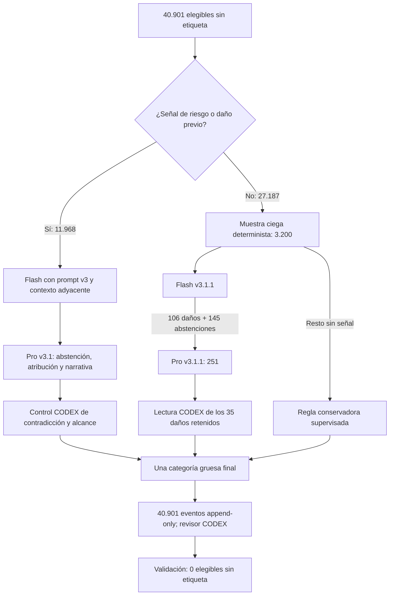

# Adjudicación de chunks sin etiqueta — CODEX, 9 de agosto de 2026

**Estado:** aplicado al historial canónico append-only  
**Revisor:** `CODEX`  
**Marco:** supervisión human-in-the-loop con criterios aportados durante la interacción humana  
**Prompt final:** `config/prompt_operacional_ollama_v3_1.md`, versión 3.1.1  
**Lote:** `CODEX-UNLABELED-PROMPT-V3_1_1-20260809`

Este documento es un anexo operativo de
`docs/AUDITORIA_MUESTRAL_ETIQUETADO_10PCT_CODEX_SOL_2026-08-09.md`. Describe la
resolución posterior de todos los chunks que seguían sin categoría gruesa y no
estaban excluidos. Las cantidades proceden exclusivamente de artefactos locales
del proyecto; las ideas externas se identifican expresamente.

## 1. Resultado ejecutivo

Se identificaron y resolvieron **40.901** chunks elegibles sin etiqueta:

| Procedencia de la fila consolidada | Chunks |
|---|---:|
| DeepSeek V4 Pro | 29.796 |
| DeepSeek V4 Flash | 11.105 |
| **Total** | **40.901** |

Se anexaron **40.901 eventos** `modify`, todos con `reviewer="CODEX"`, sin
colisiones de `event_id` y sin sobrescribir eventos anteriores. El resultado
del lote fue:

| Combinación final | Chunks |
|---|---:|
| `SEGURO` | 39.082 |
| Alguna categoría de daño | 1.819 |
| **Total** | **40.901** |

Como las categorías de daño son multietiqueta, sus totales se solapan:

| Categoría gruesa | Chunks del lote |
|---|---:|
| `ACOSO_AMENAZA` | 900 |
| `CONTENIDO_SEXUAL` | 569 |
| `RACISMO_DISCRIMINACION` | 355 |
| `ATAQUE_POR_GENERO_IDENTIDAD` | 158 |

Después de incorporar el lote, la campaña tiene **166.940** filas, **9.221**
excluidas efectivamente y **157.719** elegibles. La comprobación independiente
encontró **0 chunks elegibles sin etiqueta**. Los conteos efectivos de toda la
campaña son 144.834 `SEGURO`, 7.237 `ACOSO_AMENAZA`, 3.662
`CONTENIDO_SEXUAL`, 2.506 `RACISMO_DISCRIMINACION` y 2.185
`ATAQUE_POR_GENERO_IDENTIDAD`; el total por categoría supera el número de
chunks porque el daño admite multietiqueta.

## 2. Metodología jerárquica

La interacción humana estableció los criterios, corrigió la interpretación de
jerga peruana, exigió separar uso de mención y definió que las decisiones de
`CODEX` son referenciales y posteriormente revocables. `CODEX–Sol`, con nivel
de razonamiento extra-high solicitado, actuó como supervisor: reutilizó
evidencia Flash/Pro, dirigió nuevas consultas, leyó los casos contradictorios y
materializó la decisión final.

La jerarquía aplicada fue:

1. recuperar propuestas y justificaciones históricas de Flash y Pro;
2. formar una cola dirigida de 11.968 casos por daño previo o señales
   lingüísticas peruanas sexuales, identitarias, amenazantes o degradantes;
3. procesar 11.967 con Flash v3 y resolver el único error por la ruta Pro;
4. volver a evaluar con Pro 1.035 casos de abstención/atribución, 798 con
   atribución textual oculta y 327 con señales amplias de noticia, relato,
   audio, cita o testimonio;
5. tomar una muestra ciega determinista de 3.200 de los 27.187 casos sin señal
   dirigida ni propuesta previa: **11,770 %** de ese estrato;
6. enviar a Pro los 106 daños y 145 abstenciones de esa muestra; Pro produjo
   138 seguros, 78 nuevas abstenciones y 35 daños;
7. revisar semánticamente los 35 daños: CODEX corrigió seis etiquetas completas
   y una categoría parcial;
8. en toda evidencia vacía, asignar `SEGURO` como decisión conservadora de
   cobertura, porque no había evidencia afirmativa suficiente de daño. El
   método exacto queda en las notas de cada evento y no se presenta como una
   lectura humana individual de 24 mil textos.

La prevalencia de evidencia fue: Pro v3.1.1 sobre la muestra ciega, muestra
Flash v3.1.1, Pro de atribución amplio, Pro de atribución, Pro de casos duros,
Flash v3, opinión histórica Flash y, finalmente, criterio conservador CODEX.

## 3. Hallazgos y cambios de criterio

La corrida añadió cuatro aprendizajes al prompt nuevo:

1. **No condenar explícitamente no equivale a respaldar.** Pro seguía
   heredando insultos o amenazas cuando una víctima relataba lo ocurrido sin
   decir literalmente que lo condenaba.
2. **La excepción sexual no arrastra otros daños.** Una denuncia puede
   conservar `CONTENIDO_SEXUAL` si describe contenido explícito o difusión
   íntima no consentida, pero debe eliminar racismo, ataque identitario o
   amenaza atribuibles únicamente al tercero.
3. **La justificación y la salida deben coincidir.** Se observaron respuestas
   que concluían “corresponde SEGURO” y devolvían daño. La versión 3.1.1 exige
   una comprobación final mecánica.
4. **El contexto vecino no transfiere evidencia.** Se corrigieron casos donde
   Pro nombró “mujeres trans”, “cabro”, un objeto sexual o insultos regionales
   ausentes del chunk evaluado y presentes o inferidos solo en el contexto.

También se corrigió como sesgo de alcance la interpretación de *caviar* como
categoría racial. En este contrato, *caviar*, *rojo* y *zurdo* describen
posiciones políticas salvo que exista evidencia separada de racialización. Se
mantiene `ACOSO_AMENAZA` cuando el hablante añade un insulto personal propio.

El prompt v3 original no fue borrado. La versión nueva quedó actualizada a
3.1.1 con estos controles y con los ejemplos positivos, negativos y
fronterizos por categoría ya incorporados en la versión anterior.

## 4. Métricas de control y calidad

### 4.1. Controles estructurales

| Control | Resultado |
|---|---:|
| Eventos planeados | 40.901 |
| Eventos añadidos | 40.901 |
| Omitidos por duplicación | 0 |
| IDs de evento únicos | 40.901 |
| Chunks únicos | 40.901 |
| Colisiones con eventos anteriores | 0 |
| Decisiones sin etiqueta final | 0 |
| Conflictos `SEGURO` + daño | 0 |
| Elegibles aún sin etiqueta | 0 |

Hubo 73 cambios completos a `SEGURO`, 10 correcciones parciales de categorías
y 24.688 resoluciones conservadoras de abstención. Estas cifras no son una
tasa de error del etiquetado previo: el universo de esta ronda estaba
precisamente compuesto por filas sin decisión gruesa efectiva.

### 4.2. Control ciego del estrato de bajo riesgo

En la muestra de 3.200, Flash propuso inicialmente 106 daños y se abstuvo en
145. Tras Pro y CODEX quedaron **29 daños (0,906 %)** y **3.171 seguros
(99,094 %)**. El intervalo de Wilson al 95 % para la prevalencia de daño es
0,632–1,299 % [1].

Aplicado solo como diagnóstico a los 23.987 casos no muestreados de ese mismo
estrato, el punto estimado sería aproximadamente **217 daños residuales**, con
un intervalo indicativo de **152–312**. No es un conteo observado ni invalida
las decisiones actuales; cuantifica el riesgo de la regla conservadora y evita
presentar cobertura completa como exactitud perfecta.

### 4.3. Conclusión de calidad

La calidad final mejora de forma clara en cobertura y consistencia: ya no hay
filas elegibles vacías, se eliminaron contradicciones de atribución y cada
decisión conserva trazabilidad. Sin embargo, la muestra ciega demuestra que el
estrato denominado “bajo riesgo” no es daño cero. Por eso se recomienda una
**ampliación dirigida**, no rehacer todo el dataset: revisar primero los
23.987 seguros asignados por regla, priorizando lenguaje hostil no cubierto por
el léxico inicial, coerción sin amenaza literal, cosificación implícita y
contextos donde una palabra común cambia de sentido peruano.

## 5. Recursos, tiempo y costo incremental

Las llamadas remotas utilizaron DeepSeek V4 Flash y Pro, con contexto adyacente
y los prompts v3/v3.1. El procesamiento remoto medido, sin contar el piloto,
sumó **1.543,625 s (25,727 min)**. El costo acumulado estimado a partir de la
telemetría de tokens fue **USD 2,393066**. El último saldo observado fue USD
0,28; el saldo y el costo estimado pueden diferir temporalmente por redondeo o
actualización del proveedor.

La adjudicación semántica y el control final utilizaron `CODEX–Sol` con
razonamiento extra-high. La interfaz no expone tokens ni costo real de
suscripción. Para no inventar precisión, se estima **1–1,5 h** de trabajo
incremental de supervisión y un costo equivalente de **USD 2–4**, excluyendo
construcción de interfaz y herramientas. El hardware local preparó, filtró,
validó y persistió JSONL; la inferencia DeepSeek se ejecutó remotamente.

## 6. Reproducibilidad y auditoría

Artefactos principales:

- `datos/etiquetado/humano/codex_unlabeled_adjudication_v3_1.events.jsonl`:
  snapshot de 40.901 decisiones;
- `datos/etiquetado/humano/codex_unlabeled_adjudication_v3_1.events.manifest.json`:
  hashes, modelos, costos, métodos y conteos;
- `datos/etiquetado/humano/labeling_events_v2.jsonl`: historial canónico al que
  se anexó el lote;
- `tools/adjudicate_unlabeled_codex.py`: selección, jerarquía, overrides y
  validación reproducible;
- `config/prompt_operacional_ollama_v3_1.md`: prompt final 3.1.1;
- `datos/etiquetado/cascada_deepseek_v4/codex_unlabeled_*.jsonl`: evidencia
  remota separada de la decisión humana referencial.

El manifest registra SHA-256 del corpus, prompt, evidencia remota, snapshot y
archivo de eventos antes/después. La decisión humana futura puede prevalecer
añadiendo un evento posterior para el mismo `chunk_id`; no es necesario
reescribir ni borrar este lote.

## Referencia

[1] E. B. Wilson, “Probable Inference, the Law of Succession, and Statistical
Inference,” *Journal of the American Statistical Association*, vol. 22, no.
158, pp. 209–212, 1927, doi:
[10.1080/01621459.1927.10502953](https://doi.org/10.1080/01621459.1927.10502953).

## Nota de citas y antiplagio

Las estadísticas, decisiones, tiempos y costos se derivan de artefactos
internos identificados arriba. No se copiaron textos externos. La única técnica
estadística externa nombrada es el intervalo de Wilson y se cita en cuerpo y en
la referencia final. Los fragmentos del corpus no se reproducen en este
informe, salvo nombres de etiquetas y expresiones breves necesarias para
describir decisiones del proyecto.
