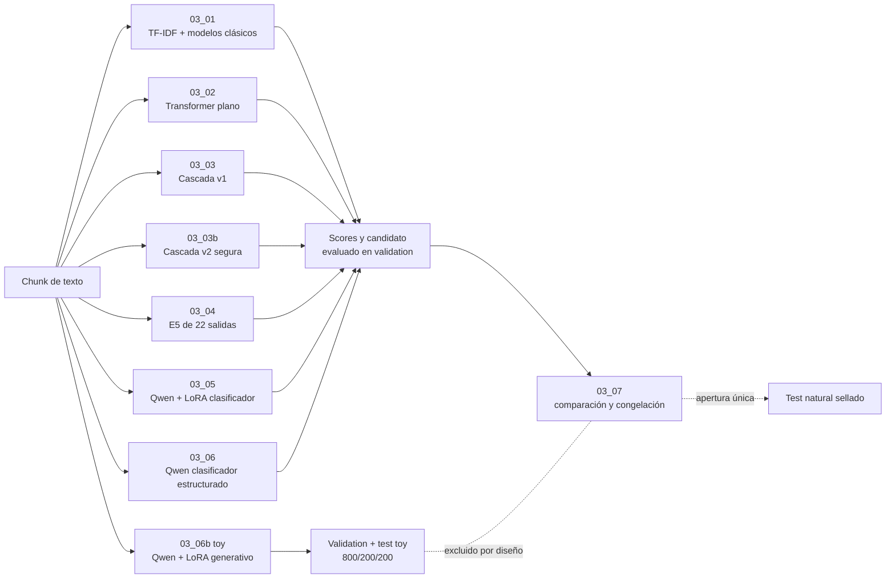
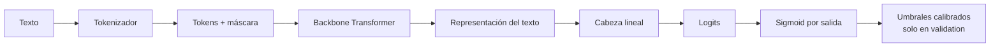
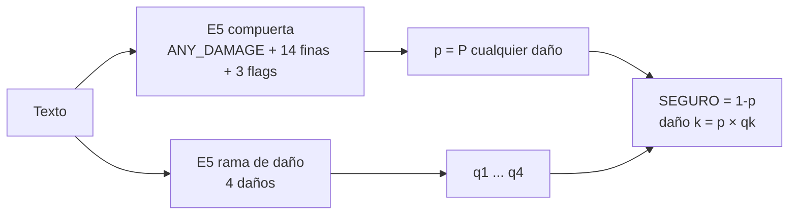
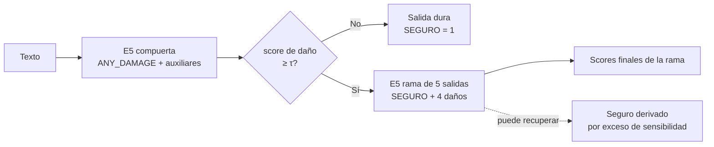
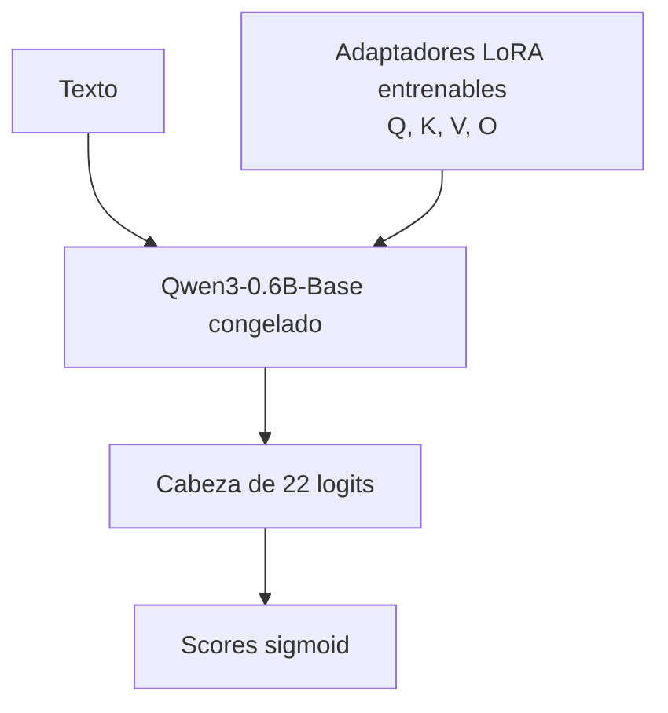
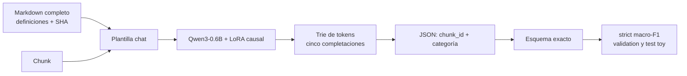

# Arquitecturas de entrenamiento 03_01–03_06b

Este documento describe lo que implementa el repositorio, no una arquitectura
idealizada. Separa los antecedentes publicados de las decisiones propias del
proyecto, explicita los costos y riesgos de cada familia y deja `test` fuera de
la selección de modelos, épocas y umbrales. El contrato principal tiene cinco
salidas: `SEGURO`, `RACISMO_DISCRIMINACION`,
`ATAQUE_POR_GENERO_IDENTIDAD`, `ACOSO_AMENAZA` y `CONTENIDO_SEXUAL`.
`SEGURO` es excluyente; los cuatro daños pueden coexistir. Cuando están
observadas, se añaden 14 etiquetas finas y tres *flags* transversales mediante
máscaras de supervisión.

## Mapa general

Los modelos clásicos se apoyan en ponderación TF–IDF [1] y algoritmos
supervisados como SVM [2] y Complement Naive Bayes [3]. Las ramas neuronales
usan la arquitectura Transformer [4]. MiniLM comprime conocimiento de
autoatención mediante destilación [5]; su variante multilingüe transfiere
representaciones entre lenguas [6], mientras E5 se entrenó como modelo
multilingüe de embeddings de texto [7]. Esos trabajos motivan los *backbones*;
no definen las cabezas ni la taxonomía de este proyecto.

## Bloque común de los clasificadores Transformer

La cabeza usa sigmoides independientes porque un chunk puede activar más de un
daño. La pérdida es entropía cruzada binaria con pesos positivos y máscara de
observación. La ausencia de una etiqueta fina o un *flag* no se convierte en
un negativo cuando el campo no fue observado. La implementación carga y
guarda modelos mediante Transformers [8].

Para MiniLM y E5, la configuración vigente usa longitud máxima 128, lote 8,
tasa de aprendizaje `2e-5` y hasta tres épocas. Cada época evalúa `validation`,
se conserva el checkpoint con mejor macro-AUPRC de las cuatro salidas de daño y
el *early stopping* tiene paciencia 1. Por eso, tres épocas son un máximo
razonable para el entrenamiento final de estas ramas, no una obligación de
usar el checkpoint de la tercera época.

La campaña de mejora de MiniLM no reabre ese entrenamiento completo. Carga el
candidato verificable de 128 tokens —que ya contiene el mejor checkpoint de
validation—, reinicia optimizador y scheduler, reduce la tasa a `1e-5` y ajusta
una época a 192 y 256 tokens. La primera pantalla mantiene fijas tanto las filas
como la semilla primaria. Solo después de escoger contexto en validation se
repiten dos semillas de entrenamiento adicionales; `sampling_seed` permanece
fija para no alterar qué filas `SEGURO` se comparan. La focal loss con
`gamma=2` es una ablación independiente frente a BCE ponderada, no un cambio
retrospectivo del baseline. Focal reduce la contribución de ejemplos fáciles
para concentrar el gradiente en errores difíciles [37].

## Justificación de los modelos base

### Criterios de selección y límite de los benchmarks

La elección se hizo *a priori*, antes de observar el test del proyecto, con
cinco criterios: cobertura del español y variación multilingüe, compatibilidad
con clasificación multietiqueta o SFT, costo que permita entrenar varias
arquitecturas en una sola GPU, licencia y acceso reproducibles, y soporte
estable en Transformers/PEFT. Un benchmark general no mide racismo, ataques por
género, acoso ni contenido sexual peruano. Por ello, las cifras siguientes son
evidencia de capacidad previa y eficiencia, no sustituyen la evaluación del
corpus local ni autorizan a elegir por test.

### Por qué MiniLM multilingüe y multilingual-E5-small

Ambos son encoders bidireccionales pequeños y producen una representación del
texto en una sola pasada, una forma natural de resolver 22 decisiones binarias
con una cabeza fija. El checkpoint MiniLM convierte textos en vectores de 384
dimensiones, admite 50 lenguas y fija 128 tokens en su tarjeta; su objetivo de
paráfrasis aporta una señal semántica distinta de la simple modelización de
lenguaje [29]. `multilingual-e5-small` tiene 12 capas, dimensión 384, alrededor
de 0,1 mil millones de parámetros y soporte declarado para 100 lenguas; fue
preentrenado contrastivamente con pares procedentes, entre otras fuentes, de
NLLB, Wikipedia, Reddit y xP3 [7], [30].

Usar los dos no pretende duplicar el mismo modelo. MiniLM representa una
inicialización destilada orientada a similitud/paráfrasis [5], [6], mientras E5
añade preentrenamiento contrastivo multilingüe a gran escala [7]. Mantenerlos en
una escala y dimensión semejantes permite atribuir una eventual diferencia más
plausiblemente al *backbone* y su preentrenamiento que a multiplicar por cinco
el número de parámetros.

#### Comparación con candidatos encoder

| Candidato | Evidencia oficial reportada | Ventaja potencial | Razón para incluirlo o no como base principal |
|---|---|---|---|
| `paraphrase-multilingual-MiniLM-L12-v2` | 50 lenguas, vector 384 y máximo 128 tokens [29] | rápido; preentrenamiento de paráfrasis; ya se usó en el análisis de longitud de chunks | **Incluido** como control neuronal eficiente y continuidad con experimentos previos |
| `multilingual-e5-small` | 12 capas, vector 384, ~0,1B; MRR@10 medio 64,4 en Mr. TyDi [30] | preentrenamiento contrastivo en 100 lenguas y transferencia semántica | **Incluido** como backbone común de planos, cascadas y multitarea |
| `multilingual-e5-base` | MRR@10 65,9; ~0,3B y vector 768 [7], [30] | +1,5 puntos frente a E5-small en ese benchmark | no elegido inicialmente: más del doble de parámetros por una mejora moderada en recuperación, no demostrada en moderación |
| `multilingual-e5-large` | MRR@10 70,5; ~0,6B y vector 1024 [7], [30] | mejor resultado E5 en Mr. TyDi | candidato de escalamiento, pero aproxima el costo de Qwen y dificulta comparar arquitecturas múltiples |
| BETO cased | XNLI 82,01, PAWS-X 89,05 y MLDoc 95,60 en español [31] | preentrenamiento monolingüe español; alternativa fuerte para lenguaje local | no se descarta; su benchmark y objetivo no son comparables con Mr. TyDi, cubre peor *code-switching* y su tarjeta advierte revisar licencias de los textos de entrenamiento |
| `mdeberta-v3-base` | XNLI medio 79,8 y 84,4 en español, frente a 76,2/80,7 de XLM-R-base bajo el mismo protocolo; 86M de backbone más 190M de embeddings [32] | evidencia fuerte de comprensión multilingüe | retador recomendable si hay presupuesto, pero requiere bastante más memoria que MiniLM/E5-small |

Mr. TyDi evalúa recuperación y XNLI inferencia textual; sus números **no deben
compararse entre filas como si midieran la misma tarea**. La lectura defendible
es interna a cada fuente: E5-small sacrifica solo 1,5 puntos frente a E5-base
con una reducción grande de tamaño, mientras BETO y mDeBERTa muestran que hay
alternativas plausibles para una ablación española o de mayor capacidad.

Para este proyecto, MiniLM y E5-small son apropiados *a priori* porque permiten
entrenar el plano, dos cascadas y el multitarea con el mismo presupuesto L4,
mantienen cobertura multilingüe útil ante nombres, anglicismos y cambios de
código, y ofrecen dos preentrenamientos complementarios. No se afirma que sean
óptimos. El 39,28 % de truncamiento observado a 128 tokens obliga a evaluar 256
tokens, y BETO/mDeBERTa deben permanecer como retadores si los resultados
finales justifican ampliar el presupuesto.

### Por qué Qwen3-0.6B como LLM base

La elección separa dos usos. `03_05` y `03_06` parten de
`Qwen/Qwen3-0.6B-Base`, preentrenado pero no alineado a chat, para que la señal
supervisada del proyecto controle una cabeza de clasificación nueva. `03_06b`
usa `Qwen/Qwen3-0.6B`, la variante posentrenada, porque sí debe seguir el prompt
operativo y generar JSON [33], [34]. No es correcto intercambiar sus resultados
ni atribuir capacidad de *prompting* al clasificador Base.

Qwen3-0.6B es un Transformer causal denso de 0,6B parámetros —0,44B sin
embeddings—, 28 capas, GQA de 16 cabezas Q y ocho KV, y contexto de 32.768
tokens [33]. La familia fue preentrenada con 36 billones de tokens en 119
lenguas y dialectos y extendió el entrenamiento de contexto a 32k [14], [33].
La licencia Apache-2.0 y el acceso no condicionado facilitan descargar,
versionar, adaptar con LoRA y redistribuir artefactos reproducibles [33].

#### Benchmark comparable dentro del informe Qwen3

La tarjeta oficial remite al informe Qwen3. Su tabla 8 evalúa conjuntamente
modelos Base pequeños; se reproducen solo cinco métricas pertinentes como
indicadores generales/multilingües [14]:

| Modelo Base | Parámetros | MMLU | BBH | MGSM | MMMLU | INCLUDE |
|---|---:|---:|---:|---:|---:|---:|
| Qwen2.5-0.5B | 0,5B | 47,50 | 20,30 | 12,07 | 31,53 | 24,74 |
| **Qwen3-0.6B** | **0,6B** | **52,81** | **41,47** | **30,99** | **50,16** | **34,26** |
| Gemma-3-1B | 1,0B | 26,26 | 28,13 | 1,74 | 26,57 | 25,62 |
| Qwen2.5-1.5B | 1,5B | 60,90 | 45,10 | 32,82 | 60,27 | 39,55 |
| Qwen3-1.7B | 1,7B | 62,63 | 54,47 | 50,71 | 63,27 | 45,57 |

En esa evaluación, Qwen3-0.6B supera al predecesor Qwen2.5-0.5B y al
Gemma-3-1B en las cinco columnas, aun siendo menor que Gemma. Los modelos
Qwen de 1,5–1,7B rinden mejor, como cabe esperar, pero multiplican entre 2,5 y
2,8 veces los parámetros del elegido. La tabla es autorreportada por Qwen y no
incluye moderación; se usa como prior de capacidad, no como prueba independiente
de superioridad.

#### Otros LLM pequeños que pudieron elegirse

| Candidato | Cualidades relevantes | Compromiso para este proyecto |
|---|---|---|
| Qwen2.5-0.5B | tamaño casi idéntico y mismo ecosistema | queda dominado por Qwen3-0.6B en la comparación conjunta del informe [14] |
| Gemma-3-1B-PT | 1B, 32k y corpus declarado en más de 140 lenguas; familia Base e instruction-tuned [35] | alternativa multilingüe razonable, pero ~1,7× más parámetros, acceso sujeto a aceptar la licencia Gemma en Hugging Face y peor resultado en la tabla 8 de Qwen; merece réplica independiente antes de descartarlo |
| Llama-3.2-1B | 1,23B, 128k y español entre ocho lenguas oficialmente soportadas; su tarjeta reporta MMLU 32,2 en inglés [36] | contexto innecesario para chunks de 128/4096 tokens, más del doble de parámetros, acceso condicionado y licencia comunitaria; el MMLU usa otro protocolo y no se compara numéricamente con la tabla anterior |
| Qwen2.5-1.5B / Qwen3-1.7B | mejores resultados generales y multilingües en la tabla 8 [14] | retadores de capacidad, pero elevan memoria, tiempo por época y costo de repetir semillas/arquitecturas |

La conclusión es limitada pero suficiente: Qwen3-0.6B es **apropiado a priori**
para esta moderación porque combina cobertura multilingüe amplia, un salto
verificable frente a la generación previa de tamaño parecido, licencia
permisiva, variantes Base y posentrenada coherentes para los dos experimentos,
y un tamaño que permite LoRA, checkpoints por época y comparación de varias
ramas en una A100. No se elige porque sea el LLM más potente ni porque los
benchmarks generales demuestren seguridad. Jerga peruana, ironía, categorías
minoritarias y el costo de un falso `SEGURO` solo pueden validarse con las
métricas locales, calibración y test sellado del proyecto.

## 03_01 · Modelos clásicos

### Arquitectura

La variante base concatena TF–IDF de palabras (1–2 gramas) y caracteres dentro
de palabra (3–5 gramas). La variante `policy_informed` agrega indicadores
léxicos auditables derivados del prompt operativo; sigue siendo aprendizaje
supervisado y no *prompting*. Una transformación uno-contra-resto enmascarada
entrena 22 cabezas con uno de cinco estimadores:

- `dummy`, como control por prevalencia;
- Complement Naive Bayes;
- regresión logística;
- SVM lineal con calibración sigmoidal de tres pliegues;
- SGD incremental con pérdida logística.

### Ventajas, límites y propósito

Es la familia más barata y explicable: permite inspeccionar n-gramas, entrena en
CPU y establece el mínimo que una red debe superar. Su debilidad es representar
el texto principalmente por coincidencias locales; ironía, negación distante y
dependencias contextuales pueden quedar mal capturadas. La variante informada
por política puede mejorar cobertura léxica, pero también heredar sesgos de las
reglas escogidas. Sus umbrales se eligen en `validation` y no deben interpretarse
como probabilidades perfectas.

## 03_02 · Transformers planos

El cuaderno entrena dos candidatos: `paraphrase-multilingual-MiniLM-L12-v2` y
`multilingual-e5-small`. Cada candidato procesa el chunk una sola vez y aplica
una cabeza de 22 logits: cinco salidas principales, 14 finas y tres *flags*. Las
pérdidas reciben pesos `1.0`, `0.3` y `0.2`, respectivamente.

MiniLM prioriza tamaño y velocidad. E5 es el encoder usado además como base de
las cascadas y ofrece otra preinicialización multilingüe. En ambos casos la
inferencia cuesta una pasada Transformer. El riesgo principal es que una sola
representación y una sola cabeza deban resolver simultáneamente detección de
daño, tipo de daño y auxiliares.

> **Fidelidad de implementación.** Aunque el nombre histórico dice “plano”, el
> código actual de `03_02` también aprende las 22 salidas auxiliares con las
> mismas ponderaciones de `03_04`. Por tanto, `flat_e5` y `multitask` no son hoy
> arquitecturas independientes: comparten backbone, cabeza, pérdida y
> configuración; solo cambia el identificador del experimento. No debe
> atribuirse una diferencia de rendimiento al “multitarea” hasta introducir una
> cabeza o un régimen de pérdidas realmente distinto. MiniLM sí constituye una
> comparación de backbone.

## 03_03 · Cascada v1

Las taxonomías jerárquicas y sus estrategias de aprendizaje cuentan con una
literatura amplia [9], incluidos modelos neuronales sensibles a jerarquías
textuales [10]. La cascada del proyecto es un diseño local más sencillo y no
implementa HiAGM.

La primera red aprende `ANY_DAMAGE` y los 17 auxiliares. La segunda solo se
entrena con filas dañinas y produce cuatro scores. En inferencia se ejecutan las
dos redes y se combinan de forma suave. La ventaja esperada es separar la
pregunta amplia “¿hay algún daño?” de la pregunta “¿qué daños hay?”.

Sus desventajas son dos pasadas Transformer, mayor memoria/latencia y
propagación de error: un score bajo de la compuerta reduce simultáneamente los
cuatro daños. Además, la rama nunca aprende a reconocer `SEGURO`, porque no ve
ejemplos seguros. El umbral diagnóstico de la compuerta maximiza F1 en
`validation`; no está optimizado específicamente para evitar falsos seguros.

## 03_03b · Cascada v2 orientada a seguridad

### Por qué tiene sentido

Sí tiene sentido cuando el costo dominante es declarar `SEGURO` un contenido
dañino. La v2 usa una compuerta deliberadamente sensible y permite que los
seguros enviados de más sean recuperados por la segunda red. La compuerta deja
de ser el clasificador final de los casos dudosos: solo puede resolver por sí
sola los casos que superan un criterio conservador de seguridad.

Sea `g(x)` el score `ANY_DAMAGE` y `τ` el umbral. Se declara seguro en la
compuerta cuando `g(x) < τ`; en otro caso se usan los cinco scores de la rama.
El umbral es el mayor valor observado en `validation` que cumple a la vez:

\[
\operatorname{Recall}_{daño}(τ) \ge 0.99,
\qquad
\operatorname{NPV}_{seguro}(τ)
= P(y=SEGURO \mid g(x)<τ) \ge 0.99.
\]

La primera condición limita daños bloqueados antes de la rama. La segunda
responde directamente a la pregunta del proyecto: entre los casos que la
compuerta llama seguros, ¿qué proporción realmente era segura? El código elige
el mayor umbral factible para aumentar la cobertura de decisiones tempranas. Si
ningún umbral que emita al menos un `SEGURO` satisface ambas restricciones,
usa `τ=0`: no emite seguros en la compuerta y deriva todo a la rama.

La rama se entrena con las cinco categorías y con todos los ejemplos del train
muestreado 4:1. Una penalización local de `0.2` desalienta la coexistencia de
score `SEGURO` alto y score de daño alto. Esto permite corregir falsos positivos
de una compuerta sensible. La implementación actual calcula ambas redes antes
de combinar los scores, incluso para los casos que la compuerta resolvería como
seguros; por tanto mantiene el costo de dos Transformers y no debe atribuirse un
ahorro de latencia por enrutamiento. La
calibración de redes merece auditoría porque su confianza puede ser incorrecta
[11]; aquí “0.99” describe el conjunto de `validation`, no garantiza esa tasa en
la población ni bajo cambio de distribución. Deben reportarse también número
de decisiones seguras, daños bloqueados y fracción derivada a la rama. Una NPV
alta con cobertura casi nula sería segura pero poco útil.

### Diferencia exacta entre v1 y v2

| Propiedad | 03_03 v1 | 03_03b v2 |
|---|---|---|
| Objetivo de compuerta | F1 de `ANY_DAMAGE` | recall de daño y NPV segura mínimos |
| Rama 2 | cuatro daños | `SEGURO` + cuatro daños |
| Datos de rama 2 | solo daños | train completo 4:1 |
| Combinación | suave: `p × q` | enrutamiento duro por `τ` |
| Recupera seguros derivados por error | no | sí |
| Fallback si no hay umbral seguro | no aplica | todo pasa a rama 2 |
| Riesgo dominante | el gate atenúa todos los daños | cobertura baja o costo casi constante |

## 03_04 · Transformer denominado multitarea

El aprendizaje multitarea comparte una representación para objetivos
relacionados y puede inducir transferencia, pero también interferencia entre
tareas [12]. En el repositorio, `03_04` usa E5 y una cabeza única de 22 logits
con supervisión enmascarada. Los pesos son `1.0` para las cinco salidas
principales, `0.3` para finas y `0.2` para *flags*.

Conceptualmente, las auxiliares podrían regularizar el encoder y aportar señales
semánticas. En la implementación vigente, sin embargo, es idéntico a `flat_e5`
de `03_02`; esta equivalencia debe conservarse en cualquier informe hasta que
se introduzcan cabezas separadas, pérdidas dinámicas u otra diferencia
verificable.

## 03_05 · Qwen-LoRA clasificador

LoRA congela el backbone e inserta matrices entrenables de bajo rango, reduciendo
los parámetros que se actualizan [13]. `03_05` carga
`Qwen/Qwen3-0.6B-Base`, cuya familia se describe en el informe Qwen3 [14], y
añade una cabeza clasificadora de 22 salidas. Los adaptadores se insertan en
`q_proj`, `k_proj`, `v_proj` y `o_proj`, con rango 8, `alpha=16` y *dropout*
0.05. La configuración usa tasa `1e-4` y hasta cuatro épocas. El perfil de
fallback usa lote 2 y acumulación 4; en la A100 observada usa lote real 8 y
acumulación 1, conservando el lote efectivo de ocho con menos micropasadas.

Su fortaleza es adaptar una representación autoregresiva mayor con una fracción
de los parámetros. Consume más VRAM y tiempo que E5, y la cabeza sigue siendo
un clasificador: no recibe el prompt operacional ni genera JSON. Llamarlo
“modelo con prompt” sería incorrecto.

## 03_06 · Qwen clasificador estructurado

El experimento histórico usó el mismo checkpoint base de Qwen y las 22 salidas,
ajustó el modelo completo y añadió a la BCE una penalización fija `0.2`. Esa
ruta se conserva como candidato independiente, pero deja de ser la opción
recomendada por su costo y su pobre resultado preliminar.

La mejora restaura por manifiesto y SHA-256 el candidato Qwen-LoRA de `03_05`,
carga su adaptador PEFT como entrenable y crea tres candidatos pequeños. Cada
uno reinicia optimizador/scheduler, entrena una sola época con `2e-5`, usa las
mismas filas/semillas y cambia únicamente `lambda` en:

\[
L = L_{BCE} + \lambda\,p(SEGURO)\max_k p(daño_k),
\qquad \lambda \in \{0, 0.02, 0.05\}.
\]

La penalización codifica una regla propia de la taxonomía: `SEGURO` no debe
coexistir con daños. No convierte las cuatro categorías de daño en mutuamente
excluyentes. Puede reducir conflictos y carga de revisión, a cambio de mayor
costo de ajuste y de introducir un hiperparámetro adicional. Ese beneficio debe
medirse; la fórmula por sí sola no demuestra mejor generalización. El brazo
`lambda=0` aísla el efecto de continuar el adaptador durante una época; los
otros dos miden el aporte incremental de la estructura sin confundirlo con un
full fine-tuning de cuatro épocas.

## 03_06b · Toy Qwen condicionado por definiciones Markdown

Este cuaderno ya no es una rama candidata. Construye un ejercicio mutuamente
excluyente de cinco clases con 1.200 videos distintos: 960 ejemplos `SEGURO` y
60 de cada daño. `80:20:20` se interpreta como pesos normalizados `4:1:1`, de
modo que train/validation/test contienen 800/200/200 filas. Dentro de cada
combinación categoría/split, una prioridad pseudoaleatoria con semilla fija
elige un chunk por video y conserva la partición original para impedir fuga.

`Qwen/Qwen3-0.6B` recibe como mensaje de sistema el contenido completo de
`config/definiciones_dano_toy_03_06b.md`. La conversación concatena ese contexto
con el identificador y el texto; LoRA causal supervisa únicamente el objeto de
respuesta. La configuración usa longitud máxima 1.536, tasa `1e-4`, hasta tres
épocas y lote efectivo ocho. En una A100 el lote físico es ocho y la evaluación
generativa usa lotes de 16.

La salida está restringida a nivel de decodificación: para cada fila se
tokenizan exactamente cinco objetos posibles, todos con el `chunk_id` esperado
y una categoría permitida, y `prefix_allowed_tokens_fn` solo habilita las ramas
del trie. Después se exige el conjunto exacto de claves; cualquier fallo cuenta
como error. La métrica principal `strict_macro_f1` promedia las cinco clases.
También se guardan accuracy, balanced accuracy, validez JSON, métricas por clase,
predicciones y matriz de confusión.

El diseño enriquecido no estima prevalencia natural. Cada daño tiene solo diez
casos en test, por lo que un error mueve su recall en 0,10. En consecuencia, el
resultado mide aprendizaje de definiciones y cumplimiento del contrato en un
entorno toy; no debe compararse numéricamente con `03_01`–`03_06` ni presentarse
como evidencia de superioridad.

## Comparación resumida

| Cuaderno | Backbone/pasadas | Salida aprendida | Ajuste | Costo relativo | Riesgo característico |
|---|---|---|---|---|---|
| 03_01 | TF–IDF, sin Transformer | 22 binarias | modelos clásicos | bajo | contexto semántico limitado |
| 03_02 | MiniLM o E5, 1 pasada | 22 binarias | completo; MiniLM opcional 192/256 y focal | medio | una cabeza resuelve todo |
| 03_03 | E5 + E5, 2 pasadas | gate 18 + rama 4 | ambos completos | alto | falso seguro bloquea daños |
| 03_03b | E5 + E5, 2 pasadas | gate 18 + rama 5 | ambos completos | alto | poca cobertura si gate conservador |
| 03_04 | E5, 1 pasada | 22 binarias | completo | medio | hoy duplica `flat_e5` |
| 03_05 | Qwen Base, 1 pasada | 22 binarias | LoRA + cabeza | alto | más latencia; sin prompt |
| 03_06 | Qwen Base, 1 pasada | 22 binarias estructuradas | LoRA desde 03_05; full histórico separado | alto | peso de penalización y dependencia del padre |
| 03_06b | Qwen chat, generación restringida | una clase en JSON | LoRA causal toy | alto | muestra pequeña y prevalencia artificial; excluido de 03_07 |

La AUPRC es preferible como lectura principal con salidas dañinas desbalanceadas
[15]. La selección usa únicamente `validation`; reutilizar test para escoger
familia, umbral o época produciría sesgo de selección [16]. Para `03_03b` deben
añadirse recall de daño de la compuerta, NPV de sus seguros, cobertura temprana,
daños bloqueados y latencia. La decisión final no debe basarse solo en una
métrica agregada.

## Hardware observado por cuaderno

“Observado” significa que la salida del cuaderno o el candidato guardó el
dispositivo efectivo. “Previsto” describe la configuración y no debe citarse
como hardware consumido.

| Cuaderno | Estado al 2026-08-15 | Hardware realmente usado | Precisión/perfil | Hardware previsto si está pendiente |
|---|---|---|---|---|
| `03_01` | completo | CPU local AMD Ryzen 7 8845HS; 8 núcleos/16 hilos, cuatro *workers*, ~28,83 GiB RAM | estimadores clásicos en `float64`; Radeon 780M no usada | no aplica |
| `03_02` | corrida histórica MiniLM+E5 completa en Drive; rerun más reciente: MiniLM 3/3 y E5 2,89/3 | NVIDIA L4, 23.034 MiB reportados | BF16, una GPU; SSD local tiene prioridad y checkpoints futuros se verifican por época | L4 para recuperar o terminar E5 con bundle `c4513a...da63a52` |
| `03_03` | candidato completo | NVIDIA L4, 23.034 MiB reportados | BF16, una GPU | no aplica |
| `03_03b` | candidato completo | NVIDIA L4, 23.034 MiB reportados | BF16, una GPU | no aplica |
| `03_04` | candidato completo | NVIDIA L4, 23.034 MiB reportados | BF16, una GPU | no aplica |
| `03_05` | candidato completo; época 2 restaurada y época 3 persistida | NVIDIA A100-SXM4-40GB, 40.960 MiB reportados | BF16, lote 8×1, evaluación 32, dos *workers*, una GPU | no aplica |
| `03_06` | full fine-tuning histórico y barrido LoRA `0/0.02/0.05` completos e incluidos en la comparación | NVIDIA A100-SXM4-40GB, 40.960 MiB reportados | BF16, una GPU; cuatro candidatos Qwen estructurados conservados | no aplica |
| `03_06b` | rediseñado como experimento toy independiente; dataset 1.200 ya materializado, entrenamiento pendiente | **no disponible** | 800/200/200, Markdown completo y JSON restringido; no aparece entre los 28 individuos comparados | A100 de 40 GB para producir la primera métrica de eficacia |
| `03_07` | comparación de `validation` completa: 28 individuos + 5 ensembles; `ensemble_soft_mean` congelado, empate estadístico/inconcluso; test sellado | CPU x86_64 del runtime Colab | 2 hilos efectivos, 2.000 réplicas por video; 1.397 s antes de escritura | test requiere una sola corrida posterior; no reentrena |
| `03_07a` | reporte local completo con sincronización automática desde Drive | CPU local | OAuth de solo lectura; compara fecha/SHA-256; cuatro CSV, tres PNG y Markdown crítico; no carga modelos | se repite tras cada publicación de comparación o test |
| `03_08` | auditoría del snapshot completa para `013d60…c1f86`; falta `calidad_predictiva_auxiliar_observada.json` | hardware no registrado en el artefacto | no entrena modelos; cobertura/consistencia disponibles, calidad de candidatos pendiente | CPU local para completar la segunda salida |

Las L4 y A100 listadas son GPUs de sesiones distintas de Colab; no trabajaron
en paralelo sobre una misma corrida. `03_05` usó una sola A100: Colab aportó el
dispositivo, mientras el cuaderno define BF16, lotes, acumulación, *workers*,
TF32 y checkpoints. El detalle de tiempos, costos y evidencia por candidato se
mantiene en `AUDITORIA_ENTRENAMIENTO_CUADERNOS_03_2026-08-10.md`.

## Antecedentes de uso y delimitación de la contribución

Esta matriz no afirma que los trabajos sean réplicas exactas. Su propósito es
atribuir patrones arquitectónicos ya usados y declarar qué se conserva, qué se
modifica y qué combinación pertenece al proyecto.

| Esquema del proyecto | Antecedente aplicado | Elemento en común | Diferencia que debe declararse |
|---|---|---|---|
| 03_01 | van Aken *et al.* compararon métodos superficiales y profundos y construyeron un ensemble para toxicidad [17] | baselines clásicos frente a redes y análisis de errores | aquí se usan 22 cabezas enmascaradas, dos vistas TF–IDF y taxonomía peruana; no se reproduce su ensemble |
| 03_02 | Schütz *et al.* ajustaron German BERT y combinaron representación textual con 14 rasgos lingüísticos para comentarios tóxicos [18] | Transformer afinado para moderación y señales auxiliares | este proyecto usa MiniLM/E5 multilingües, 22 logits conjuntos y no concatena su MLP ni sus 14 rasgos |
| 03_02 | Chalkidis *et al.* compararon Transformers y métodos jerárquicos para clasificación multietiqueta [19] | formulación plana multietiqueta con un Transformer | sus dominios y jerarquías de etiquetas son distintos; aquí hay cinco categorías operativas y auxiliares enmascaradas |
| 03_03/03_03b | Park y Fung compararon clasificación abusiva de una etapa con una de dos pasos: primero abuso y luego sexismo/racismo [20] | detector general seguido de clasificador especializado | usaron CNN/regresión logística y clases mutuamente excluyentes; aquí son dos E5, cuatro daños multietiqueta y auxiliares |
| 03_03/03_03b | Zampieri *et al.* organizaron OLID en niveles: ofensivo/no ofensivo, tipo y objetivo [21] | descomposición jerárquica de detección amplia y caracterización | OLID es un esquema de anotación de tweets y no la cascada entrenable del proyecto; nuestras categorías, idioma y reglas difieren |
| 03_03b | no se encontró en esta revisión un antecedente con la combinación exacta `gate NPV/recall + fallback route-all + rama SEGURO+4 daños` | sus piezas se relacionan con [20], [21] y calibración [11] | la combinación y los valores 0.99 son decisiones locales; no debe presentarse como teorema ni como novedad mundial sin una revisión sistemática |
| 03_04 | Chen *et al.* usaron aprendizaje multitarea jerárquico para los tres niveles de OffensEval [22] | encoder compartido y objetivos jerárquicamente relacionados | su HMTL conecta subtareas A/B/C; la implementación vigente del proyecto tiene una sola cabeza de 22 logits y hoy coincide con `flat_e5` |
| 03_04 | Morgan *et al.* aplicaron Transformers multitarea a toxicidad, engagement y afirmaciones factuales [23] | representación compartida para objetivos relacionados | sus tres objetivos y datos alemanes no son nuestras categorías gruesas, finas y flags; sus resultados no prueban transferencia aquí |
| 03_05 | Christodoulou ajustó Mistral para clasificación de odio, objetivo y postura mediante LoRA y *prompt tuning* [24] | PEFT/LoRA sobre un LLM usado como clasificador | aquí se usa Qwen3-0.6B-Base, un adaptador único de 22 salidas y no se usa *prompt tuning* |
| 03_05/03_06b | Hasan *et al.* combinaron términos TF–IDF, prompts de clasificación y LoRA sobre Llama para odio en bengalí [25] | reglas léxicas o prompt más adaptación LoRA en moderación | `03_05` no recibe prompt; `03_06b` usa un Markdown versionado, Qwen y salida JSON restringida, sin copiar su selección TF–IDF de términos |
| 03_06 | HiAGM [10] y HMTL [22] incorporan relaciones jerárquicas dentro del aprendizaje | uso de estructura de etiquetas para reducir incoherencias | la penalización `0.2·p(SEGURO)·max p(daño)` es una formulación local; no se atribuye a esos autores |
| 03_06b | LlamaLens instruyó un LLM multilingüe con múltiples tareas de noticias y redes sociales, incluidas tareas ofensivas [26] | ajuste por instrucciones para clasificación de contenido social | aquí se ajusta una sola taxonomía peruana, se supervisa únicamente la respuesta y se exige JSON trazable |
| 03_06b | Ghorbanpour *et al.* evaluaron prompting con LLaMA, Aya, Qwen y BloomZ para odio en ocho lenguas [27] | reglas expresadas en lenguaje natural y uso de Qwen para detección | su estudio es zero/few-shot; el proyecto realiza SFT LoRA supervisado y genera un contrato JSON |
| 03_06b | Wu *et al.* combinaron prompt, SFT y fusión de LLM para odio fino en chino [28] | prompt contextual y SFT para clasificación fina | este proyecto no fusiona modelos, trabaja en español peruano y conserva procedencia por SHA del Markdown completo |

Los diagramas Mermaid de este documento son esquemas originales elaborados a
partir del código del repositorio; no son figuras redibujadas de [17]–[28]. Si
una figura de un artículo se adapta posteriormente para el paper o la
presentación, su leyenda debe decir “adaptado de [n]” y conservar la cita.

### Fórmulas de redacción seguras

- Para la cascada: “Inspirados por la clasificación de dos pasos de Park y Fung
  [20] y por la descomposición jerárquica de OLID [21], diseñamos una variante
  local multietiqueta con una compuerta calibrada y una rama de cinco salidas”.
- Para multitarea: “El uso de objetivos relacionados sigue antecedentes de MTL
  para lenguaje ofensivo [22], [23]; nuestras salidas y máscaras son propias del
  contrato v2.1”.
- Para LoRA: “La adaptación eficiente sigue LoRA [13] y trabajos que la aplican
  a clasificación de odio [24], [25]; el backbone, la taxonomía y el régimen de
  entrenamiento difieren”.
- Para SFT: “La formulación se relaciona con LLM instruidos para contenido de
  redes [26] y prompting multilingüe de odio [27], pero usa una cápsula local
  versionada y genera el JSON del contrato v2.1”.

Debe evitarse “proponemos por primera vez” o “arquitectura novedosa” salvo que
una revisión sistemática posterior lo sustente. La contribución defendible es
la combinación, implementación reproducible y evaluación de estas alternativas
para el contrato y corpus peruanos, con diferencias explícitas frente a los
antecedentes.

## Referencias

[1] G. Salton and C. Buckley, “Term-Weighting Approaches in Automatic Text Retrieval,” *Information Processing & Management*, vol. 24, no. 5, pp. 513–523, 1988, doi: [10.1016/0306-4573(88)90021-0](https://doi.org/10.1016/0306-4573(88)90021-0).

[2] C. Cortes and V. Vapnik, “Support-Vector Networks,” *Machine Learning*, vol. 20, pp. 273–297, 1995, doi: [10.1007/BF00994018](https://doi.org/10.1007/BF00994018).

[3] J. D. M. Rennie, L. Shih, J. Teevan, and D. R. Karger, “Tackling the Poor Assumptions of Naive Bayes Text Classifiers,” in *Proc. ICML*, 2003, pp. 616–623. [Online]. Available: [MIT CSAIL](https://people.csail.mit.edu/jrennie/papers/icml03-nb.pdf).

[4] A. Vaswani, N. Shazeer, N. Parmar, *et al.*, “Attention Is All You Need,” in *Advances in Neural Information Processing Systems*, vol. 30, 2017. [Online]. Available: [NeurIPS](https://proceedings.neurips.cc/paper/7181-attention-is-all-you-need).

[5] W. Wang, F. Wei, L. Dong, *et al.*, “MiniLM: Deep Self-Attention Distillation for Task-Agnostic Compression of Pre-Trained Transformers,” in *Advances in Neural Information Processing Systems*, vol. 33, 2020. [Online]. Available: [NeurIPS](https://proceedings.neurips.cc/paper/2020/hash/3f5ee243547dee91fbd053c1c4a845aa-Abstract.html).

[6] N. Reimers and I. Gurevych, “Making Monolingual Sentence Embeddings Multilingual Using Knowledge Distillation,” in *Proc. EMNLP*, 2020, pp. 4512–4525, doi: [10.18653/v1/2020.emnlp-main.365](https://doi.org/10.18653/v1/2020.emnlp-main.365).

[7] L. Wang, N. Yang, X. Huang, *et al.*, “Multilingual E5 Text Embeddings: A Technical Report,” arXiv:2402.05672, 2024, doi: [10.48550/arXiv.2402.05672](https://doi.org/10.48550/arXiv.2402.05672).

[8] T. Wolf, L. Debut, V. Sanh, *et al.*, “Transformers: State-of-the-Art Natural Language Processing,” in *Proc. EMNLP: System Demonstrations*, 2020, pp. 38–45, doi: [10.18653/v1/2020.emnlp-demos.6](https://doi.org/10.18653/v1/2020.emnlp-demos.6).

[9] C. N. Silla Jr. and A. A. Freitas, “A Survey of Hierarchical Classification Across Different Application Domains,” *Data Mining and Knowledge Discovery*, vol. 22, no. 1–2, pp. 31–72, 2011, doi: [10.1007/s10618-010-0175-9](https://doi.org/10.1007/s10618-010-0175-9).

[10] J. Zhou, C. Ma, D. Long, *et al.*, “Hierarchy-Aware Global Model for Hierarchical Text Classification,” in *Proc. ACL*, 2020, pp. 1106–1117, doi: [10.18653/v1/2020.acl-main.104](https://doi.org/10.18653/v1/2020.acl-main.104).

[11] C. Guo, G. Pleiss, Y. Sun, and K. Q. Weinberger, “On Calibration of Modern Neural Networks,” in *Proc. ICML*, vol. 70, 2017, pp. 1321–1330. [Online]. Available: [PMLR](https://proceedings.mlr.press/v70/guo17a.html).

[12] R. Caruana, “Multitask Learning,” *Machine Learning*, vol. 28, pp. 41–75, 1997, doi: [10.1023/A:1007379606734](https://doi.org/10.1023/A:1007379606734).

[13] E. J. Hu, Y. Shen, P. Wallis, *et al.*, “LoRA: Low-Rank Adaptation of Large Language Models,” in *Proc. ICLR*, 2022. [Online]. Available: [OpenReview](https://openreview.net/forum?id=nZeVKeeFYf9).

[14] A. Yang, A. Li, B. Yang, *et al.*, “Qwen3 Technical Report,” arXiv:2505.09388, 2025, doi: [10.48550/arXiv.2505.09388](https://doi.org/10.48550/arXiv.2505.09388).

[15] T. Saito and M. Rehmsmeier, “The Precision-Recall Plot Is More Informative than the ROC Plot When Evaluating Binary Classifiers on Imbalanced Datasets,” *PLOS ONE*, vol. 10, no. 3, Art. no. e0118432, 2015, doi: [10.1371/journal.pone.0118432](https://doi.org/10.1371/journal.pone.0118432).

[16] G. C. Cawley and N. L. C. Talbot, “On Over-Fitting in Model Selection and Subsequent Selection Bias in Performance Evaluation,” *Journal of Machine Learning Research*, vol. 11, pp. 2079–2107, 2010. [Online]. Available: [JMLR](https://www.jmlr.org/papers/v11/cawley10a.html).

[17] B. van Aken, J. Risch, R. Krestel, and A. Löser, “Challenges for Toxic Comment Classification: An In-Depth Error Analysis,” in *Proc. 2nd Workshop on Abusive Language Online*, 2018, pp. 33–42, doi: [10.18653/v1/W18-5105](https://doi.org/10.18653/v1/W18-5105).

[18] M. Schütz, C. Demus, J. Pitz, N. Probol, M. Siegel, and D. Labudde, “DeTox at GermEval 2021: Toxic Comment Classification,” in *Proc. GermEval 2021 Shared Task*, 2021, pp. 54–61. [Online]. Available: [ACL Anthology](https://aclanthology.org/2021.germeval-1.8/).

[19] I. Chalkidis, M. Fergadiotis, S. Kotitsas, P. Malakasiotis, N. Aletras, and I. Androutsopoulos, “An Empirical Study on Large-Scale Multi-Label Text Classification Including Few and Zero-Shot Labels,” in *Proc. EMNLP*, 2020, pp. 7503–7515, doi: [10.18653/v1/2020.emnlp-main.607](https://doi.org/10.18653/v1/2020.emnlp-main.607).

[20] J. H. Park and P. Fung, “One-step and Two-step Classification for Abusive Language Detection on Twitter,” in *Proc. 1st Workshop on Abusive Language Online*, 2017, pp. 41–45, doi: [10.18653/v1/W17-3006](https://doi.org/10.18653/v1/W17-3006).

[21] M. Zampieri, S. Malmasi, P. Nakov, S. Rosenthal, N. Farra, and R. Kumar, “Predicting the Type and Target of Offensive Posts in Social Media,” in *Proc. NAACL-HLT*, 2019, pp. 1415–1420, doi: [10.18653/v1/N19-1144](https://doi.org/10.18653/v1/N19-1144).

[22] P.-C. Chen, H.-H. Huang, and H.-H. Chen, “NTU_NLP at SemEval-2020 Task 12: Identifying Offensive Tweets Using Hierarchical Multi-Task Learning Approach,” in *Proc. SemEval*, 2020, pp. 2105–2110, doi: [10.18653/v1/2020.semeval-1.279](https://doi.org/10.18653/v1/2020.semeval-1.279).

[23] S. Morgan, T. Ranasinghe, and M. Zampieri, “WLV-RIT at GermEval 2021: Multitask Learning with Transformers to Detect Toxic, Engaging, and Fact-Claiming Comments,” in *Proc. GermEval 2021 Shared Task*, 2021, pp. 32–38. [Online]. Available: [ACL Anthology](https://aclanthology.org/2021.germeval-1.5/).

[24] C. Christodoulou, “NLPDame at ClimateActivism 2024: Mistral Sequence Classification with PEFT for Hate Speech, Targets and Stance Event Detection,” in *Proc. CASE 2024*, 2024, pp. 96–104, doi: [10.18653/v1/2024.case-1.13](https://doi.org/10.18653/v1/2024.case-1.13).

[25] K. R. Hasan, M. Musarrat, and M. A. Adnan, “Ecstasy at BLP-2025 Task 1: TF-IDF Informed Prompt Engineering with LoRA Fine-tuning for Bangla Hate Speech Detection,” in *Proc. BanglaLP 2025*, 2025, pp. 551–555, doi: [10.18653/v1/2025.banglalp-1.52](https://doi.org/10.18653/v1/2025.banglalp-1.52).

[26] M. B. Kmainasi, A. E. Shahroor, M. Hasanain, S. R. Laskar, N. Hassan, and F. Alam, “LlamaLens: Specialized Multilingual LLM for Analyzing News and Social Media Content,” in *Findings of NAACL*, 2025, pp. 5642–5664, doi: [10.18653/v1/2025.findings-naacl.313](https://doi.org/10.18653/v1/2025.findings-naacl.313).

[27] F. Ghorbanpour, D. Dementieva, and A. Fraser, “Can Prompting LLMs Unlock Hate Speech Detection across Languages? A Zero-shot and Few-shot Study,” in *Proc. 9th Workshop on Online Abuse and Harms*, 2025, pp. 413–425. [Online]. Available: [ACL Anthology](https://aclanthology.org/2025.woah-1.39/).

[28] B. Wu, J. Zou, and X. Li, “System Report for CCL25-Eval Task 10: Prompt-Driven Large Language Model Merge for Fine-Grained Chinese Hate Speech Detection,” in *Proc. 24th China National Conference on Computational Linguistics*, 2025, pp. 403–410. [Online]. Available: [ACL Anthology](https://aclanthology.org/2025.ccl-2.48/).

[29] Sentence Transformers, “Model Card: `sentence-transformers/paraphrase-multilingual-MiniLM-L12-v2`,” Hugging Face Hub, revision `e8f8c211226b894fcb81acc59f3b34ba3efd5f42`. [Online]. Available: [Hugging Face](https://huggingface.co/sentence-transformers/paraphrase-multilingual-MiniLM-L12-v2/tree/e8f8c211226b894fcb81acc59f3b34ba3efd5f42). Accessed: Aug. 11, 2026.

[30] intfloat, “Model Card: `intfloat/multilingual-e5-small`,” Hugging Face Hub, revision `614241f622f53c4eeff9890bdc4f31cfecc418b3`. [Online]. Available: [Hugging Face](https://huggingface.co/intfloat/multilingual-e5-small/tree/614241f622f53c4eeff9890bdc4f31cfecc418b3). Accessed: Aug. 11, 2026.

[31] J. Cañete, G. Chaperon, R. Fuentes, J.-H. Ho, H. Kang, and J. Pérez, “Spanish Pre-Trained BERT Model and Evaluation Data,” in *PML4DC at ICLR*, 2020. [Online]. Available: [Universidad de Chile](https://users.dcc.uchile.cl/~jperez/papers/pml4dc2020.pdf); DCC Universidad de Chile, “Model Card: `dccuchile/bert-base-spanish-wwm-cased`,” revision `c691d92e2c7352822816fbe0c91ef167003fe05a`. [Online]. Available: [Hugging Face](https://huggingface.co/dccuchile/bert-base-spanish-wwm-cased/tree/c691d92e2c7352822816fbe0c91ef167003fe05a). Accessed: Aug. 11, 2026.

[32] P. He, J. Gao, and W. Chen, “DeBERTaV3: Improving DeBERTa using ELECTRA-Style Pre-Training with Gradient-Disentangled Embedding Sharing,” arXiv:2111.09543, 2021, doi: [10.48550/arXiv.2111.09543](https://doi.org/10.48550/arXiv.2111.09543); Microsoft, “Model Card: `microsoft/mdeberta-v3-base`,” Hugging Face Hub. [Online]. Available: [Hugging Face](https://huggingface.co/microsoft/mdeberta-v3-base). Accessed: Aug. 11, 2026.

[33] Qwen Team, “Model Card: `Qwen/Qwen3-0.6B-Base`,” Hugging Face Hub, revision `da87bfb608c14b7cf20ba1ce41287e8de496c0cd`. [Online]. Available: [Hugging Face](https://huggingface.co/Qwen/Qwen3-0.6B-Base/tree/da87bfb608c14b7cf20ba1ce41287e8de496c0cd). Accessed: Aug. 11, 2026.

[34] Qwen Team, “Model Card: `Qwen/Qwen3-0.6B`,” Hugging Face Hub, revision `6130ef31402718485ca4d80a6234f70d9a4cf362`. [Online]. Available: [Hugging Face](https://huggingface.co/Qwen/Qwen3-0.6B/tree/6130ef31402718485ca4d80a6234f70d9a4cf362). Accessed: Aug. 11, 2026.

[35] Gemma Team, “Model Card: `google/gemma-3-1b-pt`,” Hugging Face Hub, revision `fcf18a2a879aab110ca39f8bffbccd5d49d8eb29`. [Online]. Available: [Hugging Face](https://huggingface.co/google/gemma-3-1b-pt/tree/fcf18a2a879aab110ca39f8bffbccd5d49d8eb29). Accessed: Aug. 11, 2026.

[36] Meta, “Model Card: `meta-llama/Llama-3.2-1B`,” Hugging Face Hub. [Online]. Available: [Hugging Face](https://huggingface.co/meta-llama/Llama-3.2-1B). Accessed: Aug. 11, 2026.

[37] T.-Y. Lin, P. Goyal, R. Girshick, K. He, and P. Dollár, “Focal Loss for Dense Object Detection,” in *Proc. IEEE ICCV*, 2017, pp. 2980–2988, doi: [10.1109/ICCV.2017.324](https://doi.org/10.1109/ICCV.2017.324).
