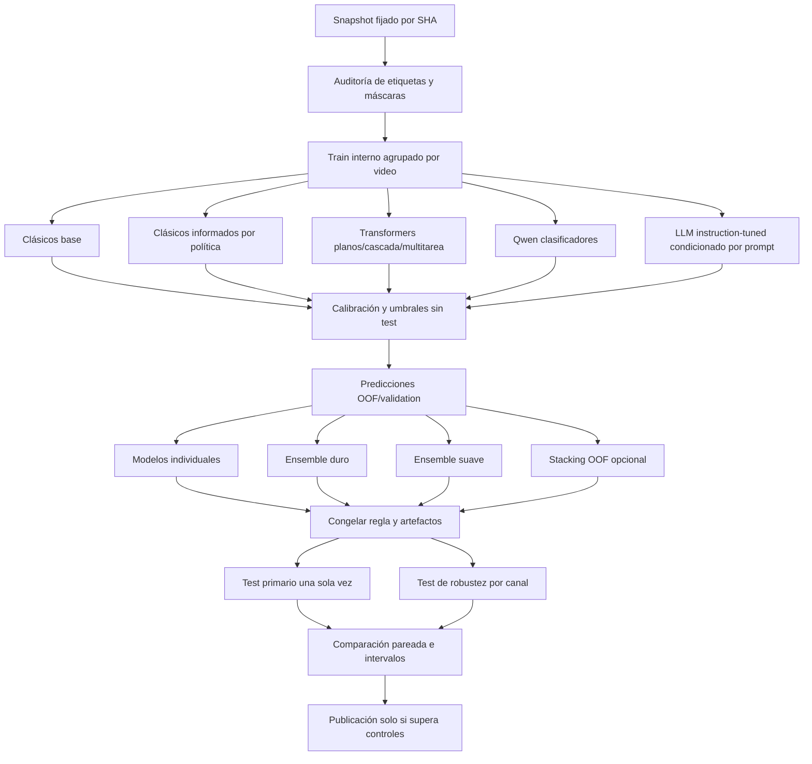

# Auditoría metodológica del entrenamiento, evaluación y *ensemble*

**Proyecto:** Moderación multietiqueta de videos peruanos
**Alcance:** cuadernos `03_01` a `03_08`, incluida la nueva rama `03_06b`, código compartido de entrenamiento, snapshot entrenable y artefactos de evaluación
**Fecha de corte:** 2026-08-10
**Estado:** recomendaciones de las secciones 13 y 15 implementadas; snapshot y bundle regenerados; entrenamiento y resultados predictivos aún pendientes

## 1. Resumen ejecutivo

La estructura general —modelos clásicos, Transformers, modelos Qwen ajustados y combinación posterior— es pertinente, pero los cuadernos 03 **no deberían ejecutarse todavía con fines de resultado final**. El bloqueo no es el dataset: el snapshot está cerrado, tiene 173.240 chunks entrenables y no presenta solapamiento de videos entre `train`, `validation` y `test`. Los bloqueos son metodológicos y de evaluación:

1. No existe ningún resultado completo asociado al SHA-256 del snapshot actual. Los 85 `candidate.json` encontrados corresponden a snapshots anteriores; por tanto, todas las métricas del estado actual están **pendientes**.
2. El supuesto *ensemble* final todavía no se evalúa contra cada método individual. `03_07` selecciona candidatos y permite registrar un consenso, pero no demuestra si el consenso mejora macro-F1, AUPRC, calibración o los errores operativos.
3. Las etiquetas finas y los *flags* solo se consumen en `03_04`. Además, su ausencia se codifica hoy como cero, aunque en 32.025 chunks la etiqueta fina no fue observada. Esto confunde “no anotado” con “negativo” y puede introducir ruido sistemático.
4. El test se calcula dentro de cada entrenamiento antes de congelar la selección final. Aunque el código declara que el test no participa en la selección automática, tener sus métricas disponibles facilita selección humana indirecta y optimismo experimental.
5. La calibración no es comparable entre familias: `LinearSVC` transforma márgenes mediante una sigmoide sin ajustar un calibrador probabilístico. Su ECE no debe compararse con probabilidades calibradas.
6. La pérdida neuronal no compensa explícitamente el fuerte desbalance: 91,82 % de los chunks son `SEGURO`; la etiqueta de daño mayor tiene 8.276 apariciones y la menor 2.331.
7. Los modelos Qwen actuales son clasificadores de secuencia sobre `Qwen3-0.6B-Base`. No son una rama generativa condicionada por el prompt operativo. El prompt v3.2 está incluido en el bundle, pero ningún cuaderno 03 lo carga durante entrenamiento o inferencia.
8. El split evita fuga por video, pero no por canal: 61 canales aparecen en los tres splits. Se requiere una evaluación adicional con canales retenidos para medir generalización a fuentes nuevas.

Los ocho puntos anteriores documentan el estado encontrado al inicio de la auditoría. Después de la aprobación se implementó la revisión: se mantienen las tres familias, se añadieron dos variantes clásicas, las 5+14+3 salidas enmascaradas, una rama LLM condicionada por prompt y una comparación reproducible de individuos contra *ensembles*. La publicación quedó separada y bloqueada. No se atribuyen todavía mejoras predictivas: deben medirse al ejecutar los cuadernos.

## 2. Preguntas de auditoría y criterio de evidencia

La revisión responde las siguientes preguntas:

- ¿El snapshot actual es identificable, reproducible y adecuado para entrenar?
- ¿Los métodos clásicos, Transformers y LLM ajustados están representados de forma metodológicamente comparable?
- ¿Las etiquetas finas y transversales contribuyen al aprendizaje sin convertir valores desconocidos en negativos?
- ¿Los modelos capaces de usar instrucciones reciben el último prompt operativo de una manera técnicamente coherente?
- ¿La selección, calibración y evaluación preservan un test realmente no visto?
- ¿Existe un experimento que demuestre si el *ensemble* mejora a sus componentes?
- ¿Las métricas permiten evaluar tanto desempeño académico como riesgo operativo?
- ¿Los resultados pueden compararse razonablemente con estudios de moderación multietiqueta?

Se inspeccionaron los cuadernos, `src/moderacion_peru/experiments.py`, `training.py`, `models.py`, `registry.py`, la taxonomía, el prompt v3.2, el bundle Colab, el snapshot y los candidatos existentes. Para la comparación externa se consultaron artículos primarios y sus tablas o páginas oficiales; no se usaron entradas de blogs como evidencia de desempeño.

## 3. Identidad reproducible del snapshot

| Elemento                      |                                                                Valor |
| ----------------------------- | -------------------------------------------------------------------: |
| Campaña antes de exclusiones |                                                       182.461 chunks |
| Excluidos                     |                                                         9.221 chunks |
| Snapshot entrenable           |                                                       173.240 chunks |
| Taxonomía                    |                                         2.1.0, cinco salidas gruesas |
| `snapshot_id`               |                                          `v2.1.0-86822445ec0262da` |
| SHA-256 del dataset           | `013d60ba1b173d7752f453d5d05629a3439b09c71f0c343da1b5e498662c1f86` |
| Bundle Colab                  | `dc8c271dda2c3b65c01bd2bea3a7ad4b2182bf40676f7e834e8367a5cf37fca9` |
| Prompt operativo              |                         `config/prompt_operacional_ollama_v3_2.md` |
| SHA-256 del prompt            | `793e1a962c7065523ba0972e6b966cef8ab2f6e6c2678fde03e6ff5c27f42271` |

Todo resultado futuro deberá persistir como mínimo: SHA del dataset, SHA del prompt si corresponde, versión de taxonomía, semilla, partición, versión del código, modelo base, hiperparámetros, umbrales, calibrador y entorno de ejecución.

El nuevo snapshot contiene 14 máscaras finas y tres máscaras de *flags* por fila. Hay 32.025 filas sin referencia fina; ya no se convierten automáticamente en negativos. La auditoría registra 141.159 filas con máscara fina completa y las 173.240 con máscara completa de *flags*. La partición adicional por canal contiene 128.156/23.834/21.250 chunks en train/validation/test y, por construcción, ningún canal cruza esos grupos.

## 4. Estadística descriptiva del snapshot

### 4.1. Particiones

| Split           |            Chunks |               % |          Videos | Canales reconstruidos desde el consolidado |
| --------------- | ----------------: | --------------: | --------------: | -----------------------------------------: |
| Train           |           123.239 |         71,14 % |           3.478 |                                        237 |
| Validation      |            27.317 |         15,77 % |             754 |                                        108 |
| Test            |            22.684 |         13,09 % |             674 |                                         94 |
| **Total** | **173.240** | **100 %** | **4.906** |                    **276 efectivos** |

No se encontraron videos compartidos entre splits. Al reconstruir la identidad de canal desde el consolidado, se encontraron 81 canales compartidos entre train–validation, 81 entre train–test, 62 entre validation–test y 61 presentes en los tres. Esto no invalida la evaluación primaria por video, pero sí limita la inferencia sobre generalización a canales nunca vistos.

La distribución por video tiene media de 35,31 chunks y mediana de 19; por canal, media de 627,68 y mediana de 25,5. La diferencia entre media y mediana muestra una concentración fuerte en pocos canales.

| Concentración por canal   | Proporción de chunks |
| -------------------------- | --------------------: |
| Canal más grande          |               19,17 % |
| Cinco canales más grandes |               41,13 % |
| Diez canales más grandes  |               55,91 % |

Los principales canales son Hablando Huevadas (33.203), Arde Troya (12.295), Nunca MAS (11.364), Goblinciano (8.166), Nada Espacial (6.224), PBO (5.970), Sin Guion (5.623), Todo Good (5.148), ATV Noticias (4.504) y RPP Noticias (4.348).

### 4.2. Longitud textual y duplicación

| Medida           | Caracteres | Palabras separadas por espacio |
| ---------------- | ---------: | -----------------------------: |
| Media            |     466,98 |                          85,84 |
| Mediana          |        483 |                             88 |
| Q1               |        408 |                             74 |
| Q3               |        546 |                            101 |
| P95              |        613 |                            117 |
| Mínimo–máximo |    90–816 |                        10–170 |

No se encontraron duplicados exactos después de normalizar el texto, ni duplicados normalizados entre splits. Esto no descarta paráfrasis, chunks solapados o duplicación aproximada. Antes del entrenamiento neuronal debe medirse la tasa real de truncamiento con cada tokenizador: `max_length=128` puede truncar una fracción material porque el número de *tokens* suele superar el de palabras.

### 4.3. Etiquetas gruesas y desbalance

| Etiqueta                        |  Chunks | % de chunks |
| ------------------------------- | ------: | ----------: |
| `SEGURO`                      | 159.077 |    91,825 % |
| `ACOSO_AMENAZA`               |   8.276 |     4,777 % |
| `CONTENIDO_SEXUAL`            |   3.875 |     2,237 % |
| `RACISMO_DISCRIMINACION`      |   2.570 |     1,484 % |
| `ATAQUE_POR_GENERO_IDENTIDAD` |   2.331 |     1,346 % |

Los porcentajes no suman 100 % porque el daño es multietiqueta. Hay 14.163 chunks con al menos una categoría de daño (8,175 %), 17.052 asignaciones de daño y 2.709 chunks dañinos multietiqueta. La cardinalidad gruesa media es 1,0167 etiquetas por chunk.

La relación `SEGURO`/daño es 11,23:1. Entre categorías de daño, la razón máximo/mínimo es 3,55, el coeficiente de variación poblacional es 0,561 y la entropía de Shannon normalizada es 0,898. El criterio relajado de al menos 2.000 ejemplos por categoría en train+validation+test se cumple; en train solamente quedan 1.880 ejemplos de racismo y 1.674 de género, lo cual se mantiene como diagnóstico, no como condición de parada.

### 4.4. Etiquetas finas y *flags*

| Etiqueta fina                |  Conteo |
| ---------------------------- | ------: |
| `seguro`                   | 128.537 |
| `seguro_ironia_marcada`    |     555 |
| `acoso_personal`           |   6.216 |
| `amenaza_directa`          |   1.783 |
| `misoginia_acoso_genero`   |   1.720 |
| `homofobia_transfobia`     |     459 |
| `sexual_explicito`         |   2.102 |
| `sexual_cosificacion`      |     797 |
| `sexual_no_consensual`     |     282 |
| `racismo_etnico_explicito` |   1.052 |
| `racismo_linguistico`      |      50 |
| `clasismo_racial`          |     403 |
| `discriminacion_regional`  |     382 |
| `racismo_encubierto`       |     792 |

Hay 145.130 asignaciones finas en 141.215 chunks. En 32.025 chunks (18,49 %) no existe referencia fina. No se detectaron inconsistencias fina→gruesa entre las referencias existentes.

| *Flag* transversal   | Conteo |
| ---------------------- | -----: |
| `humor_encubridor`   |  1.398 |
| `contexto_necesario` |    244 |
| `ironia_ambigua`     |    114 |

Los *flags* aparecen en 1.669 chunks (0,963 %). Su baja prevalencia hace especialmente riesgoso interpretar la ausencia como negativo confirmado.

### 4.5. Pesos y procedencia

El campo `sample_weight` existe, pero vale 1,0 en los 173.240 registros; actualmente no aporta ponderación. Las fuentes de etiqueta son:

| Fuente                                     | Chunks |
| ------------------------------------------ | -----: |
| `deepseek_remote_historical_recovered`   | 79.586 |
| `human_modified`                         | 44.145 |
| `llm_remote_review_historical_recovered` | 32.371 |
| `deepseek_remote`                        | 11.980 |
| `llm_remote_review`                      |  2.600 |
| `human_accepted`                         |  2.558 |

La procedencia debe conservarse como variable de auditoría y estratificación de errores, pero no utilizarse como predictor del contenido.

## 5. Inventario y estado de los cuadernos 03

| Cuaderno | Método implementado | Estado de ejecución | Control incorporado |
| --- | --- | --- | --- |
| `03_01_modelos_clasicos` | cinco estimadores; variantes base palabra+carácter e informada por política | `RUN_TRAINING=False` | 22 salidas enmascaradas, SGD balanceado y SVC calibrado |
| `03_02_transformers_planos` | MiniLM y E5, 5+14+3 salidas | `RUN_TRAINING=False` | `pos_weight`, máscaras, early stopping, truncamiento y robustez por canal opcional |
| `03_03_transformer_cascada` | puerta de daño con finas/flags + rama de cuatro daños | `RUN_TRAINING=False` | propagación de error y comparación plana en `03_07` |
| `03_04_transformer_multitarea` | 5 gruesas + 14 finas + 3 flags | `RUN_TRAINING=False` | pérdida enmascarada y ratio 4:1 fijo en train/validation |
| `03_05_qwen_lora` | Qwen3-0.6B-Base clasificador LoRA de 22 salidas | `RUN_TRAINING=False` | rotulado explícito como clasificador supervisado |
| `03_06_qwen_estructurado` | Qwen clasificador de 22 salidas con penalización estructural | `RUN_TRAINING=False` | calibración y auxiliares enmascarados |
| `03_06b_qwen_prompt_sft` | Qwen3-0.6B conversacional [R19], LoRA causal, prompt v3.2 y JSON | `RUN_PILOT=False`; `RUN_FULL_TRAINING=False` | piloto no elegible y corrida completa separada |
| `03_07_comparacion_final` | individuos, voto duro, medias suaves, unión/intersección | tres compuertas en `False` | Pareto, diversidad, bootstrap por video, pruebas pareadas/Holm, test único y publicación bloqueada |
| `03_08_auditoria_finas_flags` | cobertura, consistencia y calidad auxiliar disponible | ejecutable sin entrenar | métricas solo en posiciones observadas |

Los cuadernos 03_02–03_06b están preparados para Colab L4 y fijan el bundle actual. El entrenamiento no se ejecutó como parte de esta implementación; por tanto, las métricas predictivas continúan pendientes.

## 6. Estado real de los resultados

Se localizaron 85 candidatos con estado `complete`, todos de pilotos o snapshots anteriores. Ninguno tiene el SHA-256 nuevo `013d60...c1f86`. Tampoco existe `modelos/registro_modelos_5_salidas.json`.

| Familia o combinación         | Resultado válido para snapshot actual              |
| ------------------------------ | --------------------------------------------------- |
| Clásicos                      | **Pendiente**                                 |
| Transformer plano              | **Pendiente**                                 |
| Transformer cascada            | **Pendiente**                                 |
| Transformer multitarea         | **Pendiente**                                 |
| Qwen + LoRA                    | **Pendiente**                                 |
| Qwen estructurado              | **Pendiente**                                 |
| LLM condicionado por prompt    | **Implementado; ejecución pendiente** |
| *Ensemble* duro 2-de-3       | **Implementado; evaluación pendiente** |
| *Ensemble* suave o ponderado | **Implementado; evaluación pendiente** |

No es académicamente válido trasladar métricas de los 85 candidatos históricos al snapshot actual. En futuras actualizaciones del presente informe, la tabla de resultados deberá completarse automáticamente desde candidatos cuyo SHA coincida exactamente.

## 7. Auditoría crítica de la metodología actual

### 7.1. Aspectos sólidos

- Contrato explícito de cinco salidas canónicas.
- Split sin solapamiento de videos.
- Bundle Colab versionado y con hashes.
- Baselines clásicos y Dummy para evitar atribuir mérito a la prevalencia.
- Umbrales por etiqueta, apropiados para un problema multietiqueta desbalanceado.
- Arquitecturas complementarias: plana, cascada, multitarea y Qwen.
- Restricciones para evitar `SEGURO` simultáneo con daño.
- Métricas operativas existentes: falso seguro sobre daño, carga de revisión, conflictos y ausencia de categoría.

### 7.2. Hallazgos que requieren corrección antes de entrenar

#### A. Test visible antes de congelar el experimento — severidad alta

Cada candidato calcula métricas de test durante su entrenamiento. La solución propuesta es que 03_01–03_06 produzcan únicamente predicciones y métricas de entrenamiento/validación; `03_07` congela candidato, umbrales, calibradores y regla de *ensemble*, y solo entonces abre el test una vez.

#### B. Etiquetas auxiliares no observadas tratadas como negativas — severidad alta

`03_04` genera un vector de 22 ceros/unos. Una lista fina vacía o un *flag* ausente se convierte en cero, aunque puede significar “no anotado”. La literatura distingue explícitamente el aprendizaje multietiqueta con etiquetas faltantes del escenario completamente anotado; tratar lo desconocido como negativo degrada el aprendizaje cuando hay positivos no observados [R7, R8].

Se requiere un contrato con máscaras explícitas:

```text
coarse_targets[5], coarse_observed_mask[5] = 1
fine_targets[14], fine_observed_mask[14]
flag_targets[3], flag_observed_mask[3]
```

La pérdida por familia debe ser:

```text
L = L_gruesa
  + lambda_fina * sum(mask_fina * BCE_fina) / sum(mask_fina)
  + lambda_flags * sum(mask_flags * BCE_flags) / sum(mask_flags)
```

Una máscara cero excluye esa posición de la pérdida; no genera ni positivo ni negativo. Si la anotación fina de un chunk fue exhaustiva, la máscara puede valer uno para las 14 posiciones. Si solo se verificó una etiqueta concreta, la máscara debe ser por etiqueta.

#### C. Uso incompleto de etiquetas finas y *flags* — severidad alta

Por requisito del proyecto, todo método compatible debe aprovecharlas:

- Modelos clásicos: un conjunto de clasificadores auxiliares por etiqueta, entrenado solo con observaciones válidas; alternativa de cadenas de clasificadores a evaluar como ablación.
- Transformers planos: cabeza compartida de 22 salidas o tres cabezas, con BCE enmascarada.
- Cascada: finas de daño en la rama condicional, finas seguras en la puerta o cabeza auxiliar, y *flags* transversales en una cabeza independiente.
- Multitarea: conservar 5+14+3, corregir la máscara y evaluar cada nivel.
- Qwen de clasificación: cabezas multitarea y pérdida enmascarada.
- LLM generativo: salida JSON con gruesas, finas y *flags*; la pérdida de campos no observados debe omitirse o esos campos deben marcarse como `null`, nunca inventarse como negativos.

No todos los modelos necesariamente mejorarán con auxiliares. Por eso se exige una ablación `solo_gruesas` frente a `gruesas+finas+flags_enmascaradas` por familia compatible.

#### D. Calibración incomparable — severidad media-alta

Aplicar `sigmoid(decision_function)` a `LinearSVC` produce puntuaciones acotadas, no probabilidades calibradas. ECE y Brier solo serán comparables tras un calibrador entrenado fuera de la muestra de ajuste, por ejemplo Platt o isotónico. Las redes neuronales también pueden estar mal calibradas; el escalado de temperatura es un baseline simple respaldado empíricamente [R12].

#### E. Desbalance no tratado en la pérdida neuronal — severidad alta

La BCE actual asigna el mismo costo a cada posición. Deben compararse al menos:

- BCE con `pos_weight` calculado solo en train y limitado para evitar pesos extremos;
- *focal loss* como ablación, que reduce el peso de negativos fáciles en escenarios muy desbalanceados [R13];
- muestreo por video y lotes con presencia de daño, sin duplicar ejemplos en validation/test.

La opción ganadora se elige por validación, no por intuición.

#### F. Selección lexicográfica vulnerable — severidad alta

Minimizar primero `false_safe_rate_on_damage` puede favorecer un clasificador que marque casi todo como daño. Debe reemplazarse por una frontera de Pareto o una selección con restricciones operativas: piso de recall de daño, techo de falsas alarmas/carga de revisión y, dentro de los candidatos factibles, maximización de macro-AUPRC o macro-F1 de daños. Si no se fijan límites operativos, el reporte debe presentar la frontera y no declarar un único ganador.

#### G. Falta de parada temprana y mejor checkpoint — severidad media

Los Transformers entrenan un número fijo de épocas sin evaluación durante entrenamiento ni `load_best_model_at_end`. Se propone evaluar por época con macro-AUPRC de daños, guardar el mejor checkpoint y aplicar paciencia. Deben registrarse media y desviación en varias semillas.

#### H. Máximo de 128 tokens sin diagnóstico — severidad media

Antes del entrenamiento debe reportarse, por tokenizador, porcentaje truncado y número medio/P95 de tokens descartados. Si el truncamiento es material, comparar 128 contra 256 en un piloto estratificado.

#### I. Generalización por canal no medida — severidad media-alta

El split por video evita memorizar el mismo video, pero la presencia del mismo canal en varios splits permite aprender estilo, invitados y muletillas. Se propone conservar el test principal y añadir un conjunto de robustez con canales completamente retenidos. La estratificación multietiqueta requiere conservar en lo posible las prevalencias y combinaciones de etiquetas [R14].

## 8. Metodología aprobada e implementada; ejecución pendiente



### 8.1. Datos y particiones internas

1. Mantener el snapshot y los splits actuales como evaluación principal.
2. Dentro de train, crear folds agrupados por video y aproximadamente estratificados por combinaciones multietiqueta.
3. Reservar predicciones *out-of-fold* para calibración, *stacking* y estimación de diversidad.
4. Usar validation para selección final de candidatos, umbrales y regla de *ensemble*.
5. No calcular test hasta que el manifiesto de selección quede firmado.
6. Construir además un test de robustez por canal, reportado por separado; no mezclarlo con el test primario.

### 8.2. Dos variantes de modelos clásicos

#### Clásica A: base supervisada por etiquetas

- TF-IDF de palabras 1–2 gramos.
- TF-IDF de caracteres 3–5 gramos como variante o unión, útil ante faltas ortográficas, alargamientos y jerga.
- ComplementNB, regresión logística balanceada, LinearSVC calibrada y SGD con `class_weight='balanced'`.
- Baseline Dummy por etiqueta.
- Objetivos gruesos y auxiliares finos/*flags* separados con máscaras.

#### Clásica B: informada por política

Mantiene los mismos clasificadores y añade rasgos auditables derivados del prompt v3.2:

- lexemas y expresiones peruanas;
- insultos compuestos y patrones de amenaza;
- negación, cita, denuncia y estilo informativo;
- condescendencia, diminutivos y marcadores de superioridad;
- contexto sexual y desambiguación semántica local;
- grupos protegidos, clasismo y referencias regionales;
- indicadores de ironía, humor encubridor y necesidad de contexto.

Esta rama **no se denominará “condicionada por prompt”**: el algoritmo clásico no ejecuta instrucciones. Es una variante supervisada con rasgos de política. Si se incorporan similitudes de embeddings entre texto y definiciones de etiquetas, se reportará como híbrido clásico-semántico.

La comparación A/B cuantificará el aporte de la política sin confundirlo con el efecto de la arquitectura.

### 8.3. Transformers

- **Plano:** MiniLM multilingüe y E5-small multilingüe con salida multitarea enmascarada. MiniLM procede de destilación de autoatención [R15]; E5 multilingüe fue preentrenado contrastivamente sobre pares multilingües [R16].
- **Cascada:** puerta daño/no daño y cabeza condicional de daños; debe medirse la propagación de falsos seguros. Las finas y *flags* observados se incorporan como auxiliares.
- **Multitarea:** 5 gruesas + 14 finas + 3 flags, con máscaras y pesos ajustados solo en train/validation.
- **Ablaciones obligatorias:** solo gruesas; gruesas+finas; gruesas+finas+flags; BCE ponderada frente a focal.

### 8.4. Qwen y LLM ajustado

Qwen3 cubre modelos densos y MoE en varios tamaños y es multilingüe [R17]. LoRA reduce parámetros entrenables al inyectar matrices de bajo rango [R18]. Sin embargo, `03_05` y `03_06` actuales son clasificadores, no modelos de respuesta JSON instruidos.

Se proponen dos ramas claramente separadas:

1. **Qwen clasificador:** conservar las cabezas de clasificación LoRA y estructurada; usar las 22 salidas con máscara.
2. **LLM condicionado por prompt:** variante *instruction-tuned* compatible con L4, ajustada para recibir el prompt v3.2, el chunk y devolver JSON válido con gruesas, finas, *flags* y confianza. El tamaño exacto se decide con un piloto de memoria/velocidad; no se fija aquí sin evidencia de ejecución.

Para la rama condicionada por prompt:

- el prompt completo se usa en entrenamiento e inferencia;
- se persiste su SHA por corrida y por candidato;
- el formato JSON se valida estrictamente;
- las etiquetas no observadas se representan como `null`/máscara y no como cero;
- la confianza del LLM no se toma como probabilidad calibrada hasta contrastarla con exactitud empírica;
- se mide tasa de JSON inválido, reparación y contradicción jerárquica.

No se recomienda anteponer el prompt completo a cada ejemplo de un encoder convencional: consume ventana y no equivale a aprendizaje instruccional. En esos modelos, el prompt se operacionaliza mediante descripciones de etiquetas, auxiliares semánticos y las etiquetas supervisadas.

### 8.5. Prompt operativo por capacidad del modelo

| Familia                       | Forma correcta de incorporar v3.2                                                                           |
| ----------------------------- | ----------------------------------------------------------------------------------------------------------- |
| Clásica base                 | No ejecuta prompt; aprende la política contenida en las etiquetas.                                         |
| Clásica informada            | Rasgos versionados derivados del prompt; SHA y lista de rasgos persistidos.                                 |
| Transformer encoder           | Descripciones/prototipos de etiquetas o aprendizaje multitarea; no anteponer el prompt largo sin ablación. |
| Qwen con cabeza clasificadora | Definiciones de etiquetas como señal auxiliar opcional; salida fija.                                       |
| LLM instruction-tuned         | Prompt v3.2 completo en train e inferencia, JSON estricto y SHA obligatorio.                                |

## 9. Cuaderno requerido de comparación individual–ensemble

Se propone convertir `03_07_comparacion_final.ipynb` en un cuaderno que **primero evalúe y compare** y solo publique después de una confirmación explícita. Alternativamente, publicación puede moverse a un `03_09`; esta segunda opción es más limpia, pero implica renumeración. La opción mínima recomendada es conservar el nombre y agregar un bloqueo fuerte de publicación.

El cuaderno debe cargar predicciones del mismo conjunto de ejemplos y comparar:

1. cada candidato individual de cada familia;
2. el mejor individuo por familia;
3. voto duro 2-de-3;
4. promedio suave de probabilidades calibradas;
5. voto suave ponderado con pesos aprendidos solo en validación y restricciones simples;
6. *stacking* opcional entrenado exclusivamente con predicciones OOF;
7. unión e intersección como límites operativos de recall/precisión.

También debe calcular diversidad:

- desacuerdo par a par;
- correlación de errores;
- doble fallo;
- ganancia oracular máxima;
- desempeño por categoría minoritaria y por canal.

Van Aken et al. obtuvieron una mejora de macro-F1 de 0,783 a 0,791 al combinar modelos diversos, solo 0,8 puntos absolutos [R1]. Esto respalda medir el beneficio, no asumirlo. Si el intervalo de confianza de la diferencia incluye cero, si empeora una categoría crítica o si su costo/latencia no compensa la ganancia, debe seleccionarse el mejor modelo individual.

## 10. Métricas y comparación estadística propuestas

### 10.1. Métricas gruesas

- precisión, recall, F1 y soporte por etiqueta;
- macro-F1, micro-F1 y F1 ponderado;
- AP/AUPRC por etiqueta, macro-AUPRC de las cuatro categorías de daño y micro-AUPRC;
- Hamming loss;
- exact match o subset accuracy;
- Jaccard por ejemplo;
- error de cardinalidad y densidad de etiquetas;
- conflictos `SEGURO`+daño y salida sin categoría.

### 10.2. Métricas operativas

- any-damage: precisión, recall, F1, AUPRC, AUROC, MCC y balanced accuracy;
- tasa de falso seguro condicionada a daño;
- falsa alarma condicionada a `SEGURO`;
- carga de revisión a distintos umbrales;
- curvas precisión–recall y frontera de costo;
- desempeño por canal, procedencia de etiqueta y longitud del chunk.

### 10.3. Etiquetas finas y *flags*

Las métricas se calculan **solo sobre posiciones observadas**, reportando denominador y cobertura por etiqueta. Además:

- consistencia fina→gruesa;
- desempeño de cada cabeza auxiliar;
- mejora o deterioro de la tarea gruesa frente a la ablación sin auxiliares;
- desempeño específico de `humor_encubridor`, `contexto_necesario` e `ironia_ambigua` con intervalos amplios por su baja frecuencia.

### 10.4. Calibración

- Brier y ECE por etiqueta, no solo ECE aplanado;
- diagramas de confiabilidad;
- cobertura–riesgo para revisión humana;
- comparación antes/después de calibración;
- excluir puntuaciones SVC no calibradas de métricas probabilísticas.

### 10.5. Incertidumbre y pruebas pareadas

- cinco semillas para modelos neuronales cuando el costo lo permita; reportar media, desviación y resultados por semilla;
- intervalos de confianza mediante bootstrap pareado y agrupado por video;
- McNemar para el resultado binario any-damage;
- bootstrap pareado para diferencias de macro/micro-F1 y AUPRC;
- corrección de Holm cuando se prueben múltiples comparaciones;
- tamaño de efecto e intervalo, no solo valor p.

La selección de pruebas debe ajustarse a la métrica y al diseño pareado, como recomienda el protocolo de significancia para NLP de Dror et al. [R11].

## 11. Comparación con estudios externos

### 11.1. Resultados extraídos

| Estudio                           | Idioma/tarea                      |                            Etiquetas | Método destacado             | Resultado reportado                                                                      |
| --------------------------------- | --------------------------------- | -----------------------------------: | ----------------------------- | ---------------------------------------------------------------------------------------- |
| Van Aken et al. 2018 [R1]         | Inglés, comentarios Wikipedia    |                     6, multietiqueta | BiGRU-attention / ensemble    | macro-F1 0,783 / 0,791; AUC 0,983                                                        |
| Ozler et al. 2020 [R2]            | Inglés, incivilidad multidominio |                 5 y 6, multietiqueta | BERT; binarios separados      | en Wikipedia: F1 por etiqueta 0,86, 0,50, 0,88, 1,00, 0,76, 1,00; AUC 0,990              |
| Alghamdi et al. 2024, AraTar [R3] | Árabe, tipo y objetivo de odio   |                   multietiqueta fina | AraBERT Twitter               | tipo: micro-F1 0,845, macro-F1 0,7746; objetivo: 0,8503 y 0,7315                         |
| Gilda et al. 2022 [R4]            | Inglés, toxicidad sutil          |                     7, multietiqueta | redes neuronales              | micro-F1 0,8876; macro-F1 0,6798; ROC-AUC 0,71                                           |
| Belal et al. 2023 [R5]            | Bengalí, tipos de toxicidad      | 6, multietiqueta tras puerta binaria | CNN-BiLSTM-attention          | exactitud media 78,92 %; F1 ponderado 0,86                                               |
| Leonardelli y Casula 2023 [R6]    | Inglés, EDOS jerárquico         |         binaria, 4 clases, 11 clases | RoBERTa multitarea + ensemble | mejores del reto: macro-F1 0,8746 / 0,7326 / 0,5606; su sistema 0,8402 / 0,6385 / 0,4935 |

Ozler et al. encontraron que los clasificadores binarios por etiqueta superaban al clasificador conjunto en la mayoría de sus experimentos [R2]. Esto justifica comparar cabezas conjuntas frente a objetivos separados, no asumir que multitarea siempre mejora. Leonardelli y Casula encontraron que el desacuerdo de anotadores se asociaba con ejemplos más difíciles y que las tareas auxiliares podían aportar [R6], lo cual respalda evaluar los *flags* como señal auxiliar siempre que su observación esté correctamente enmascarada.

La comparación de Ozler et al. requiere una cautela adicional: su dataset de Wikipedia no tenía un split de desarrollo separado y los autores usaron el test como desarrollo para esos experimentos; además, muestran que AUC puede permanecer alta aun cuando algunas clases no se predicen [R2]. Sus valores se incluyen como antecedente metodológico, no como referencia limpia para validar nuestro test.

### 11.2. Interpretación para este proyecto

Los valores externos **no son umbrales de aprobación**. Difieren el idioma, unidad textual, prevalencia, taxonomía, calidad de anotación, número de clases y partición. Aun así, forman una banda orientativa:

- tareas multietiqueta gruesas comparables reportan macro-F1 aproximadamente entre 0,68 y 0,79;
- una taxonomía fina jerárquica de 11 clases puede caer hacia 0,49–0,56 aun con Transformers fuertes;
- las métricas ponderadas o micro pueden ser altas mientras las categorías minoritarias fallan;
- las tareas binarias suelen rendir mejor: EDOS alcanzó 0,8746 de macro-F1 en binario, frente a 0,5606 en su nivel fino [R6].

Por ello, el proyecto no debe declarar calidad con accuracy o micro-F1 solamente. La métrica principal debe dar peso equivalente a cada daño y acompañarse de AUPRC, recall de any-damage, falso seguro, falsas alarmas y desempeño fino observado.

### 11.3. Tabla para completar después de ejecutar

| Modelo                      | Macro-F1 gruesa |  Micro-F1 | Macro-AUPRC daño | Any-damage F1 | Falso seguro | ECE/Brier | Macro-F1 fina observada | Test canal retenido |
| --------------------------- | --------------: | --------: | ----------------: | ------------: | -----------: | --------: | ----------------------: | ------------------: |
| Clásico base               |       Pendiente | Pendiente |         Pendiente |     Pendiente |    Pendiente | Pendiente |               Pendiente |           Pendiente |
| Clásico informado          |       Pendiente | Pendiente |         Pendiente |     Pendiente |    Pendiente | Pendiente |               Pendiente |           Pendiente |
| Transformer plano           |       Pendiente | Pendiente |         Pendiente |     Pendiente |    Pendiente | Pendiente |               Pendiente |           Pendiente |
| Cascada                     |       Pendiente | Pendiente |         Pendiente |     Pendiente |    Pendiente | Pendiente |               Pendiente |           Pendiente |
| Multitarea                  |       Pendiente | Pendiente |         Pendiente |     Pendiente |    Pendiente | Pendiente |               Pendiente |           Pendiente |
| Qwen LoRA clasificador      |       Pendiente | Pendiente |         Pendiente |     Pendiente |    Pendiente | Pendiente |               Pendiente |           Pendiente |
| Qwen estructurado           |       Pendiente | Pendiente |         Pendiente |     Pendiente |    Pendiente | Pendiente |               Pendiente |           Pendiente |
| LLM condicionado por prompt |       Pendiente | Pendiente |         Pendiente |     Pendiente |    Pendiente | Pendiente |               Pendiente |           Pendiente |
| Mejor ensemble              |       Pendiente | Pendiente |         Pendiente |     Pendiente |    Pendiente | Pendiente |               Pendiente |           Pendiente |

## 12. Criterios de publicación propuestos

Un candidato o *ensemble* solo puede publicarse si:

1. coincide exactamente con SHA de dataset, taxonomía y, cuando corresponda, prompt;
2. emite las cinco salidas gruesas válidas para todos los chunks;
3. no usa test para hiperparámetros, umbrales, pesos ni selección;
4. reporta resultados por etiqueta y no oculta categorías minoritarias bajo promedios;
5. incorpora finas y *flags* en toda arquitectura compatible, con máscaras explícitas;
6. supera Dummy y los baselines clásicos con intervalo de confianza o aporta una ventaja operativa demostrable;
7. respeta los límites operativos aprobados de recall, falsas alarmas y carga de revisión;
8. demuestra si el *ensemble* mejora, empata o empeora frente al mejor individuo;
9. guarda calibrador, umbrales, versiones, latencia, memoria y costo;
10. pasa el test primario y reporta por separado el test de canal retenido.

## 13. Cambios concretos implementados por cuaderno

Estos cambios se implementaron después de la aprobación. “Implementado” describe código, contrato y cuaderno; no implica que el entrenamiento ya se haya ejecutado ni que el desempeño haya mejorado.

### 13.1. Submuestreo de `SEGURO` y evaluación dual del test

La política fija conserva todos los chunks dañinos y selecciona `SEGURO` a 4:1 mediante SHA-256, semilla declarada y cuotas aproximadamente proporcionales por canal en train y validation. Train pasa de 123.239 a 51.205 filas (10.241 daño + 40.964 `SEGURO`; −58,45 %) y validation, de 27.317 a 10.600 (2.120 + 8.480; −61,20 %). No se elimina ningún registro del snapshot.

Test conserva las 22.684 filas naturales (1.802 daño + 20.882 `SEGURO`; 11,59:1) y permanece sellado hasta congelar modelo, ensemble y umbrales. `03_07` realiza una única inferencia sobre esas filas. Su informe calcula métricas principales con prevalencia natural y métricas secundarias sobre una submuestra determinista 4:1 de 9.010 filas (1.802 + 7.208), seleccionada de las mismas predicciones. Así no hay reinferencia ni segunda apertura. La vista 4:1 facilita comparar con validation; la natural permite interpretar precisión, AP, calibración y falsas alarmas en el corpus real. Todos los modelos comparten los mismos IDs de train/validation y la misma política de test.

| Cuaderno                                           | Cambio implementado                                                                                                                                              |
| -------------------------------------------------- | ------------------------------------------------------------------------------------------------------------------------------------------------------------- |
| 03_01                                              | Añadir clásica base palabra+carácter y clásica informada por política; objetivos auxiliares enmascarados; corregir`class_weight` de SGD; calibrar SVC. |
| 03_02                                              | Salida multitarea 5+14+3, máscaras, balance de pérdida, early stopping, calibración y diagnóstico de truncamiento.                                        |
| 03_03                                              | Añadir auxiliares en puerta/rama, medir propagación y comparar contra modelo plano en los mismos ejemplos.                                                  |
| 03_04                                              | Introducir máscaras explícitas, métricas auxiliares, ablations y pérdida balanceada.                                                                      |
| 03_05                                              | Mantener Qwen LoRA clasificador, ampliar a 22 salidas enmascaradas y etiquetarlo correctamente como clasificador.                                             |
| 03_06                                              | Mantener restricción estructural, añadir auxiliares/máscaras y calibración; separar de la rama prompt.                                                    |
| Nuevo brazo dentro de 03_05/03_06 o nuevo cuaderno | SFT instruction-tuned con prompt v3.2 y JSON estricto. Se recomienda cuaderno separado para no mezclar clasificación y generación.                          |
| 03_07                                              | Comparar todos los individuos y ensembles, diversidad, CIs y significancia; congelar el test; publicación desactivada por defecto.                           |
| 03_08                                              | Auditar máscaras, cobertura, consistencia y calidad predictiva de finas/flags sobre observados.                                                              |

## 14. Orden de ejecución posterior a la implementación

1. ~~Modificar el contrato de snapshot para máscaras observadas y regenerar un snapshot con nuevo SHA.~~ Completado: `013d60...c1f86`.
2. ~~Regenerar el bundle Colab y fijar su ID en los cuadernos.~~ Completado: `dc8c27...7fca9`.
3. Ejecutar 03_08 como control previo de datos.
4. Ejecutar 03_01 y conservar sus predicciones OOF/validation.
5. Ejecutar 03_02–03_06 y `03_06b`, la rama LLM condicionada por prompt; comenzar esta última con el piloto no elegible.
6. Ejecutar 03_07 para comparar individuos/ensembles y congelar la decisión.
7. Abrir test una vez, inferir sus 22.684 filas y generar resultados naturales más la vista secundaria 4:1 sin reinferencia.
8. Publicar el registro solo después de revisar la tabla de evidencia.

## 15. Decisiones aprobadas y trazabilidad de implementación

El paquete metodológico fue aprobado en la interacción *human-in-the-loop* y quedó implementado así:

- [X] Crear máscaras explícitas para finas y *flags* y regenerar snapshot/bundle.
- [X] Exigir 5+14+3 salidas auxiliares en todos los métodos técnicamente compatibles.
- [X] Incorporar las dos variantes clásicas: base e informada por política.
- [X] Añadir una rama LLM realmente condicionada por el prompt v3.2, separada de Qwen clasificador.
- [X] Impedir que 03_01–03_06 calculen test antes de congelar selección y ensemble; evaluar después el test natural y su vista 4:1 con una sola inferencia.
- [X] Convertir 03_07 en comparación individual–ensemble con voto duro, suave y *stacking* OOF opcional.
- [X] Añadir calibración válida, pérdidas para desbalance, early stopping y diagnóstico de truncamiento.
- [X] Añadir evaluación de robustez con canales retenidos.
- [X] Aplicar bootstrap agrupado por video, pruebas pareadas y corrección por comparaciones múltiples.
- [X] Mantener publicación del registro desactivada hasta una aprobación posterior basada en resultados.

La serie 03 ya puede comenzar bajo el snapshot y bundle nuevos. Los interruptores costosos siguen en `False`. `03_07` rechaza candidatos que hayan abierto test, separa congelación y apertura única, y mantiene la publicación bloqueada hasta una aprobación posterior basada en resultados.

## 16. Conclusiones

El dataset actual es suficientemente grande para iniciar entrenamiento y cumple el mínimo relajado de 2.000 ejemplos por daño en el conjunto total. Los riesgos metodológicos detectados quedaron convertidos en controles ejecutables: máscaras observadas, test sellado, calibración comparable, pérdida balanceada, partición alternativa por canal y comparación individual–ensemble. Falta ejecutar esos controles y completar la tabla de resultados.

La corrección más importante es semántica y estadística: **ausente no significa negativo**. Finas y *flags* deben enriquecer todos los modelos compatibles, pero solo donde exista observación verificable. La segunda corrección es experimental: el test debe permanecer cerrado hasta que modelos, umbrales y ensemble estén congelados. La tercera es conceptual: un Qwen con cabeza de clasificación no equivale a un modelo condicionado por prompt; ambos deben compararse como ramas distintas.

Con las mejoras implementadas, la serie 03 podrá responder de forma auditable no solo qué modelo obtiene el mejor promedio en validation 4:1, sino también si reconoce daños minoritarios, si está calibrado bajo la prevalencia natural del test, si generaliza a canales nuevos y si el costo adicional del ensemble o del LLM aporta una mejora estadística y operativamente defendible. La doble lectura natural/4:1 del test se obtiene de una única matriz de predicciones y evita convertir el benchmark secundario en una oportunidad adicional de selección.

## 17. Cierre técnico: hardware, tiempos y costos

### 17.1. Estado de evidencia

Al cierre de esta auditoría, **ningún entrenamiento 03_01–03_06b sobre el snapshot vigente `013d60...c1f86` ha sido ejecutado**. Tampoco se abrió test. Por tanto, el tiempo de cómputo y costo efectivamente consumidos por las corridas finales de entrenamiento, validation y test son, hasta este corte, **0 horas y USD 0**. Los candidatos históricos corresponden a pilotos o snapshots anteriores y no se contabilizan como entrenamiento final. `03_08` sí tiene salidas de auditoría del snapshot, pero la ejecución conservada no registró tiempo de pared; no es válido reconstruirlo a partir de la hora de modificación del archivo.

La distinción entre observado y estimado es obligatoria:

- **Observado:** valor escrito por el proceso en `stage_timings_seconds`, `training_metrics`, manifiesto o reporte de test.
- **Estimado:** rango de planificación previo a la corrida; no se presenta como consumo real.
- **No disponible:** una corrida existente sin instrumentación suficiente; no se imputa un valor retrospectivo.

Las implementaciones actuales ya registran tiempos de extracción de rasgos, ajuste, inferencia y métricas de validation; los Transformers conservan además `train_runtime` del `Trainer`. `03_07` registra bootstrap, comparación, inferencia única del test y cálculo de sus dos vistas. De este modo, la próxima actualización de este informe podrá sustituir los rangos por tiempos observados sin estimación manual.

### 17.2. Hardware local observado

El inventario reproducible se guardó en `resultados/auditorias/hardware_local_2026-08-10.json`. La máquina local reportó Windows 11 Pro de 64 bits, Python 3.13.2, AMD Ryzen 7 8845HS, ocho núcleos físicos, 16 procesadores lógicos, 30.954.729.472 bytes de memoria del sistema (~28,83 GiB utilizables) y Radeon 780M con 3 GiB informados por el adaptador. El entorno `.venv` no tenía PyTorch instalado; `resolve_device('auto')` resolvió exclusivamente CPU. En consecuencia, la GPU AMD **no se utilizó** en preparación, pruebas ni auditoría.

El código reconoce ROCm si una distribución PyTorch compatible expone `torch.version.hip`; PyTorch mantiene deliberadamente la interfaz `torch.cuda` para HIP [R24]. Esta compatibilidad de software no demuestra que la Radeon integrada, el sistema operativo y la rueda instalada formen una combinación soportada. Para el corte actual no se atribuye aceleración AMD ni tiempo GPU local.

Las optimizaciones locales aprobadas quedaron así:

- `03_01` ajusta TF–IDF una sola vez por variante y reutiliza la matriz dispersa entre los cinco estimadores;
- las 22 cabezas enmascaradas se ajustan y predicen con cuatro hilos `joblib`, compartiendo memoria;
- `03_07` distribuye las réplicas bootstrap por video entre cuatro hilos con semillas por réplica, por lo que uno y cuatro trabajadores producen las mismas muestras;
- la inferencia de los miembros del ensemble permanece secuencial para no multiplicar RAM o VRAM.

### 17.3. Hardware remoto de referencia

Los cuadernos `03_02`–`03_06b` exigen una NVIDIA L4. NVIDIA especifica 24 GB de memoria, 300 GB/s de ancho de banda y soporte de FP16/BF16 mediante Tensor Cores [R21]. El preflight del proyecto comprueba el nombre efectivo de GPU y rechaza un runtime distinto cuando `COLAB_REQUIRE_L4=True`.

Google advierte que los tipos de GPU, límites y disponibilidad de Colab personal varían, no están garantizados y que una sesión suele tener un máximo de 12 horas; el consumo efectivo depende del saldo de unidades de cómputo [R20]. Por ello, el hardware de Colab personal debe volver a registrarse al inicio de cada corrida. Como referencia reproducible de costo —no como factura de Colab personal— se usa la configuración oficial de Colab Enterprise en regiones L4: `g2-standard-4`, una L4 y 100 GB `pd-balanced` [R23]. El tipo `g2-standard-4` aporta cuatro vCPU, 16 GB de RAM y una L4 de 24 GB [R25].

Con precios públicos de referencia en Iowa: cuatro vCPU G2, 16 GiB de memoria, una L4 y 100 GiB de disco balanceado suman aproximadamente **USD 0,8646 por hora**. El componente L4 es USD 0,672048287/h y Google indica que CPU, memoria, acelerador y disco se suman [R22]. La fórmula utilizada es:

```text
4 × 0,029985854 + 16 × 0,003512938 + 0,672048287 + 100 × 0,000164384
= USD 0,864637111 por hora
```

La tarifa cambia por región y fecha. Para Colab personal debe reportarse adicionalmente el débito real de unidades de cómputo mostrado por la sesión; no se lo reemplaza por esta equivalencia Enterprise.

### 17.4. Matriz por cuaderno y etapa

Todos los rangos de esta tabla son **estimaciones de planificación**, no tiempos ya consumidos. Incluyen carga, entrenamiento y evaluaciones repetidas sobre validation; excluyen la apertura final de test.

| Cuaderno | Hardware previsto | Entrenamiento | Validation | Test | Estado y tiempo observado | Estimación previa | Costo remoto equivalente |
| --- | --- | --- | --- | --- | --- | ---: | ---: |
| `03_01` clásicos | CPU local; Ryzen 7, 4/16 hilos, ~28,83 GiB | 51.205 filas; dos matrices TF–IDF compartidas y diez candidatos | 10.600 filas por candidato | sellado; solo el ganador pasa a `03_07` | pendiente en snapshot vigente | 4–12 h | USD 0 externo; electricidad no medida |
| `03_02` planos | Colab NVIDIA L4, BF16/FP16 | MiniLM + E5, 51.205 filas | 10.600 por época y calibración final | sellado | pendiente | 1–2,5 h | USD 0,86–2,16 |
| `03_03` cascada | Colab NVIDIA L4, BF16/FP16 | compuerta + rama de daño | doble inferencia y diagnóstico de propagación | sellado | pendiente | 1–2,5 h | USD 0,86–2,16 |
| `03_04` multitarea | Colab NVIDIA L4, BF16/FP16 | 5+14+3 salidas enmascaradas | early stopping y calibración | sellado | pendiente | 0,75–1,67 h | USD 0,65–1,44 |
| `03_05` Qwen-LoRA | Colab NVIDIA L4, adaptación LoRA | 51.205 filas, 22 salidas | 10.600 y calibración | sellado | pendiente | 2–5 h | USD 1,73–4,32 |
| `03_06` Qwen estructurado | Colab NVIDIA L4 | ajuste completo con penalización estructural | 10.600 y calibración | sellado | pendiente | 2–5 h | USD 1,73–4,32 |
| `03_06b` piloto | Colab NVIDIA L4, LoRA causal | 5.000 filas | 1.000; no elegible para selección | no se abre | pendiente | 2–6 h | USD 1,73–5,19 |
| `03_06b` completo | Colab NVIDIA L4, LoRA causal y checkpoint reanudable | 51.205 filas | 10.600 mediante generación JSON | sellado | pendiente | 36–96 h | USD 31,13–83,01 |
| `03_07` comparación | CPU local, cuatro hilos | no entrena | predicciones existentes + bootstrap agrupado | 22.684 filas naturales una vez; vista 4:1 sin reinferencia | pendiente por falta de candidatos vigentes | 1–4 h para comparación | USD 0 externo |
| `03_08` auditoría | CPU local | no aplica | audita máscaras y candidatos | no aplica | ejecutado; tiempo no disponible | segundos–2 min | USD 0 externo |

La suma remota orientativa de `03_02`–`03_06b`, incluyendo piloto y corrida completa de `03_06b`, es **44,75–118,67 horas L4**, equivalentes a **USD 38,69–102,61** con la referencia anterior. No es una factura ni una reserva de presupuesto: early stopping puede reducirla, las interrupciones pueden aumentarla y Colab personal usa unidades de cómputo variables. La corrida completa `03_06b` excede la duración típica de una sesión; debe reanudarse desde checkpoints a lo largo de varias sesiones [R20].

### 17.5. Validación y test

Validation usa 10.600 filas con ratio `SEGURO`/daño 4:1 y se ejecuta en cada época para early stopping; por ello su costo ya está incluido en cada rango de entrenamiento. El test natural tiene 22.684 filas y se abre después de congelar modelo, umbrales y ensemble. El reporte secundario 4:1 selecciona 9.010 de esas mismas filas después de inferir, por lo que su costo marginal de modelo es cero.

No se asigna todavía un tiempo o costo al test porque depende del ganador congelado. Para clasificadores de secuencia se registrará una pasada por miembro. Si el seleccionado incluye `03_06b`, el test implica generación autoregresiva y debe presupuestarse a partir del rendimiento observado del piloto (`filas/s` y `tokens/s`), no extrapolarse desde un clasificador. El reporte `test_final_abierto_una_vez.json` guardará `test_inference_all_selected_members`, `natural_and_4_to_1_metrics` y tiempo total.

## Referencias

[R1] Van Aken, B., Risch, J., Krestel, R. y Löser, A. (2018). “Challenges for Toxic Comment Classification: An In-Depth Error Analysis”. *Proceedings of the 2nd Workshop on Abusive Language Online*, 33–42. Association for Computational Linguistics. https://aclanthology.org/W18-5105/ — DOI: 10.18653/v1/W18-5105.

[R2] Ozler, K. B., Kenski, K., Rains, S., Shmargad, Y., Coe, K. y Bethard, S. (2020). “Fine-tuning for multi-domain and multi-label uncivil language detection”. *Proceedings of the Fourth Workshop on Online Abuse and Harms*, 28–33. https://aclanthology.org/2020.alw-1.4/ — DOI: 10.18653/v1/2020.alw-1.4.

[R3] Alghamdi, S., Benkhedda, Y., Alharbi, B. y Batista-Navarro, R. (2024). “AraTar: A Corpus to Support the Fine-grained Detection of Hate Speech Targets in the Arabic Language”. *OSACT at LREC-COLING 2024*, 1–12. https://aclanthology.org/2024.osact-1.1/.

[R4] Gilda, S., Silva, M., Giovanini, L. y Oliveira, D. (2022). “Predicting Different Types of Subtle Toxicity in Unhealthy Online Conversations”. *Procedia Computer Science*, 198, 360–366. https://doi.org/10.1016/j.procs.2021.12.254.

[R5] Belal, T. A., Shahariar, G. M. y Kabir, M. H. (2023). “Interpretable Multi Labeled Bengali Toxic Comments Classification using Deep Learning”. *ECCE 2023*. https://doi.org/10.1109/ECCE57851.2023.10101588; preprint: https://arxiv.org/abs/2304.04087.

[R6] Leonardelli, E. y Casula, C. (2023). “DH-FBK at SemEval-2023 Task 10: Multi-Task Learning with Classifier Ensemble Agreement for Sexism Detection”. *SemEval-2023*, 1894–1905. https://aclanthology.org/2023.semeval-1.261/ — DOI: 10.18653/v1/2023.semeval-1.261.

[R7] Bi, W. y Kwok, J. T. (2014). “Multilabel Classification with Label Correlations and Missing Labels”. *Proceedings of the AAAI Conference on Artificial Intelligence*, 28(1). https://doi.org/10.1609/aaai.v28i1.8996.

[R8] Durand, T., Mehrasa, N. y Mori, G. (2019). “Learning a Deep ConvNet for Multi-Label Classification With Partial Labels”. *CVPR 2019*. https://openaccess.thecvf.com/content_CVPR_2019/html/Durand_Learning_a_Deep_ConvNet_for_Multi-Label_Classification_With_Partial_Labels_CVPR_2019_paper.html.

[R9] Tsoumakas, G., Spyromitros-Xioufis, E., Vilcek, J. y Vlahavas, I. (2011). “MULAN: A Java Library for Multi-Label Learning”. *Journal of Machine Learning Research*, 12, 2411–2414. https://www.jmlr.org/papers/v12/tsoumakas11a.html.

[R10] Sechidis, K., Tsoumakas, G. y Vlahavas, I. (2011). “On the Stratification of Multi-label Data”. *ECML PKDD 2011*, 145–158. https://doi.org/10.1007/978-3-642-23808-6_10.

[R11] Dror, R., Baumer, G., Shlomov, S. y Reichart, R. (2018). “The Hitchhiker’s Guide to Testing Statistical Significance in Natural Language Processing”. *ACL 2018*, 1383–1392. https://aclanthology.org/P18-1128/ — DOI: 10.18653/v1/P18-1128.

[R12] Guo, C., Pleiss, G., Sun, Y. y Weinberger, K. Q. (2017). “On Calibration of Modern Neural Networks”. *ICML 2017*, PMLR 70, 1321–1330. https://proceedings.mlr.press/v70/guo17a.html.

[R13] Lin, T.-Y., Goyal, P., Girshick, R., He, K. y Dollár, P. (2017). “Focal Loss for Dense Object Detection”. *ICCV 2017*, 2999–3007. https://openaccess.thecvf.com/content_ICCV_2017/html/Lin_Focal_Loss_for_ICCV_2017_paper.html — DOI: 10.1109/ICCV.2017.324.

[R14] Szymański, P. y Kajdanowicz, T. (2017). “A Network Perspective on Stratification of Multi-Label Data”. *Proceedings of Machine Learning Research*, 74, 22–35. https://proceedings.mlr.press/v74/szymanski17a.html.

[R15] Wang, W., Wei, F., Dong, L., Bao, H., Yang, N. y Zhou, M. (2020). “MiniLM: Deep Self-Attention Distillation for Task-Agnostic Compression of Pre-Trained Transformers”. *NeurIPS 2020*. https://proceedings.neurips.cc/paper/2020/hash/3f5ee243547dee91fbd053c1c4a845aa-Abstract.html.

[R16] Wang, L., Yang, N., Huang, X., Yang, L., Majumder, R. y Wei, F. (2024). “Multilingual E5 Text Embeddings: A Technical Report”. https://arxiv.org/abs/2402.05672.

[R17] Yang, A. et al. (2025). “Qwen3 Technical Report”. https://arxiv.org/abs/2505.09388.

[R18] Hu, E. J. et al. (2022). “LoRA: Low-Rank Adaptation of Large Language Models”. *International Conference on Learning Representations*. https://openreview.net/forum?id=nZeVKeeFYf9.

[R19] Qwen Team (2025). “Model Card: Qwen/Qwen3-0.6B”, revisión `6130ef31402718485ca4d80a6234f70d9a4cf362`. *Hugging Face Hub*. https://huggingface.co/Qwen/Qwen3-0.6B/tree/6130ef31402718485ca4d80a6234f70d9a4cf362. Consulta: 10 de agosto de 2026.

[R20] Google. “Google Colab: Frequently Asked Questions”, secciones *Resource Limits* y duración de runtimes. https://research.google.com/colaboratory/faq.html. Consulta: 10 de agosto de 2026.

[R21] NVIDIA. “L4 Tensor Core GPU for AI & Graphics”, especificaciones del producto. https://www.nvidia.com/en-sg/data-center/l4/. Consulta: 10 de agosto de 2026.

[R22] Google Cloud. “Precios de Colab Enterprise”, tarifas por CPU, memoria, acelerador y disco. https://cloud.google.com/colab/pricing?hl=es-419. Consulta: 10 de agosto de 2026.

[R23] Google Cloud. “Enable default runtimes with GPUs”, configuración L4 `g2-standard-4` y disco `pd-balanced`. https://docs.cloud.google.com/colab/docs/default-runtimes-with-gpus. Consulta: 10 de agosto de 2026.

[R24] PyTorch. “HIP (ROCm) semantics”, detección de HIP y reutilización de interfaces CUDA. https://docs.pytorch.org/docs/main/notes/hip.html. Consulta: 10 de agosto de 2026.

[R25] Google Cloud. “GPU machine types”, especificaciones de `g2-standard-4`. https://docs.cloud.google.com/compute/docs/gpus. Consulta: 10 de agosto de 2026.

## Anexo A. Fuentes internas auditadas

- `datos/model_ready/v2/dataset_5_salidas.jsonl`
- `datos/etiquetado/consolidado/anotaciones_v2.jsonl`
- `docs/artefactos/auditoria_estado_final_182461.json`
- `resultados/auditorias/auditoria_finas_flags_v2.json`
- `resultados/auditorias/hardware_local_2026-08-10.json`
- `resultados/colab_bundle/bundle_manifest.json`
- `config/taxonomia_v2.json`
- `config/prompt_operacional_ollama_v3_2.md`
- `flujo/03_entrenamiento/03_01_modelos_clasicos.ipynb`
- `flujo/03_entrenamiento/03_02_transformers_planos.ipynb`
- `flujo/03_entrenamiento/03_03_transformer_cascada.ipynb`
- `flujo/03_entrenamiento/03_04_transformer_multitarea.ipynb`
- `flujo/03_entrenamiento/03_05_qwen_lora.ipynb`
- `flujo/03_entrenamiento/03_06_qwen_estructurado.ipynb`
- `flujo/03_entrenamiento/03_06b_qwen_prompt_sft.ipynb`
- `flujo/03_entrenamiento/03_07_comparacion_final.ipynb`
- `flujo/03_entrenamiento/03_08_auditoria_finas_flags.ipynb`
- `src/moderacion_peru/experiments.py`
- `src/moderacion_peru/ensemble_evaluation.py`
- `src/moderacion_peru/policy_features.py`
- `src/moderacion_peru/prompt_sft.py`
- `src/moderacion_peru/training.py`
- `src/moderacion_peru/models.py`
- `src/moderacion_peru/registry.py`

## Anexo B. Regla para actualizar este informe después del entrenamiento

La actualización debe ser mecánica y auditable:

1. Rechazar cualquier candidato cuyo `dataset_sha256` no coincida.
2. Verificar hashes de prompt para ramas condicionadas o informadas por política.
3. Importar métricas de validation antes de abrir test.
4. Persistir el manifiesto de selección y la regla de ensemble.
5. Calcular test una sola vez.
6. Completar la tabla de la sección 11.3, incluyendo intervalos y deltas frente al mejor individuo.
7. Añadir curvas PR/calibración y matrices de coocurrencia como artefactos enlazados, sin sustituir las tablas numéricas.
8. Registrar hardware, tiempo, memoria máxima, costo y emisiones si se dispone de medición.
9. Documentar cualquier desviación de la metodología aprobada.
