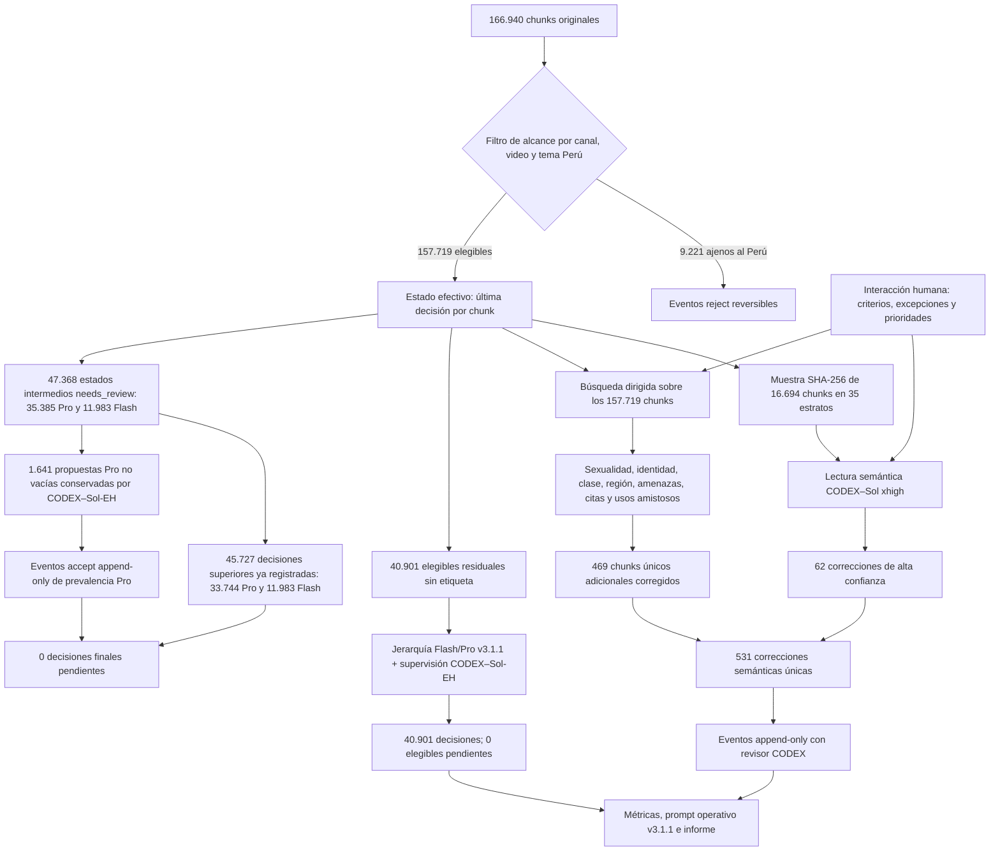

# Auditoría del etiquetado peruano: muestra estratificada del 10 % y búsquedas dirigidas de corpus completo

**Fecha de corte:** 9 de agosto de 2026  
**Supervisor de referencia:** `CODEX`  
**Modelo de auditoría:** `CODEX–Sol` (`GPT-5.6 Sol`), razonamiento `xhigh` o
“extra high”, velocidad estándar  
**Contrato:** `moderacion_peru_5_salidas_v2`, taxonomía `2.1.0`  
**Carácter de las decisiones:** referencial, trazable y human-in-the-loop; una
decisión humana posterior puede prevalecer sobre cualquier modelo.

> **Actualización integrada:** se incorporaron la resolución de los 40.901
> chunks elegibles que aún no tenían categoría gruesa y la comparación
> reproducible Flash/Pro–CODEX–Sol-EH sobre los 16.694 casos de la muestra. El
> detalle operativo complementario está en
> `docs/ADJUDICACION_CHUNKS_SIN_ETIQUETA_CODEX_2026-08-09.md`.

Las cantidades de este documento se calcularon a partir de
`datos/etiquetado/consolidado/anotaciones_v2.jsonl`, la última decisión por
`chunk_id` de `datos/etiquetado/humano/labeling_events_v2.jsonl` y los
archivos `primary_flash.jsonl`, `review_pro.jsonl` y manifiestos de
`datos/etiquetado/cascada_deepseek_v4/`. La reconstrucción comparativa se
automatizó en `tools/report_audit_comparison.py`. Son resultados del proyecto,
no afirmaciones tomadas de fuentes externas. La documentación del dataset y
del contexto de producción se explicita porque favorece la reproducibilidad y
el análisis de sesgos [1], [2].

## 1. Estadísticas descriptivas del dataset

### 1.1. Tamaño y depuración de alcance

| Magnitud | Antes del filtro | Dataset peruano elegible | Variación |
|---|---:|---:|---:|
| Chunks | 166.940 | 157.719 | −9.221 (−5,524 %) |
| Videos | 4.992 | 4.513 | −479 (−9,595 %) |
| Canales con al menos un chunk | 322 | 276 | −46 (−14,286 %) |

El filtro encontró 78 canales de origen extranjero con país identificable. No
se excluyó un canal solo por ser extranjero: se conservaron los videos cuyo
título o texto completo contenía evidencia temática explícita sobre el Perú.
De ese modo se retuvieron 70 videos extranjeros pertinentes, equivalentes a
3.890 chunks. Se excluyeron 9.221 chunks de 479 videos, pertenecientes a 72
canales afectados; 46 canales quedaron completamente fuera y los restantes
conservaron al menos un video sobre el Perú.

La exclusión es lógica y reversible: cada chunk recibió un evento `reject`, no
fue borrado físicamente. Los canales con más material retirado fueron Infobae
(818 chunks), Instituto Nacional de Formación Política de Morena (796), 24
Horas–TVN Chile (746), La Negra Candela Oficial (723) y W Radio Colombia (677).
La contaminación extranjera ajena al Perú queda, por tanto, resuelta en el
estado efectivo usado por esta auditoría.

### 1.2. Distribución por canal y video

En los 157.719 chunks elegibles:

| Unidad | Número | Media de chunks | Mediana | Mínimo | Máximo |
|---|---:|---:|---:|---:|---:|
| Canal | 276 | 571,45 | 25,5 | 1 | 30.888 |
| Video | 4.513 | 34,95 | 19 | 1 | 767 |

Los diez canales con más chunks son:

| Canal | Chunks |
|---|---:|
| Hablando Huevadas | 30.888 |
| Arde Troya con Juliana Oxenford | 11.596 |
| Goblinciano | 6.525 |
| Nada Espacial | 6.224 |
| Sin Guion con Rosa María Palacios | 5.623 |
| Todo Good | 5.071 |
| Nunca MÁS | 4.716 |
| ATV Noticias | 4.504 |
| RPP Noticias | 4.348 |
| DÍA D | 4.129 |

Como resumen exploratorio —no como metadato editorial certificado— se aplicó
una heurística reproducible sobre el nombre del canal:

| Tipo heurístico | Canales | Chunks | Porcentaje de chunks |
|---|---:|---:|---:|
| Noticias/comentario | 63 | 58.823 | 37,30 % |
| Entretenimiento/comedia | 9 | 58.586 | 37,15 % |
| Otros/mixto | 204 | 40.310 | 25,56 % |

Esta concentración importa: un mismo error sistemático en pocos canales de
gran tamaño puede mover más el dataset que errores dispersos en muchos canales.

### 1.3. Estado final de las etiquetas

`SEGURO` es excluyente y las cuatro categorías de daño son multietiqueta; por
eso la suma de asignaciones de daño puede superar el número de chunks dañinos.

| Estado o etiqueta | Chunks/asignaciones | % de los 157.719 chunks |
|---|---:|---:|
| `SEGURO` | 144.834 | 91,830 % |
| Sin decisión final / contexto pendiente | 0 | 0,000 % |
| Al menos una categoría de daño | 12.885 | 8,170 % |
| `ACOSO_AMENAZA` | 7.237 | 4,589 % |
| `CONTENIDO_SEXUAL` | 3.662 | 2,322 % |
| `RACISMO_DISCRIMINACION` | 2.506 | 1,589 % |
| `ATAQUE_POR_GENERO_IDENTIDAD` | 2.185 | 1,385 % |

Las categorías menos representadas son ataque por género/identidad y
racismo/discriminación. Sobre las cuatro cuentas de daño, la razón
máximo/mínimo es **3,312**, el coeficiente de variación poblacional es
**0,514** y la entropía de Shannon normalizada es **0,913**. La entropía
relativamente alta indica que las cuatro categorías están presentes; la razón
y el coeficiente de variación muestran, sin embargo, una concentración clara
en acoso/amenaza. La
taxonomía distingue blanco, modalidad y alcance porque “lenguaje abusivo” no es
una clase semántica única [3], [4].

La resolución residual añadió 39.082 `SEGURO` y 1.819 chunks con al menos un
daño. Sus asignaciones —que pueden solaparse— fueron 900 de acoso/amenaza, 569
sexuales, 355 de racismo/discriminación y 158 de ataque por género/identidad.
El estado final tiene, por tanto, **cobertura gruesa del 100 %** de los chunks
elegibles; cobertura no significa exactitud perfecta.

El daño **no se redujo en términos netos**. En la muestra congelada pasó de
1.155 a 1.319 chunks (+164; +14,20 %), principalmente porque la resolución de
abstenciones encontró daños antes ausentes. En el universo, el corte previo a
la adjudicación residual tenía 11.066 daños efectivos y el final 12.885
(+1.819; +16,44 %). Al mismo tiempo sí se corrigieron falsos positivos de daño
en citas y denuncias; ese movimiento local hacia `SEGURO` fue menor que el
movimiento opuesto de chunks sin etiqueta hacia daños sustentados. No debe
confundirse “menos falsos positivos” con “menos daños totales”.

### 1.4. Balance de train después de cerrar `needs_review`

El archivo canónico `datos/model_ready/v2/dataset_5_salidas.jsonl` se actualizó
después de la última adjudicación. El snapshot inmutable
`v2.1.0-05854b628c1a3b4d` aplica la última decisión por chunk, conserva el split
histórico por `video_id` y usa SHA-256 con semilla `20260805` para videos sin
asignación previa. Contiene 111.723 filas en `train`, 25.200 en `validation` y
20.796 en `test`, sin fuga de video; su SHA-256 es
`d9261b5afe35f2753ec838708398a8152ce1d9113e78ee3f5ec1af6a6f5dc0f6`.

| Split/etiqueta | Train | Validation | Test | Total |
|---|---:|---:|---:|---:|
| Chunks | 111.723 | 25.200 | 20.796 | 157.719 |
| `SEGURO` | 102.467 | 23.251 | 19.116 | 144.834 |
| Al menos un daño | 9.256 | 1.949 | 1.680 | 12.885 |
| `ACOSO_AMENAZA` | 5.255 | 1.028 | 954 | 7.237 |
| `CONTENIDO_SEXUAL` | 2.568 | 590 | 504 | 3.662 |
| `RACISMO_DISCRIMINACION` | 1.826 | 379 | 301 | 2.506 |
| `ATAQUE_POR_GENERO_IDENTIDAD` | 1.568 | 346 | 271 | 2.185 |

En `train`, la razón máximo/mínimo es **3,351**, el coeficiente de variación
poblacional es **0,521** y la entropía de Shannon normalizada es **0,911**.
Solo acoso/amenaza y contenido sexual superan 2.000; faltan **174 chunks de
racismo/discriminación** y **432 de ataque por género/identidad**. Por ello se
recomienda ampliación dirigida, pero no un raspado indiscriminado de los
canales dominantes.

El rendimiento histórico de `train` identifica como fuentes útiles a Hablando
Huevadas (673 racismo; 783 género/identidad), Goblinciano (637; 174), Juanito y
Richard (128; 79), Nunca MAS (12; 103), Arde Troya (84; 67), Magaly TV La Firme
(24; 55), Todo Good (30; 28) y PBO (17; 19). Estos conteos sirven para priorizar
fuentes, no para trasladar etiquetas a videos nuevos. Para limitar sesgo por
canal y estilo, la campaña combina fuentes conversacionales, humorísticas,
periodísticas y de farándula; conserva una reserva para validation/test y
somete cada chunk nuevo al prompt operativo.

La campaña quedó implementada en
[`flujo/01_datos/01_015_ampliacion_dirigida_minorias.ipynb`](../flujo/01_datos/01_015_ampliacion_dirigida_minorias.ipynb),
sin modificar `01_01`. Selecciona como máximo 450 candidatos cuyo split estable
es `train`, 80 de `validation` y 80 de `test`; después de etiquetar el lote debe
recalcular el déficit y detener la adquisición cuando las cuatro cuentas de
train alcancen 2.000. El presupuesto de videos incorpora margen porque una
consulta temática no garantiza que un chunk positivo aparezca.

## 2. Diseño metodológico

### 2.1. Jerarquía de revisión

La auditoría combinó una fase probabilística general y varias fases dirigidas.
La separación es crucial: la muestra estima una tasa de desacuerdo sin buscar
palabras específicas; la búsqueda dirigida inspecciona todo el universo
elegible para errores raros o sistemáticos. La literatura muestra que el
contexto conversacional puede cambiar la clasificación de lenguaje abusivo
[5], por lo que cada decisión consideró hablante, blanco, atribución, sentido
local y postura, no una coincidencia léxica.



### 2.2. Intervención humana en el ciclo

La revisión no fue una inferencia autónoma aislada. Hubo interacción humana en
cuatro puntos:

1. se estableció que una decisión de `CODEX` era referencial y que, si no había
   evidencia suficiente para cambiarla, prevalecía la decisión Pro;
2. se incorporaron criterios propuestos durante la auditoría: significado
   sexual peruano de *cachar*, ambigüedad de *tirar/coger/chupar*,
   condescendencia, diminutivos, clasismo educativo, citas informativas y
   exclusión temática de canales extranjeros;
3. se pidió ampliar el análisis desde una muestra del 10 % hacia búsquedas
   dirigidas de corpus completo;
4. una persona conserva la capacidad de intervenir y prevalecer en cualquier
   decisión posterior.

`CODEX–Sol` aplicó esos criterios como supervisor de referencia y registró solo
cambios de confianza alta. El proceso sigue el principio práctico de diferir
casos inciertos a un experto, sin confundir deferencia con una etiqueta de
daño [15].

Una comprobación posterior encontró 47.368 filas con `needs_review=true` en el
nivel intermedio: 35.385 provenían de Pro y 11.983 de Flash. Ese campo no
prevalece sobre una decisión CODEX–Sol-EH o humana. Ya existían eventos
superiores para 45.727 (33.744 Pro y los 11.983 Flash); los otros 1.641 tenían
propuesta Pro no vacía y estaban cubiertos por la regla explícita “si CODEX no
modifica, prevalece Pro”, pero la aceptación no se había materializado. Se
añadieron 1.641 eventos `accept` deterministas bajo el lote
`CODEX-PRO-PRECEDENCE-20260809`: 1.243 corresponden a train, 247 a validation y
151 a test. Esta normalización de procedencia **no cambió ninguna etiqueta
semántica ni los conteos del corpus total**; sí evitó que el generador del
snapshot omitiera esos chunks. El estado jerárquico final comprobado es 157.719
resueltos, 9.221 excluidos y cero pendientes o diferidos. Para evitar confundir
una señal histórica con trabajo restante, la interfaz reporta por separado los
35.385 `needs_review` intermedios de Pro y las cero decisiones finales Pro
pendientes.

### 2.3. Muestra estratificada del 10 %

Se fijó un tamaño exacto de **16.694 chunks**, igual al 10 % del dataset
original redondeado y al 10,585 % del universo peruano elegible. La selección
se congeló antes de corregir etiquetas:

- semilla textual: `CODEX-AUDIT-20260809-CLEAN`;
- clave pseudoaleatoria: SHA-256 de `semilla|chunk_id`;
- 35 estratos observados, definidos por la combinación de etiqueta gruesa
  efectiva, modelo fuente y estado de revisión;
- asignación proporcional, mínimo de un caso por estrato y distribución de los
  residuos por restos mayores;
- sin reemplazo y sin chunks extranjeros fuera de alcance.

La muestra contenía 11.186 `SEGURO`, 4.353 casos sin decisión final y 1.155
chunks con al menos un daño; 12.341 estaban resueltos y eran comparables de
forma directa con la decisión de referencia en la primera auditoría. Después
de la adjudicación residual, los 16.694 tienen etiqueta gruesa: **15.375
`SEGURO` y 1.319 con al menos una categoría de daño**. De los 4.353 pendientes
iniciales, 4.327 pertenecieron al lote final de 40.901 y los demás se habían
resuelto en eventos intermedios.

| Estado/asignación en la muestra | Corte congelado | Referencia final |
|---|---:|---:|
| `SEGURO` | 11.186 | 15.375 |
| Sin etiqueta | 4.353 | 0 |
| Al menos un daño | 1.155 | 1.319 |
| `ACOSO_AMENAZA` | 679 | 725 |
| `CONTENIDO_SEXUAL` | 298 | 379 |
| `RACISMO_DISCRIMINACION` | 236 | 273 |
| `ATAQUE_POR_GENERO_IDENTIDAD` | 217 | 218 |

La prevalencia final de daño en la muestra fue **7,901 %**, IC Wilson 95 %
[7,501 %, 8,320 %], cercana al 8,170 % del universo elegible. Esta cercanía es
descriptiva: la estratificación y la dependencia de las decisiones requieren
conservar los estratos en la inferencia posterior.

### 2.4. Búsqueda dirigida de corpus completo

Después de la muestra se recorrieron **los 157.719 chunks elegibles completos**.
El procedimiento tuvo dos niveles:

1. recuperación amplia por familias léxicas, flexiones, errores de transcripción
   y patrones de atribución;
2. criba semántica por ventana y lectura del chunk: blanco, relación entre
   hablantes, literalidad, atribución, postura y plausibilidad del daño.

Las familias incluyeron:

- sexualidad: *cachar, tirar, coger, chupar/cupar, manosear, chapar, agarrar,
  comer/comerse, polvo, leche, venirse, acabar, meter, calato, arrecho, concha,
  poto, pinga/pichula, huevos, culear/culiar, encamar, fornicar, pajear, mamar,
  felación, penetrar, violar, mamacita* y *chibola/chibolo*;
- racialización, clase y región: *terruco, motoso, amixer, pituco, chusma,
  huachafo, conero, provinciano, charapa, paisano, marrón, color puerta, llama,
  auquénido, veneco, chamo, gringo/gringa, comemote, llorcho, characato,
  cholo/cholito, chino/chinito, serrano, indio, chuncho* y *puneño*;
- género e identidad: *cabro, maricón, rosquete, traba, mostacero, marimacha,
  machona, marica, loca, machito, mandilón, pisado, sacolargo, feminazi, hembra,
  histérica, zorra, perra, puta* y *mantenida*;
- amenazas: *enfriar, dar piso, meter plomo, reventar, cuadrar, cogotear,
  bajar, hacer la vuelta, sacar la mierda, plomear, chifar, ajustar, marcar,
  pepear, sembrar, levantar, desaparecer, romperte, sacar el ancho* y “sabemos
  dónde vives”;
- usos amistosos o figurativos: *causa, pata, brother, huevón, gordo, negro,
  chino, cholo, matarse de risa, romperla, está criminal, tirar la toalla* y
  *chuparse el dedo*;
- jerarquías educativas: universidad privada, PUCP, analfabetismo, lectura y
  escritura, y colegio estatal.

Los estudios peruanos justifican que *motoso* y *terruco* pueden operar dentro
de procesos de racialización lingüística y política [6]; *amixer* también se ha
estudiado como identidad y marcación social en espacios digitales peruanos
[7]. La asociación entre “falta de educación”, superioridad y discurso racista
tiene antecedentes específicos en el Perú [8], dentro de dinámicas sociales
que no se reducen al insulto racial explícito [9]. Estas fuentes orientan el
contexto; la etiqueta concreta de cada chunk se decidió con el contrato local.

La palabra *cachar* recibió atención especial: se revisaron los 347 chunks
elegibles que contenían flexiones relevantes y aún no tenían
`CONTENIDO_SEXUAL`; 230 mostraron sentido sexual inequívoco y fueron corregidos.
En cambio, *llama*, *meter el dedo*, *venirse encima*, *hacer la vuelta* y otros
patrones generaron muchos homónimos, verbos literales o modismos seguros. Esto
confirma que el léxico sirve para recuperar candidatos, no para etiquetar.

Las amenazas, el doxeo y la difusión íntima no consentida tienen relevancia
documentada en la violencia de género en línea en el Perú [10], pero una noticia
que las denuncia no se convirtió automáticamente en daño del narrador.

La síntesis operacional de las expresiones adicionales es:

| Familia | Riesgo de daño | Lectura segura que debe comprobarse |
|---|---|---|
| *terruco, motoso, comemote, llorcho* | criminalización o inferiorización andina/lingüística | explicación, cita condenatoria o referencia histórica |
| *pituco, conero, amixer, chusma, huachafo* | clasismo racializado | descripción social, autorreferencia o broma afiliativa |
| *gringo, chamo, veneco, charapa, puneño* | degradación por nacionalidad o región | gentilicio/vocativo neutral; *chamo* suele ser afiliativo |
| *cabro, marica, rosquete, loca, machito, pisado* | homofobia o vigilancia de expresión de género | animal, estado mental descrito, situación “loca” o confianza recíproca |
| *perra, zorra, puta, mantenida, mamita* | misoginia, humillación o cosificación | animal literal, interjección, parentesco o vocativo afectuoso |
| *cachar, tirar, coger, chupar, culear* | actividad sexual explícita | lanzar, tomar, beber o sentido no sexual |
| *mamacita, chibola/chibolo* | cosificación o sexualización por edad | parentesco, juventud o vocativo sin contenido sexual |
| *desaparecer, plomear, dar piso, sacar el ancho* | amenaza plausible | noticia atribuida, consecuencia figurativa o esfuerzo económico |
| *caviar, rojo, zurdo* | ataque político; puede combinarse con terruqueo | posición política no protegida por sí sola |

### 2.5. Diseño de la comparación Flash/Pro–CODEX–Sol-EH

La comparación usa la misma muestra congelada, no una selección posterior
favorable a un modelo. Se definieron cuatro objetos distintos:

1. **cascada Flash/Pro consolidada:** salida en
   `anotaciones_v2.jsonl` antes de las decisiones CODEX posteriores;
2. **Flash aislado:** salida primaria `primary_flash.jsonl`;
3. **Pro aislado:** salida `review_pro.jsonl`, disponible solo para la cola
   dirigida a Pro;
4. **referencia final CODEX–Sol-EH:** última decisión efectiva tras la lectura
   muestral, las búsquedas dirigidas y la adjudicación híbrida final.

Una lista de etiquetas vacía se trató como **abstención**, nunca como
`SEGURO`. Por eso se informa primero cobertura y luego métricas selectivas solo
sobre los casos respondidos. Para daño/no-daño se reportan matriz de confusión,
precisión, sensibilidad, especificidad, F1, exactitud balanceada, MCC y kappa;
para las cuatro salidas multietiqueta se reportan precisión/recobrado/F1 micro
y macro, pérdida Hamming y Jaccard por ejemplo. F1 y Hamming capturan aspectos
distintos de una salida multietiqueta [21]; MCC complementa las métricas que
pueden verse favorecidas por el desbalance [22], mientras kappa corrige el
acuerdo nominal esperado por azar [23].

Los IC del acuerdo exacto son Wilson al 95 %. Para F1, MCC y pérdida Hamming se
usó *bootstrap* percentil estratificado: 2.000 réplicas, remuestreo dentro de
los 35 estratos y semilla `20260809`. La diferencia pareada Flash–Pro se evaluó
en los casos donde ambos respondieron con IC *bootstrap* y prueba exacta de
McNemar. Los puntajes `score_confianza` de Flash/Pro se analizaron por bandas,
Brier y error de calibración esperado (ECE) de diez intervalos; Brier es una
regla de puntuación probabilística [24] y la calibración exige contrastar
confianza con frecuencia empírica [25].

La denominación **Sol-EH** significa aquí GPT-5.6 Sol con esfuerzo de
razonamiento `xhigh` (*extra high*), no un identificador distinto del modelo.
No se registró una probabilidad numérica de confianza Sol por chunk. En
consecuencia, no se inventa ese dato: se informa la procedencia de la decisión
y el umbral operativo cualitativo de alta confianza. Además, la referencia no
es un *gold standard* independiente: cuando CODEX–Sol-EH no encontró evidencia
suficiente para cambiar, prevaleció Pro o la decisión efectiva previa, y 4.327
casos de la muestra se resolvieron mediante una jerarquía Flash/Pro/CODEX. Las
cifras siguientes son, por ello, **concordancia respecto de una referencia
interna supervisada**, no exactitud causal ni superioridad independiente de
Sol.

## 3. Resultados de calidad

### 3.1. Auditoría muestral congelada y comparación de modelos

#### 3.1.1. Resultado de la primera lectura congelada

En los 12.341 chunks resueltos al congelar la muestra hubo 62 desacuerdos de
alta confianza:

- 61 daños se corrigieron a `SEGURO` porque eran menciones, citas o denuncias
  claramente atribuidas sin respaldo del narrador;
- 1 caso cambió de ataque por género/identidad a acoso por apariencia, porque
  había humillación personal pero no motivación de género.

| Métrica de la primera lectura | Resultado |
|---|---:|
| Acuerdo exacto modelo–`CODEX` en resueltos | 99,498 % |
| Desacuerdo exacto en resueltos | 0,502 % |
| Cambio sobre toda la muestra | 0,371 % |
| Error observado dentro de los 1.155 chunks de daño | 5,368 % |
| Falsos positivos de daño dentro de la muestra de daño | 5,281 % |
| Precisión observada de daño, aproximación | 94,632 % |
| IC Wilson 95 % del error en daño | [4,210 %, 6,822 %] |
| IC complementario de precisión observada | [93,178 %, 95,790 %] |

Se usó el intervalo de Wilson por su comportamiento para proporciones
binomiales [11]. Esta primera “precisión observada” mide los daños resueltos en
ese corte; no incluye entonces los 4.353 pendientes. El acuerdo tampoco
equivale por sí solo a validez semántica [12].

#### 3.1.2. Referencia final y niveles de evidencia

La referencia final deja 15.375 seguros y 1.319 daños en los 16.694 casos. Su
procedencia es:

| Procedencia de la última decisión | Chunks | % de la muestra |
|---|---:|---:|
| Decisión del modelo base conservada tras revisión | 11.968 | 71,690 % |
| Adjudicación híbrida residual Flash/Pro/CODEX | 4.327 | 25,919 % |
| Revisión prioritaria CODEX previa a la muestra | 288 | 1,725 % |
| Cambio muestral explícito de alta confianza | 62 | 0,371 % |
| Cambio dirigido posterior de alta confianza | 47 | 0,282 % |
| Evento manual previo distinto | 2 | 0,012 % |
| **Total** | **16.694** | **100,000 %** |

Dentro de los 4.327 adjudicados al final, 2.634 usaron resolución conservadora
tras abstención, 1.516 evidencia Flash, 167 evidencia Pro y 10 una corrección
directa o parcial CODEX. Estas rutas son niveles de **evidencia operativa**, no
probabilidades comparables entre sí. No existe `score_confianza` numérico de
Sol-EH en el historial; los 62 y 47 cambios se registraron bajo la regla
cualitativa de “cambiar solo con alta confianza”.

#### 3.1.3. Cobertura y concordancia contra CODEX–Sol-EH

La cascada y Flash tenían registro para toda la muestra, pero no siempre
emitieron etiqueta. Pro fue enrutado a 7.083 casos y respondió 3.910: 55,203 %
de su cola y 23,422 % de la muestra.

| Magnitud | Cascada Flash/Pro | Flash aislado | Pro aislado |
|---|---:|---:|---:|
| Casos respondidos | 12.050 | 11.537 | 3.910 |
| Cobertura sobre 16.694 | 72,182 % | 69,109 % | 23,422 % |
| Abstención/no enrutado | 27,818 % | 30,891 % | 76,578 % |
| Acuerdo exacto selectivo | 0,9933 | 0,9039 | 0,9614 |
| IC Wilson 95 % del acuerdo | [0,9917; 0,9946] | [0,8984; 0,9091] | [0,9549; 0,9670] |
| TP / TN / FP / FN, daño binario | 1.062 / 10.912 / 64 / 12 | 1.074 / 9.606 / 821 / 36 | 1.092 / 2.680 / 135 / 3 |
| Precisión binaria | 0,9432 | 0,5668 | 0,8900 |
| Sensibilidad binaria | 0,9888 | 0,9676 | 0,9973 |
| Especificidad binaria | 0,9942 | 0,9213 | 0,9520 |
| F1 binario | 0,9655 | 0,7148 | 0,9406 |
| Exactitud balanceada | 0,9915 | 0,9444 | 0,9747 |
| MCC binario | 0,9623 | 0,7074 | 0,9186 |
| Kappa de Cohen binario | 0,9620 | 0,6754 | 0,9156 |

“Selectivo” significa condicionado a que el sistema respondió. No se imputó
un acierto a la abstención; por eso una cifra alta debe leerse junto a la
cobertura. La cascada tuvo 64 falsos positivos y 12 falsos negativos binarios;
Flash aislado mantuvo sensibilidad alta, pero generó 821 falsos positivos. Pro
redujo ese exceso a 135 en su subconjunto respondido.

| Métrica multietiqueta | Cascada Flash/Pro | Flash aislado | Pro aislado |
|---|---:|---:|---:|
| Precisión micro | 0,9421 | 0,5132 | 0,8783 |
| Recobrado micro | 0,9873 | 0,8195 | 0,9941 |
| F1 micro | 0,9641 | 0,6312 | 0,9326 |
| F1 macro | 0,9653 | 0,6326 | 0,9275 |
| Pérdida Hamming | 0,0020 | 0,0281 | 0,0125 |
| Jaccard por ejemplo | 0,9935 | 0,9118 | 0,9631 |

Los IC *bootstrap* estratificados al 95 % fueron:

| Sistema | F1 binario | MCC binario | F1 micro multietiqueta | Pérdida Hamming |
|---|---:|---:|---:|---:|
| Cascada Flash/Pro | [0,9576; 0,9729] | [0,9538; 0,9703] | [0,9559; 0,9719] | [0,0016; 0,0025] |
| Flash aislado | [0,7019; 0,7275] | [0,6951; 0,7195] | [0,6163; 0,6460] | [0,0269; 0,0293] |
| Pro aislado | [0,9311; 0,9494] | [0,9063; 0,9304] | [0,9219; 0,9423] | [0,0107; 0,0145] |

En el panel pareado de **2.252 casos donde Flash y Pro sí respondieron**, el
acuerdo exacto con la referencia fue 73,579 % para Flash y 93,917 % para Pro:
diferencia Pro−Flash de **20,337 puntos porcentuales**, IC *bootstrap* 95 %
[18,694; 21,980]. Hubo 41 casos acertados solo por Flash y 499 solo por Pro;
la prueba exacta de McNemar dio `p = 4,06 × 10⁻101`. Es evidencia fuerte de
mejor concordancia de Pro **dentro de la cola dirigida**, no una estimación
aleatoria de superioridad sobre todo el dataset, porque el enrutamiento a Pro
seleccionó casos difíciles.

En los 7.083 casos enrutados, incluyendo abstenciones conjuntas, Flash y Pro
coincidieron exactamente en 56,191 %. El acuerdo binario fue 83,849 % solo si
la abstención se agrupa con el polo no-daño; esta segunda cifra es descriptiva
y no debe interpretarse como desempeño.

#### 3.1.4. Confianza declarada y calibración

| Sistema | Confianza media | Mediana [RIC] | Acuerdo exacto empírico | Brier | ECE-10 |
|---|---:|---:|---:|---:|---:|
| Cascada Flash/Pro | 0,9363 | 0,95 [0,95; 0,95] | 0,9933 | 0,0110 | 0,0569 |
| Flash aislado | 0,9234 | 0,95 [0,90; 0,95] | 0,9039 | 0,0706 | 0,0612 |
| Pro aislado | 0,9106 | 0,95 [0,90; 0,95] | 0,9614 | 0,0361 | 0,0508 |

Menor Brier y ECE indican mejor correspondencia entre confianza y frecuencia
de acierto, pero `score_confianza` es un autoinforme del modelo sobre su salida,
no una probabilidad calibrada mediante un conjunto independiente.

| Sistema y banda de confianza | n | Confianza media | Acuerdo exacto |
|---|---:|---:|---:|
| Cascada, `<0,70` | 107 | 0,642 | 98,131 % |
| Cascada, `0,70–<0,85` | 65 | 0,782 | 100,000 % |
| Cascada, `0,85–<0,95` | 2.130 | 0,891 | 97,512 % |
| Cascada, `≥0,95` | 9.748 | 0,951 | 99,733 % |
| Flash, `<0,70` | 235 | 0,646 | 39,574 % |
| Flash, `0,70–<0,85` | 615 | 0,776 | 40,976 % |
| Flash, `0,85–<0,95` | 2.049 | 0,884 | 74,378 % |
| Flash, `≥0,95` | 8.638 | 0,951 | 99,085 % |
| Pro, `<0,70` | 175 | 0,643 | 69,714 % |
| Pro, `0,70–<0,85` | 83 | 0,779 | 85,542 % |
| Pro, `0,85–<0,95` | 1.371 | 0,887 | 95,332 % |
| Pro, `≥0,95` | 2.281 | 0,950 | 99,036 % |

El patrón más claro es que Flash fue poco fiable en sus bandas menores de
0,85 y muy preciso en `≥0,95`; esto apoya el enrutamiento por incertidumbre.
Pro mejoró especialmente los casos de confianza baja/media. La cascada parece
mejor calibrada en gran parte porque conserva la salida Pro/final y porque la
referencia interna no es independiente; no debe usarse esta tabla para afirmar
que Sol “demostró” una exactitud propia.

### 3.2. Rendimiento de las búsquedas dirigidas

Las colas se superponen y por eso no deben sumarse como universos
independientes.

| Cola dirigida | Candidatos adjudicados | Cambios | Rendimiento de cambio |
|---|---:|---:|---:|
| *cachar* sin etiqueta sexual | 347 | 230 | 66,28 % |
| *coger* sin etiqueta sexual | 283 | 20 | 7,07 % |
| *chupar/cupar*, contexto sexual fuerte | 52 | 37 | 71,15 % |
| *tirar*, contexto sexual fuerte | 48 | 21 | 43,75 % |
| Cita/denuncia y condena, cola de alta precisión | 55 | 46 | 83,64 % |
| Amenazas locales fuertes sin `ACOSO_AMENAZA` | 41 | 25 reclasificados a `SEGURO` | 60,98 % |
| Patrones sexuales ambiguos fuertes | 20 | 7 decisiones correctivas | 35,00 % |
| Léxico adicional: 4 colas semánticas | 223 evaluaciones de familia | 11 | 4,93 % |

En las amenazas, “cambio” significa principalmente resolver como `SEGURO` una
cita periodística, amenaza a un animal, broma no plausible o giro figurativo;
no significa ignorar la gravedad del hecho reportado. La distinción es entre
el contenido referido y la postura del narrador.

Las cinco fases de esta auditoría dejaron:

| Fase | Eventos | Chunks únicos |
|---|---:|---:|
| Exclusión de alcance extranjero | 9.221 | 9.221 |
| Muestra estratificada | 62 | 62 |
| Búsqueda dirigida *cachar* | 230 | 230 |
| Léxico peruano y educación, v2 | 121 | 121 |
| Léxico ampliado, amenazas y citas, v3 | 108 | 108 |
| Léxico adicional, v4 | 11 | 11 |
| **Correcciones semánticas únicas** | **532 eventos** | **531 chunks** |

Un chunk de *cachar* recibió después una ampliación por género y explica la
diferencia entre eventos y chunks únicos.

### 3.3. Cuánto cambió el dataset y cómo quedó la cobertura

Tomando como línea base el estado posterior a la cola prioritaria Flash/Pro y
anterior a esta auditoría:

- **531 de 157.719 chunks elegibles** cambiaron semánticamente: **0,337 %**;
- **9.221 de 166.940 chunks** cambiaron de alcance: **5,524 %**;
- alcance y semántica juntos afectaron **9.752 chunks**, **5,842 %** del dataset
  original, sin solapamiento entre los excluidos y los corregidos;
- la cobertura resuelta de esa fase pasó de 116.586 a 116.818 chunks, de
  **73,920 %** a **74,067 %**, un aumento de **0,147 puntos porcentuales**.

Dentro de los 531 cambios semánticos únicos:

- 127 chunks con daño pasaron a `SEGURO`;
- 55 chunks sin decisión pasaron a `SEGURO`;
- se añadieron 315 asignaciones sexuales que antes faltaban;
- el resto corrigió o completó racismo, género/identidad y acoso.

El saldo de asignaciones antes→después fue:

| Etiqueta | Antes | Después | Cambio neto |
|---|---:|---:|---:|
| `SEGURO` | 105.682 | 105.752 | +70 |
| `ACOSO_AMENAZA` | 6.400 | 6.337 | −63 |
| `CONTENIDO_SEXUAL` | 2.791 | 3.093 | +302 |
| `RACISMO_DISCRIMINACION` | 2.189 | 2.151 | −38 |
| `ATAQUE_POR_GENERO_IDENTIDAD` | 2.039 | 2.027 | −12 |

El cambio sexual alto no contradice la tasa pequeña de error muestral: fue el
resultado de una búsqueda deliberadamente enriquecida por términos locales,
especialmente *cachar*. Del mismo modo, la reducción de racismo, género y acoso
proviene sobre todo del sesgo sistemático de atribuir al narrador una cita que
este reportaba o condenaba. La detección de datos mal etiquetados y la revisión
enriquecida de candidatos son estrategias conocidas para mejorar conjuntos de
entrenamiento [13], [14].

La corrida posterior no debe sumarse a las 531 correcciones como si midiera el
mismo fenómeno: tomó los **40.901 chunks todavía sin etiqueta** y les dio
cobertura. Produjo 39.082 seguros y 1.819 daños, con 1.982 asignaciones de daño
por el solapamiento multietiqueta. El cambio final respecto del estado de la
tabla anterior fue:

| Etiqueta/estado | Después de auditoría dirigida | Estado final | Cambio neto posterior |
|---|---:|---:|---:|
| Sin etiqueta | 40.901 | 0 | −40.901 |
| `SEGURO` | 105.752 | 144.834 | +39.082 |
| Al menos un daño | 11.066 | 12.885 | +1.819 |
| `ACOSO_AMENAZA` | 6.337 | 7.237 | +900 |
| `CONTENIDO_SEXUAL` | 3.093 | 3.662 | +569 |
| `RACISMO_DISCRIMINACION` | 2.151 | 2.506 | +355 |
| `ATAQUE_POR_GENERO_IDENTIDAD` | 2.027 | 2.185 | +158 |

La cobertura pasó así de 116.818 a 157.719, es decir, de 74,067 % a **100 %**.
El anexo operativo documenta que 24.688 resoluciones se hicieron por una regla
conservadora posterior a abstención. Su muestra ciega de bajo riesgo encontró
29 daños entre 3.200 casos (0,906 %, IC Wilson 95 % [0,632 %, 1,299 %]); por
ello, el 100 % de cobertura estructural no se reporta como 100 % de calidad
semántica.

### 3.4. Evaluación cualitativa final

La calidad global encontrada es **alta en consistencia gruesa y cobertura,
pero desigual por fenómeno lingüístico y ruta de decisión**. La cascada
consolidada alcanzó 99,328 % de concordancia exacta selectiva con la referencia
final y MCC binario 0,962, aunque solo respondió 72,182 % de la muestra pura.
Flash aislado tuvo más falsos positivos (821) y F1 micro multietiqueta 0,631;
Pro elevó ese F1 a 0,933 dentro de su subconjunto dirigido. La comparación
pareada confirma una diferencia material a favor de Pro en esa cola, pero la
dependencia de la referencia impide convertirla en una prueba independiente de
exactitud. Persisten dos errores sistemáticos materialmente importantes:

1. **sobreetiquetado de uso/mención:** noticias, denuncias y explicaciones se
   marcaron como si el narrador respaldara el daño;
2. **subetiquetado de sexualidad peruana:** *cachar* y, en menor medida,
   *tirar/coger/chupar*, se interpretaron literalmente o quedaron sin resolver
   aun cuando el contexto era sexual.

También aparecieron errores menos frecuentes al separar clasismo racializado
de acoso personal, homofobia coloquial de confianza entre amistades, y amenaza
plausible de hipérbole o lenguaje figurado. Los diminutivos (*cholito,
chinito, mamita*) no fueron considerados dañinos por defecto: el daño dependió
de infantilización, desigualdad de relación y efecto degradante.

La calidad final es mejor que la línea base en los sesgos específicamente
auditados y ya no hay vacíos estructurales. Sin embargo, 24.688 decisiones del
lote residual usaron una regla conservadora después de abstención y el control
ciego estimó daño no nulo en ese estrato. No se presenta una “exactitud final”
independiente porque las correcciones, retenciones y su evaluación comparten
el mismo supervisor de referencia. La lectura más rigurosa combina cobertura,
matrices de confusión selectivas, F1/MCC/kappa/Hamming, calibración, intervalos,
rendimiento de colas dirigidas y cambio neto; ninguna cifra aislada resume la
calidad completa.

### 3.5. ¿Hace falta revisar más del 10 %?

**Sí, pero de manera dirigida, no mediante otra muestra uniforme ciega de todo
el corpus.** Los rendimientos de 66,28 % para *cachar*, 71,15 % para
*chupar/cupar* y 83,64 % en la cola estricta de citas muestran errores
sistemáticos concentrados. Ya se recorrió el 100 % de los 157.719 chunks con
los patrones dirigidos definidos en esta auditoría. Para una siguiente ronda se
recomienda:

1. ejecutar el prompt operativo v3.1.1 sobre los candidatos residuales de
   sexualidad polisémica y uso/mención;
2. auditar de forma dirigida todos los casos nuevos con baja confianza, choque
   Flash/Pro o palabras locales de alta ambigüedad;
3. extraer después un **holdout adicional del 2–3 %**, estratificado por canal y
   categoría, que no haya participado en las reglas actuales, para estimar la
   mejora sin circularidad;
4. priorizar los canales grandes de comedia y noticias, pues concentran los dos
   sesgos opuestos. Las palabras *chibolo, loca, gringo* y *desaparecer* deben
   continuar como disparadores contextuales, no como reglas automáticas.
5. revisar de forma dirigida los 23.987 seguros no muestreados del estrato de
   bajo riesgo asignado por regla conservadora, empezando por coerción implícita,
   hostilidad fuera del léxico y cambios de sentido local.

Esta recomendación es consistente con aprendizaje activo: invertir revisión
en ejemplos informativos o inciertos suele ser más eficiente que aumentar una
muestra aleatoria sin criterio [14].

## 4. Trazabilidad y decisiones previas

Antes de la auditoría muestral se procesó una cola prioritaria de 2.705 chunks
que Pro no pudo resolver con suficiente confianza o que mantenían etiquetas
problemáticas. `CODEX` registró 2.688 decisiones y 17 ya tenían una decisión
previa. Esta cola no se mezcló con la estimación congelada del 10 %: el estado
posterior a ella fue la línea base de la auditoría descrita aquí.

Para todo evento nuevo se usó:

- revisor visible `CODEX`, seudonimizado por el servidor como
  `reviewer-879d60dc246ead2d`;
- acción `modify` o `reject`;
- etiquetas propuestas y finales;
- modelo fuente, evento fuente cuando existía, nota metodológica y fecha;
- persistencia append-only y precedencia de la última decisión por `chunk_id`.

Si `CODEX` no cambió un caso, prevaleció la decisión Pro o la última decisión
efectiva existente. No se generaron eventos de aceptación redundantes para cada
coincidencia correcta.

La fase residual añadió después 40.901 eventos `modify` en el lote
`CODEX-UNLABELED-PROMPT-V3_1_1-20260809`, con `reviewer="CODEX"`, IDs únicos y
notas que identifican método, evidencia de modelo y versión de prompt. El
archivo comparativo reproducible conserva solo IDs, estrato, etiquetas,
confianzas y procedencia —no transcripciones— en
`docs/artefactos/auditoria_16k_flash_pro_sol_eh_sample.csv`; sus métricas y
hashes de entrada están en
`docs/artefactos/auditoria_16k_flash_pro_sol_eh_metrics.json`.

## 5. Reporte técnico de modelos, tiempo, hardware y costo

### 5.1. Modelos y ejecución de preetiquetado

DeepSeek Flash realizó la primera pasada remota y DeepSeek Pro la revisión
dirigida. Ambos operaron con salida JSON, cinco registros por solicitud,
concurrencia de hasta 32 solicitudes y *thinking* desactivado. La identidad de
la familia V4 procede de la documentación del proveedor [16] y los costos se
reconstruyen con sus precios documentados [17]. Los manifiestos locales son la
fuente de las cifras de consumo real o proyectado.

| Componente | Volumen activo | Tiempo neto | Costo USD |
|---|---:|---:|---:|
| Calibración Flash | 1.000 | 97,25 s | 0,0733 |
| Calibración Pro | 1.000 | 122,59 s | 0,2692 |
| Flash, primera pasada nueva | 114.696 aprox. | 132 min aprox. | 7,24 aprox. |
| Pro, segmento previo | 14.079 | 31,1 min | 4,7275 |
| Pro, continuación final | 40.704, 1 error | 79,0 min | 13,4555 |
| Resolución residual Flash/Pro v3.1.1 | 17.578 evaluaciones solapadas; 40.901 adjudicados | 25,727 min | 2,3931 |
| **Total de procesamiento remoto activo** | — | **271,5 min ≈ 4,53 h** | **28,16 aprox.** |

Se recuperaron además 52.244 anotaciones Flash y 9.912 Pro mediante
coincidencia exacta y única de `video_id` más texto normalizado. Esa reutilización
no tuvo costo API activo y su tiempo histórico no está disponible. El
checkpoint final de Flash sobrescribió contadores acumulativos; por eso su
tiempo y costo se reportan como proyección reconstruida y no como telemetría
exacta.

`Qwen/Qwen3-1.7B` estaba disponible como fallback local, con revisión fijada en
la tarjeta del modelo [18], pero no se mezcló con las métricas de la cascada
remota final que aquí se evalúa.

### 5.2. Hardware

El equipo local fue un GMKtec NucBox K8 Plus con AMD Ryzen 7 8845HS, 8 núcleos
y 16 hilos, 28,8 GB de RAM disponible y Radeon 780M integrada reportada con 3 GB
de memoria gráfica. Este equipo realizó preparación, enrutamiento, validación,
servidor, búsquedas léxicas y persistencia. El etiquetado DeepSeek se ejecutó en
infraestructura remota del proveedor; el tipo exacto de acelerador remoto no se
expone en los artefactos del proyecto.

### 5.3. Costo y tiempo de `CODEX`

La auditoría semántica, adjudicación de colas y elaboración del reporte utilizó
`CODEX–Sol` / `GPT-5.6 Sol`, razonamiento `xhigh`, velocidad estándar. No se usó
`Terra` ni `Luna` para las decisiones reportadas. La documentación oficial
describe Sol como el modelo de frontera de la familia y publica precios de USD
5 por millón de tokens de entrada, USD 0,50 por millón de entrada en caché y
USD 30 por millón de salida [19]. `xhigh` es uno de los niveles de esfuerzo
oficialmente admitidos; la recomendación del proveedor es usarlo cuando exista
una ganancia medida, no por defecto [20].

La interfaz no expone telemetría exacta de tokens, costo real de suscripción ni
porcentaje semanal consumido. Por ello se registra un intervalo auditable, no
una falsa precisión:

| Recurso `CODEX` | Estimación |
|---|---:|
| Tiempo activo dedicado al etiquetado/auditoría | 3–4,5 h |
| Costo equivalente API, escenario | USD 4–10 |
| Consumo semanal orientativo comunicado | 3–7 %, no telemetría |

El intervalo excluye la construcción previa de interfaces y herramientas. La
estimación no es una factura: la interfaz no expone tokens de esta sesión, y la
referencia de precio sirve solo para expresar un costo API equivalente.

## 6. Conclusiones y recomendaciones técnicas

1. El dataset efectivo queda en 157.719 chunks peruanos o temáticamente
   vinculados al Perú; la reducción por alcance es 5,524 %.
2. La muestra final tiene 16.694 decisiones: 15.375 seguras y 1.319 con daño.
   La cascada Flash/Pro alcanzó acuerdo exacto selectivo 0,993 y MCC 0,962 con
   72,182 % de cobertura; estas son concordancias con una referencia interna,
   no exactitud contra un *gold standard* independiente.
3. La búsqueda de corpus completo confirmó dos sesgos sistemáticos: citas y
   denuncias sobreetiquetadas, y sexualidad peruana subetiquetada. Las 531
   correcciones semánticas únicas afectaron 0,337 % del corpus elegible.
4. En el panel pareado dirigido, Pro superó a Flash en concordancia exacta por
   20,337 puntos porcentuales; esto respalda la cascada por incertidumbre, sin
   generalizar la diferencia fuera de la cola enrutada.
5. Para futuros flujos semiautomáticos conviene usar el prompt v3.1.1, separar
   recuperación léxica de adjudicación semántica, almacenar hablante/postura y
   mantener colas específicas por sesgo.
6. El próximo control debe ser dirigido a los seguros conservadores y seguido
   de un holdout pequeño no
   usado para construir reglas. No se recomienda repetir sin más otra muestra
   uniforme del 10 %.
7. En un modelo fine-tuned, los ejemplos fronterizos deben aparecer como pares
   contrastivos: misma palabra en uso sexual/no sexual, amistoso/degradante y
   cita/respaldo. La revisión por incertidumbre y por desacuerdo entre modelos
   debe mantenerse como ruta de operación.
8. El próximo snapshot debe materializar los 1.641 casos donde prevaleció Pro;
   después de ese cierre, `train` aún queda en 1.826 ejemplos de racismo y
   1.568 de género/identidad. Se recomienda ejecutar `01_015`, volver a
   etiquetar el incremento y detener el scraping dirigido al llegar a 2.000
   por daño en train.

El prompt mejorado final quedó en
[`config/prompt_operacional_ollama_v3_1.md`](../config/prompt_operacional_ollama_v3_1.md),
versión 3.1.1, sin borrar
[`config/prompt_operacional_ollama_v3.md`](../config/prompt_operacional_ollama_v3.md)
ni
[`config/prompt_operacional_ollama_v2.md`](../config/prompt_operacional_ollama_v2.md).

## Anexo A. Prompt de auditoría de etiquetado

El siguiente prompt reconstruye las instrucciones efectivamente aplicadas. Su
objetivo es reproducir la auditoría, no sustituir el prompt operativo de
producción. Los valores de fecha, semilla y tamaño congelan esta ejecución; para
una réplica nueva deben cambiarse y documentarse.

```text
PROMPT DE AUDITORÍA DE ETIQUETADO — CODEX v1.0

ROL
Actúa como supervisor de referencia CODEX para una auditoría human-in-the-loop
de subtítulos de YouTube relacionados con el Perú. Tu decisión es referencial:
puede ser revisada y reemplazada por una persona. No cambies una decisión
Flash/Pro salvo que tengas alta confianza en un error o una inconsistencia. Si
no cambias el caso, prevalece la última decisión efectiva, en particular Pro.

AUTORIDAD Y ENTRADAS
1. Autoridad normativa: config/taxonomia_v2.json, contrato
   moderacion_peru_5_salidas_v2, versión 2.1.0.
2. Prompt vigente en la corrida auditada:
   config/prompt_operacional_ollama_v2.md.
   Prompt aprendido y aplicado a la resolución residual:
   config/prompt_operacional_ollama_v3_1.md, versión 3.1.1.
3. Base: datos/etiquetado/consolidado/anotaciones_v2.jsonl.
4. Eventos: datos/etiquetado/humano/labeling_events_v2.jsonl.
5. Para cada chunk usa la última decisión: accept/modify reemplaza etiquetas;
   reject lo saca del universo; defer no inventa etiqueta.
6. Revisor para nuevos eventos: CODEX. Conserva proposed_labels, final_labels,
   modelo y evento fuente, nota y fecha. La persistencia es append-only.

ALCANCE
1. Identifica canales extranjeros mediante metadatos de canal y video.
2. No excluyas por nacionalidad solamente. Retén un video extranjero si título
   o texto completo habla explícitamente del Perú, una entidad peruana, una
   región peruana o un acontecimiento peruano.
3. Excluye mediante reject los videos extranjeros sin vínculo temático con el
   Perú. Cuantifica chunks, videos y canales retirados y retenidos.
4. No uses los chunks rechazados en la muestra ni en el análisis semántico.

FASE A — MUESTRA GENERAL CONGELADA
1. Universo elegible esperado en esta ejecución: 157.719 chunks.
2. Tamaño exacto: 16.694, igual al 10 % del dataset original de 166.940.
3. Semilla: CODEX-AUDIT-20260809-CLEAN.
4. Clave de selección: SHA-256("semilla|chunk_id").
5. Estratifica por combinación de etiqueta gruesa efectiva, modelo fuente y
   estado resuelto/necesita revisión. Usa asignación proporcional, mínimo uno
   por estrato y restos mayores. Selecciona por hash ascendente sin reemplazo.
6. Congela la muestra y sus etiquetas antes de registrar correcciones.
7. Lee cada caso con esta jerarquía:
   a) evaluabilidad y referente;
   b) hablante y blanco;
   c) uso, mención, cita o denuncia;
   d) postura del narrador;
   e) sentido peruano y relación entre hablantes;
   f) daño sustentado y multietiqueta.
8. No fuerces SEGURO si falta contexto. No heredes la etiqueta del vecino.

FASE B — BÚSQUEDA DIRIGIDA DE CORPUS COMPLETO
Recorre los 157.719 chunks elegibles, no solo la muestra. La palabra recupera
candidatos, pero nunca decide una etiqueta. Haz criba semántica de:

- sexual: cachar, tirar, coger, chupar/cupar, manosear, chapar, agarrar,
  comer/comerse, polvo, leche, venirse, acabar, meter, calato, arrecho, concha,
  poto, pinga/pichula, huevos, culear/culiar, encamar, fornicar, pajear, mamar,
  felación, penetrar, violar, mamacita, chibola/chibolo;
- raza/clase/región: terruco, motoso, amixer, pituco, chusma, huachafo, conero,
  provinciano, charapa, paisano, marrón, color puerta, llama, auquénido, veneco,
  chamo, gringo/gringa, comemote, llorcho, characato, cholo/cholito,
  chino/chinito, serrano, indio, chuncho, puneño;
- género/identidad: cabro, maricón, rosquete, traba, mostacero, marimacha,
  machona, marica, loca, machito, mandilón, pisado, sacolargo, feminazi, hembra,
  histérica, zorra, perra, puta, mantenida;
- amenaza: enfriar, dar piso, meter plomo, reventar, cuadrar, cogotear, bajar,
  hacer la vuelta, sacar la mierda, plomear, chifar, ajustar, marcar, pepear,
  sembrar, levantar, desaparecer, romperte, sacar el ancho, sabemos dónde vives;
- amistoso/figurado: causa, pata, brother, huevón, gordo, negro, chino, cholo,
  matarse de risa, romperla, está criminal, tirar la toalla, chuparse el dedo;
- educación/clase: universidad privada, PUCP, colegio estatal, analfabeto, no
  saber leer o escribir, y cualquier uso de superioridad educativa.

Para cada coincidencia determina: sentido literal/local, blanco, vínculo entre
hablantes, atribución, postura, consentimiento cuando corresponda y daño
plausible. Cachar es sexual en el Perú cuando el contexto semántico habla de
personas y actividad sexual. Un diminutivo puede ser afectuoso o
condescendiente. Una universidad o nivel de alfabetización no implica daño sin
superioridad, exclusión o racialización. Las citas informativas y condenatorias
no heredan el daño; una descripción sexual gráfica puede ser la excepción.

UMBRAL DE CAMBIO
1. Modifica solo si la evidencia contextual es clara y el cambio puede
   justificarse con blanco, atribución y criterio del contrato.
2. Si dos lecturas razonables permanecen abiertas, conserva Pro o difiere.
3. Humor no borra daño, pero amistad cercana y reciprocidad pueden convertir un
   vocativo en seguro. No supongas amistad sin evidencia.
4. Registra todos los daños concurrentes y respeta que SEGURO es excluyente.

FASE C — RESOLUCIÓN RESIDUAL Y COMPARACIÓN
1. Identifica todos los chunks elegibles sin etiqueta después de las fases A y
   B; en esta ejecución fueron 40.901.
2. Reutiliza las opiniones Flash/Pro ya emitidas y aplica el prompt 3.1.1.
3. Dirige a Pro los casos duros, de atribución o abstención mientras exista
   saldo; reserva CODEX–Sol-EH xhigh para contradicciones y excepciones.
4. En bajo riesgo, toma una muestra ciega determinista antes de aplicar una
   resolución conservadora. Reporta el daño observado y su IC Wilson.
5. No presentes una resolución conservadora como lectura individual ni la
   cobertura completa como exactitud perfecta.
6. Sobre la muestra congelada compara cascada, Flash y Pro con la referencia
   final. Trata etiqueta vacía como abstención, no como SEGURO.
7. Separa cobertura de desempeño selectivo. Reporta matriz binaria,
   precisión, sensibilidad, especificidad, F1, exactitud balanceada, MCC,
   kappa; para multietiqueta reporta F1 micro/macro, Hamming y Jaccard.
8. Calcula IC Wilson del acuerdo y bootstrap estratificado de las métricas;
   usa comparación pareada y McNemar donde Flash y Pro respondieron ambos.
9. Evalúa score_confianza por bandas, Brier y ECE, pero no inventes una
   confianza numérica Sol si el historial no la contiene.
10. Explicita que la referencia CODEX–Sol-EH es interna y parcialmente
    dependiente de Flash/Pro; usa el término concordancia, no exactitud gold.

MÉTRICAS OBLIGATORIAS
1. Estadísticas del dataset, canales, videos y chunks por canal.
2. Conteos finales por categoría, categoría menos representada, razón
   máximo/mínimo, coeficiente de variación y entropía normalizada.
3. En la muestra congelada: acuerdo exacto, desacuerdo, cambio total, error en
   chunks de daño e intervalo Wilson 95 %.
4. En la búsqueda dirigida: candidatos, cambios y rendimiento por familia.
5. Cambio semántico único sobre elegibles; exclusión de alcance sobre original;
   cobertura resuelta antes y después.
6. Separa acuerdo Flash/Pro de exactitud frente a CODEX.
7. No declares exactitud final independiente usando los mismos casos con los
   que construiste las reglas.
8. Informa cobertura/abstención y denominadores para cada modelo.
9. Conserva un artefacto reproducible con IDs, estratos, etiquetas,
   confianzas, procedencia y hashes, sin necesidad de copiar transcripciones.

REPORTE
Genera un Markdown en docs. Empieza con estadísticas descriptivas; incluye un
diagrama Mermaid, metodología human-in-the-loop, resultados cuantitativos y
cualitativos, jerga peruana, sesgos, modelos, hardware, tiempo y costo. Cita en
IEEE toda idea externa y agrega referencias. Distingue resultados locales de
afirmaciones externas. Incluye este prompt como anexo para reproducibilidad.
Concluye si corresponde ampliar la auditoría aleatoria o la revisión dirigida.
```

## Referencias

[1] E. M. Bender and B. Friedman, “Data Statements for Natural Language
Processing: Toward Mitigating System Bias and Enabling Better Science,”
*Transactions of the Association for Computational Linguistics*, vol. 6, pp.
587–604, 2018, doi: [10.1162/tacl_a_00041](https://doi.org/10.1162/tacl_a_00041).

[2] B. Vidgen and L. Derczynski, “Directions in Abusive Language Training Data,
a Systematic Review: Garbage In, Garbage Out,” *PLOS ONE*, vol. 15, no. 12,
e0243300, 2020, doi:
[10.1371/journal.pone.0243300](https://doi.org/10.1371/journal.pone.0243300).

[3] Z. Waseem, T. Davidson, D. Warmsley, and I. Weber, “Understanding Abuse: A
Typology of Abusive Language Detection Subtasks,” in *Proc. First Workshop on
Abusive Language Online*, 2017, pp. 78–84, doi:
[10.18653/v1/W17-3012](https://doi.org/10.18653/v1/W17-3012).

[4] M. Banko, B. MacKeen, and L. Ray, “A Unified Taxonomy of Harmful Content,”
in *Proc. Fourth Workshop on Online Abuse and Harms*, 2020, pp. 125–137, doi:
[10.18653/v1/2020.alw-1.16](https://doi.org/10.18653/v1/2020.alw-1.16).

[5] T. Bourgeade, Z. Li, F. Benamara, V. Moriceau, J. Su, and A. Sun, “Humans
Need Context, What about Machines? Investigating Conversational Context in
Abusive Language Detection,” in *Proc. LREC-COLING*, 2024, pp. 8438–8452.
[ACL Anthology](https://aclanthology.org/2024.lrec-main.740/).

[6] V. Zavala and C. Almeida, “«Motoso y terruco»: ideologías lingüísticas y
racialización en la política peruana,” *Lexis*, vol. 46, no. 2, pp. 481–521,
2022, doi:
[10.18800/lexis.202202.002](https://doi.org/10.18800/lexis.202202.002).

[7] V. Salem, “Amixer está en Facebook: una investigación de la choledad
virtual,” *Revista Chilena de Antropología Visual*, no. 27, pp. 69–88, 2016.
[Texto](https://www.antropologiavisual.cl/sites/default/files/2016_27_art04_salem.pdf).

[8] V. Zavala and R. Zariquiey, “«Yo te segrego a ti porque tu falta de
educación me ofende»: una aproximación al discurso racista en el Perú
contemporáneo,” in *Racismo y discurso en América Latina*, T. A. van Dijk, Ed.
Barcelona, España: Gedisa, 2007, pp. 333–370.

[9] J. C. Callirgos, *El racismo: la cuestión del otro (y de uno)*. Lima, Perú:
DESCO, 1993.

[10] Defensoría del Pueblo del Perú, *Violencia de género contra las mujeres en
línea*, Documento de Trabajo n.º 001-2021-DP/ADM, ago. 2021.
[PDF](https://www.defensoria.gob.pe/wp-content/uploads/2021/08/Documento-de-trabajo-01-Violencia-de-g%C3%A9nero-contra-las-mujeres-en-l%C3%ADnea.pdf).

[11] E. B. Wilson, “Probable Inference, the Law of Succession, and Statistical
Inference,” *Journal of the American Statistical Association*, vol. 22, no.
158, pp. 209–212, 1927, doi:
[10.1080/01621459.1927.10502953](https://doi.org/10.1080/01621459.1927.10502953).

[12] R. Artstein and M. Poesio, “Inter-Coder Agreement for Computational
Linguistics,” *Computational Linguistics*, vol. 34, no. 4, pp. 555–596, 2008,
doi: [10.1162/coli.07-034-R2](https://doi.org/10.1162/coli.07-034-R2).

[13] C. E. Brodley and M. A. Friedl, “Identifying Mislabeled Training Data,”
*Journal of Artificial Intelligence Research*, vol. 11, pp. 131–167, 1999,
doi: [10.1613/jair.606](https://doi.org/10.1613/jair.606).

[14] B. Settles, *Active Learning Literature Survey*, Computer Sciences
Technical Report 1648, University of Wisconsin–Madison, 2009.
[Repositorio](https://minds.wisconsin.edu/handle/1793/60660).

[15] H. Mozannar and D. Sontag, “Consistent Estimators for Learning to Defer to
an Expert,” in *Proc. 37th International Conference on Machine Learning*, vol.
119, 2020, pp. 7076–7087.
[PMLR](https://proceedings.mlr.press/v119/mozannar20b.html).

[16] DeepSeek, “DeepSeek V4 Preview Release,” *DeepSeek API Documentation*, abr.
2026. Accedido: 29-jul-2026.
[En línea](https://api-docs.deepseek.com/news/news260424/).

[17] DeepSeek, “Models and Pricing,” *DeepSeek API Documentation*, 2026.
Accedido: 7-ago-2026.
[En línea](https://api-docs.deepseek.com/quick_start/pricing).

[18] Qwen Team, “Model Card: Qwen/Qwen3-1.7B,” revisión
`70d244cc86ccca08cf5af4e1e306ecf908b1ad5e`, Hugging Face Hub, 2025.
Accedido: 7-ago-2026.
[En línea](https://huggingface.co/Qwen/Qwen3-1.7B/tree/70d244cc86ccca08cf5af4e1e306ecf908b1ad5e).

[19] OpenAI, “GPT-5.6 Sol,” *OpenAI Developers*, 2026. Accedido: 9-ago-2026.
[En línea](https://developers.openai.com/api/docs/models/gpt-5.6-sol).

[20] OpenAI, “Model guidance: Using GPT-5.6,” *OpenAI Developers*, 2026. Accedido:
9-ago-2026.
[En línea](https://developers.openai.com/api/docs/guides/latest-model).

[21] W. Waegeman, K. Dembczyński, A. Jachnik, W. Cheng, and E. Hüllermeier,
“On the Bayes-Optimality of F-Measure Maximizers,” *Journal of Machine Learning
Research*, vol. 15, no. 103, pp. 3513–3568, 2014.
[JMLR](https://www.jmlr.org/papers/v15/waegeman14a.html).

[22] D. Chicco and G. Jurman, “The Advantages of the Matthews Correlation
Coefficient (MCC) over F1 Score and Accuracy in Binary Classification
Evaluation,” *BMC Genomics*, vol. 21, art. 6, 2020, doi:
[10.1186/s12864-019-6413-7](https://doi.org/10.1186/s12864-019-6413-7).

[23] J. Cohen, “A Coefficient of Agreement for Nominal Scales,” *Educational
and Psychological Measurement*, vol. 20, no. 1, pp. 37–46, 1960, doi:
[10.1177/001316446002000104](https://doi.org/10.1177/001316446002000104).

[24] G. W. Brier, “Verification of Forecasts Expressed in Terms of
Probability,” *Monthly Weather Review*, vol. 78, no. 1, pp. 1–3, 1950, doi:
[10.1175/1520-0493(1950)078<0001:VOFEIT>2.0.CO;2](https://doi.org/10.1175/1520-0493%281950%29078%3C0001%3AVOFEIT%3E2.0.CO%3B2).

[25] C. Guo, G. Pleiss, Y. Sun, and K. Q. Weinberger, “On Calibration of
Modern Neural Networks,” in *Proc. 34th International Conference on Machine
Learning*, PMLR, vol. 70, 2017, pp. 1321–1330.
[PMLR](https://proceedings.mlr.press/v70/guo17a.html).

## Auditoría de citas y antiplagio

- Estilo aplicado: IEEE numérico, citas en el cuerpo y lista final.
- Referencias numeradas en el cuerpo: 25 referencias únicas.
- Entradas en la lista de referencias: 25.
- Afirmaciones cuantitativas del proyecto: derivadas de artefactos locales
  identificados al inicio; no requieren adjudicarse a una fuente externa.
- Ideas, tipologías, contexto lingüístico, métodos estadísticos, calibración,
  modelos y precios externos: parafraseados y citados.
- Citas textuales extensas de fuentes externas: 0.
- Referencias duplicadas: 0.
- Claves faltantes o citas sin referencia: 0.
- Referencias no utilizadas: 0.
- Fuentes pendientes: ninguna para las afirmaciones externas incluidas; los
  tiempos/costos aproximados están marcados explícitamente como estimaciones.
