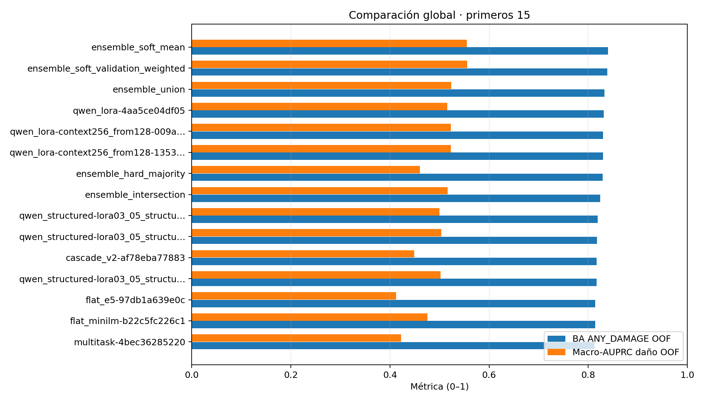
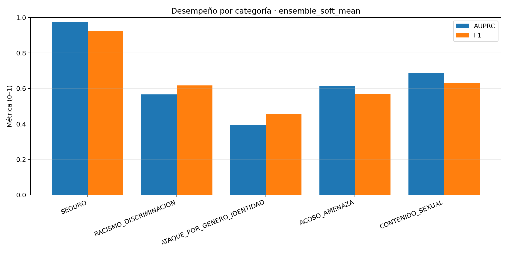
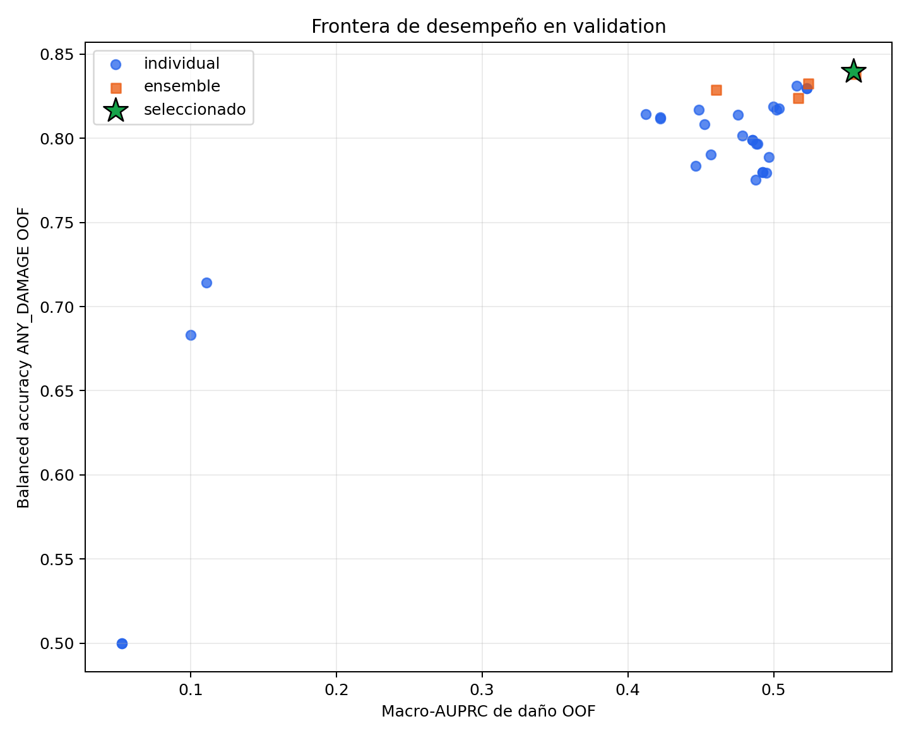

# Reporte de comparación de modelos — 03_07a

**Generado:** 2026-08-15T13:45:02.103643+00:00
**Comparación:** `comparacion_individual_ensemble_validation.json`
**SHA-256 del artefacto:** `e0f688fbad23b71d742dcd6bb0ecfe99f233d9675b9c6b1a5caf6f2544cfd8ae`
**Firma de comparación:** `ca06c9d74d95ccc33555e365186bfe07c57bad273e2f53d86c5451aab07e5baf`
**SHA-256 del dataset:** `013d60ba1b173d7752f453d5d05629a3439b09c71f0c343da1b5e498662c1f86`
**Split de selección:** `validation`
**Estado de test:** `evaluado_una_vez`

## Resumen ejecutivo

Se compararon **28 modelos individuales** y **5 ensembles**. La política de selección congeló **`ensemble_soft_mean`**; el mejor individuo según la regla fue **`qwen_lora-4aa5ce04df05`**. El estado inferencial del líder es **`statistical_tie_or_inconclusive`**.

| Seleccionado | BA ANY_DAMAGE OOF | Macro-AUPRC daño OOF | FNR | FPR | Macro-F1 daño | ECE | Carga revisión |
|---|---|---|---|---|---|---|---|
| ensemble_soft_mean | 0.8400 | 0.5549 | 0.1274 | 0.1927 | 0.5683 | 0.0117 | 0.3254 |

## Criterio de comparación

- Ranking primario: `max binary_any_damage_oof.balanced_accuracy at full coverage`.
- Agregación: `lexicographic_not_weighted_sum`.
- Salvaguarda: `macro AUPRC damage noninferiority when margin predeclared; otherwise Pareto report`.
- Capacidad máxima de revisión: `0.4`.
- Margen de no inferioridad: `0.1`.
- Test no interviene en esta selección.

## Contraste inferencial con el retador elegible más cercano

| Referencia | Retador | Δ retador−referencia | IC 95 % inferior | IC 95 % superior | p Holm | Réplicas | Hilos efectivos |
|---|---|---|---|---|---|---|---|
| ensemble_soft_mean | ensemble_soft_validation_weighted | -0.0017 | -0.0044 | 0.0008 | 0.2289 | 2000 | 2 |

## Comparación global de todos los modelos

| # | Modelo/ensemble | Tipo | Familia | BA OOF | Macro-AUPRC OOF | FNR | FPR | Macro-F1 daño | Micro-F1 |
|---|---|---|---|---|---|---|---|---|---|
| 1 | ensemble_soft_mean | ensemble | ensemble | 0.8400 | 0.5549 | 0.1274 | 0.1927 | 0.5683 | 0.8420 |
| 2 | ensemble_soft_validation_weighted | ensemble | ensemble | 0.8383 | 0.5560 | 0.1340 | 0.1894 | 0.5694 | 0.8408 |
| 3 | ensemble_union | ensemble | ensemble | 0.8328 | 0.5236 | 0.1717 | 0.1627 | 0.5648 | 0.8363 |
| 4 | qwen_lora-4aa5ce04df05 | individual | qwen_lora | 0.8314 | 0.5158 | 0.1698 | 0.1675 | 0.5534 | 0.8409 |
| 5 | qwen_lora-context256_from128-009a589e6574 | individual | qwen_lora | 0.8298 | 0.5228 | 0.1420 | 0.1985 | 0.5716 | 0.8434 |
| 6 | qwen_lora-context256_from128-1353d08f2963 | individual | qwen_lora | 0.8298 | 0.5228 | 0.1420 | 0.1985 | 0.5716 | 0.8434 |
| 7 | ensemble_hard_majority | ensemble | ensemble | 0.8288 | 0.4606 | 0.1788 | 0.1637 | 0.5723 | 0.8444 |
| 8 | ensemble_intersection | ensemble | ensemble | 0.8242 | 0.5165 | 0.1651 | 0.1864 | 0.5381 | 0.8317 |
| 9 | qwen_structured-lora03_05_structured_p005-54868bbad1a7 | individual | qwen_structured | 0.8188 | 0.4997 | 0.1684 | 0.1940 | 0.5397 | 0.8393 |
| 10 | qwen_structured-lora03_05_structured_p000-3978be2d2f44 | individual | qwen_structured | 0.8179 | 0.5035 | 0.1679 | 0.1963 | 0.5422 | 0.8360 |
| 11 | cascade_v2-af78eba77883 | individual | cascade_v2 | 0.8170 | 0.4489 | 0.1590 | 0.2071 | 0.5192 | 0.8266 |
| 12 | qwen_structured-lora03_05_structured_p002-255b54f1e028 | individual | qwen_structured | 0.8170 | 0.5020 | 0.1745 | 0.1915 | 0.5409 | 0.8382 |
| 13 | flat_e5-97db1a639e0c | individual | flat_e5 | 0.8143 | 0.4124 | 0.1929 | 0.1784 | 0.4816 | 0.8114 |
| 14 | flat_minilm-b22c5fc226c1 | individual | flat_minilm | 0.8139 | 0.4757 | 0.1868 | 0.1854 | 0.5300 | 0.8271 |
| 15 | multitask-4bec36285220 | individual | multitask | 0.8124 | 0.4224 | 0.1575 | 0.2177 | 0.4733 | 0.8088 |
| 16 | multitask-5a9b00f79262 | individual | multitask | 0.8118 | 0.4225 | 0.1981 | 0.1783 | 0.4911 | 0.8185 |
| 17 | cascade-2b78ad8fe71f | individual | cascade | 0.8082 | 0.4526 | 0.1844 | 0.1992 | 0.5060 | 0.8213 |
| 18 | classical-logistic_regression_c0p5-54f7971c6000 | individual | classical:base:logistic_regression | 0.8014 | 0.4787 | 0.1769 | 0.2203 | 0.5034 | 0.8151 |
| 19 | classical-base_logistic_regression-347f3734fb9e | individual | classical:base:logistic_regression | 0.7989 | 0.4854 | 0.2009 | 0.2012 | 0.5118 | 0.8214 |
| 20 | classical-logistic_regression_c1-54f7971c6000 | individual | classical:base:logistic_regression | 0.7989 | 0.4854 | 0.2009 | 0.2012 | 0.5118 | 0.8214 |
| 21 | classical-logistic_regression_c2-54f7971c6000 | individual | classical:base:logistic_regression | 0.7969 | 0.4880 | 0.2042 | 0.2020 | 0.5128 | 0.8191 |
| 22 | classical-policy_informed_logistic_regression-347f3734fb9e | individual | classical:policy_informed:logistic_regression | 0.7966 | 0.4891 | 0.2137 | 0.1932 | 0.5175 | 0.8239 |
| 23 | classical-base_sgd_incremental-347f3734fb9e | individual | classical:base:sgd_incremental | 0.7904 | 0.4569 | 0.1972 | 0.2219 | 0.4883 | 0.8118 |
| 24 | classical-linear_svm_c0p5-54f7971c6000 | individual | classical:base:linear_svm | 0.7889 | 0.4968 | 0.2259 | 0.1962 | 0.5150 | 0.8237 |
| 25 | classical-policy_informed_sgd_incremental-347f3734fb9e | individual | classical:policy_informed:sgd_incremental | 0.7835 | 0.4464 | 0.1802 | 0.2527 | 0.4866 | 0.8082 |
| 26 | classical-base_linear_svm-347f3734fb9e | individual | classical:base:linear_svm | 0.7798 | 0.4925 | 0.2311 | 0.2092 | 0.5169 | 0.8260 |
| 27 | classical-linear_svm_c1-54f7971c6000 | individual | classical:base:linear_svm | 0.7798 | 0.4925 | 0.2311 | 0.2092 | 0.5169 | 0.8260 |
| 28 | classical-policy_informed_linear_svm-347f3734fb9e | individual | classical:policy_informed:linear_svm | 0.7796 | 0.4949 | 0.2448 | 0.1960 | 0.5133 | 0.8255 |
| 29 | classical-linear_svm_c2-54f7971c6000 | individual | classical:base:linear_svm | 0.7755 | 0.4876 | 0.2486 | 0.2005 | 0.5133 | 0.8258 |
| 30 | classical-base_complement_nb-347f3734fb9e | individual | classical:base:complement_nb | 0.7143 | 0.1109 | 0.2123 | 0.3592 | 0.1251 | 0.7854 |
| 31 | classical-policy_informed_complement_nb-347f3734fb9e | individual | classical:policy_informed:complement_nb | 0.6830 | 0.0999 | 0.2670 | 0.3670 | 0.1171 | 0.5664 |
| 32 | classical-base_dummy-347f3734fb9e | individual | classical:base:dummy | 0.5000 | 0.0530 | 0.0000 | 1.0000 | 0.0770 | 0.4792 |
| 33 | classical-policy_informed_dummy-347f3734fb9e | individual | classical:policy_informed:dummy | 0.5000 | 0.0530 | 0.0000 | 1.0000 | 0.0770 | 0.4792 |

La tabla completa, con calibración, riesgo, carga de revisión y salvaguardas, está en [`tablas_03_07a/ranking_validation.csv`](tablas_03_07a/ranking_validation.csv).

## Mejor modelo por tipo

El mejor de cada tipo se toma del mismo ranking lexicográfico de validation usado para la congelación; no se recalculó un ranking alternativo por una sola métrica.

| Tipo | Mejor modelo | Ranking global | BA OOF | Macro-AUPRC OOF | FNR | FPR | Macro-F1 daño | Seleccionado final |
|---|---|---|---|---|---|---|---|---|
| classical | classical-logistic_regression_c0p5-54f7971c6000 | 18 | 0.8014 | 0.4787 | 0.1769 | 0.2203 | 0.5034 | False |
| transformer | cascade_v2-af78eba77883 | 11 | 0.8170 | 0.4489 | 0.1590 | 0.2071 | 0.5192 | False |
| qwen | qwen_lora-4aa5ce04df05 | 4 | 0.8314 | 0.5158 | 0.1698 | 0.1675 | 0.5534 | False |
| ensemble | ensemble_soft_mean | 1 | 0.8400 | 0.5549 | 0.1274 | 0.1927 | 0.5683 | True |

El detalle reproducible está en [`tablas_03_07a/mejores_por_tipo_validation.csv`](tablas_03_07a/mejores_por_tipo_validation.csv).

## Mejor representante individual por familia

| Familia | Representante | Ranking global | BA OOF | Macro-AUPRC OOF |
|---|---|---|---|---|
| classical | classical-logistic_regression_c0p5-54f7971c6000 | 18 | 0.8014 | 0.4787 |
| transformer | cascade_v2-af78eba77883 | 11 | 0.8170 | 0.4489 |
| qwen | qwen_lora-4aa5ce04df05 | 4 | 0.8314 | 0.5158 |

## Desempeño del seleccionado por categoría

| Categoría | Soporte | AUPRC | Precisión | Recall | F1 | ECE | Brier |
|---|---|---|---|---|---|---|---|
| SEGURO | 8480 | 0.9744 | 0.8868 | 0.9596 | 0.9217 | 0.0391 | 0.0939 |
| RACISMO_DISCRIMINACION | 382 | 0.5664 | 0.5776 | 0.6623 | 0.6171 | 0.0047 | 0.0211 |
| ATAQUE_POR_GENERO_IDENTIDAD | 374 | 0.3943 | 0.4050 | 0.5187 | 0.4549 | 0.0041 | 0.0263 |
| ACOSO_AMENAZA | 1146 | 0.6129 | 0.5444 | 0.5986 | 0.5702 | 0.0128 | 0.0633 |
| CONTENIDO_SEXUAL | 633 | 0.6876 | 0.7109 | 0.5671 | 0.6309 | 0.0089 | 0.0313 |

## Mejores resultados por categoría

| Categoría | Mejor AUPRC | AUPRC | Mejor F1 | F1 | Mejor recall | Recall | Precisión asociada |
|---|---|---|---|---|---|---|---|
| SEGURO | ensemble_soft_validation_weighted | 0.9745 | qwen_lora-context256_from128-009a589e6574 | 0.9240 | classical-linear_svm_c2-54f7971c6000 | 0.9665 | 0.8640 |
| RACISMO_DISCRIMINACION | qwen_lora-context256_from128-009a589e6574 | 0.5711 | qwen_lora-context256_from128-009a589e6574 | 0.6222 | qwen_lora-context256_from128-009a589e6574 | 0.6832 | 0.5711 |
| ATAQUE_POR_GENERO_IDENTIDAD | qwen_lora-context256_from128-009a589e6574 | 0.4017 | ensemble_hard_majority | 0.4695 | ensemble_soft_validation_weighted | 0.5535 | 0.3884 |
| ACOSO_AMENAZA | ensemble_soft_validation_weighted | 0.6143 | ensemble_union | 0.5839 | ensemble_union | 0.6344 | 0.5409 |
| CONTENIDO_SEXUAL | ensemble_soft_mean | 0.6876 | ensemble_union | 0.6382 | ensemble_union | 0.6382 | 0.6382 |

Los ganadores por categoría se restringen a candidatos que no fallaron la salvaguarda macro-AUPRC global. Esto evita declarar ganador a un clasificador degenerado que maximiza recall prediciendo siempre positivo. El CSV detallado conserva los candidatos fallidos.

El detalle de cada modelo × categoría está en [`tablas_03_07a/metricas_por_categoria_validation.csv`](tablas_03_07a/metricas_por_categoria_validation.csv).

## Figuras

### Ranking Global Validation

### Seleccion Por Categoria Validation

### Frontera Ba Macro Auprc Validation

## Apertura única de test

| Vista | Filas | BA ANY_DAMAGE | Macro-AUPRC daño | FNR | FPR | Macro-F1 daño | ECE |
|---|---|---|---|---|---|---|---|
| natural | 22684 | 0.8459 | 0.4152 | 0.0943 | 0.2139 | 0.4348 | 0.0184 |
| 4_to_1 | 9010 | 0.8459 | 0.5694 | 0.0943 | 0.2139 | 0.5582 | 0.0107 |

La vista natural es primaria. La vista 4:1 reutiliza las mismas predicciones y es secundaria; no constituye otra apertura de test.

## Análisis crítico

1. La regla predeclarada seleccionó `ensemble_soft_mean`. Frente al mejor individuo (`qwen_lora-4aa5ce04df05`), la diferencia puntual es +0.0086 en BA ANY_DAMAGE OOF y +0.0392 en macro-AUPRC de daño OOF. Estas diferencias describen validation y no deben interpretarse aisladamente como ganancia de producción.
2. Las pruebas pareadas no confirmaron un ganador estadísticamente superior. El elemento congelado es el primero según la política lexicográfica y sus salvaguardas, no un ganador universal; alternativas cercanas siguen siendo compatibles con la evidencia. El retador más próximo fue `ensemble_soft_validation_weighted`: diferencia retador−referencia -0.0017, IC 95 % [-0.0044, 0.0008] y p de Holm 0.2289.
3. Por categoría de daño, el mayor F1 del seleccionado aparece en `CONTENIDO_SEXUAL` (0.6309) y el menor en `ATAQUE_POR_GENERO_IDENTIDAD` (0.4549). La lectura debe acompañarse del soporte y AUPRC: una categoría minoritaria puede tener mayor incertidumbre aunque el promedio global sea competitivo.
4. La capacidad máxima de revisión declarada fue 40.0%; el punto elegido usa 0.3254. Es una carga humana alta y requiere justificar volumen, tiempo y error residual del revisor.
5. El margen de no inferioridad macro-AUPRC fue 0.100. Es permisivo para una métrica en escala 0–1; el informe conserva la frontera completa para que esta decisión operacional no se confunda con equivalencia estadística.
6. El artefacto registra 2 hilos efectivos para el bootstrap agrupado, con motor `paired-balanced-accuracy-grouped-video-threaded-v3`. Este valor observado prevalece sobre cualquier configuración ejemplificada en documentación anterior.
7. La apertura única de test natural registró BA ANY_DAMAGE 0.8459, una diferencia de +0.0059 frente a validation OOF. Test informa generalización; no debe usarse para cambiar el modelo o reajustar umbrales.

## Límites de interpretación

- La comparación usa chunks agrupados por video; un chunk no representa un video independiente.
- Las métricas por categoría reflejan el corpus y la supervisión disponible, no prevalencia nacional.
- Un score alto no sustituye revisión contextual ni convierte la etiqueta de referencia en verdad humana absoluta.
- Si el líder es estadísticamente inconcluso, debe informarse la selección operacional y la frontera, no una superioridad universal.
- Test, cuando exista, se reporta una sola vez y no autoriza reajustar la selección.
